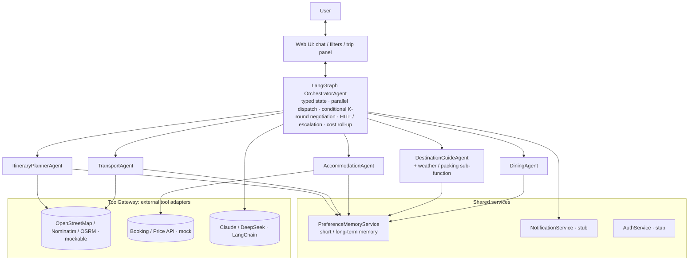

# AI Trip Planner

> A multi-agent trip planning system — the travel version of the ELEC5620 "One-Person AI Company" theme.
> GitHub repo: `AI_TRIP_PLANNER` (referred to as **AI Trip Planner** throughout the project).

A user describes a trip in natural language. The **OrchestratorAgent** decomposes the request,
dispatches tasks to a set of specialist agents, collects their proposals, and detects conflicts
(budget / time / geography). On conflict it runs up to K=3 targeted revision rounds. Once the plan
converges it is sent to the user for confirmation (Human-in-the-loop, HITL); if it does not converge
or hits a red line it is escalated to the Human Founder. The final plan is shown as a
**mind-map + timeline**.

> **Requirements / architecture source of truth** (Stage 1 deliverable — 4+1 viewpoints, feature
> diagrams, use cases): the Google Doc *ELEC5620 Project1--docs*. This README only covers *how we
> build together*; it does not repeat the architecture modelling.

**🚀 Live demo:** [elec5620-ai-trip-planner.vercel.app](https://elec5620-ai-trip-planner.vercel.app)
— auto-deploys from `main` on every merge. This is the one canonical deployment for the team; please
don't link any other Vercel URL in submissions or demos.

---

## 1. Architecture overview



### UML

**UML (spine)** — the agent &amp; orchestration class model
([`docs/diagrams/class-3-agents.svg`](docs/diagrams/class-3-agents.svg)):


**UML (with all use cases)** — the same model with the ten use cases traced in via `«trace»`
([`docs/diagrams/class-5-with-use-cases.svg`](docs/diagrams/class-5-with-use-cases.svg)):


### Agents

| Layer | Name | Responsibility | Owner |
|---|---|---|---|
| Orchestrator | `OrchestratorAgent` | chat intake, requirement decomposition, task dispatch, proposal aggregation, conflict detection, up-to-K=3 revision rounds, **all HITL and escalation**, cost roll-up | A |
| Specialist | `ItineraryPlannerAgent` | structured day-by-day schedule, pacing from dates/group/prefs, model-backed drafting with deterministic fallback, route-feasibility checks | B |
| Specialist | `TransportAgent` | group flight pricing, inter-city/local routes, explicit timing, budget and schedule revisions | B |
| Specialist | `AccommodationAgent` | lodging search and comparison, individual / group room allocation | C |
| Specialist | `DestinationGuideAgent` | attractions, local customs, safety, visa / vaccine by nationality; **+ weather and packing advice as an LLM sub-function (no weather API)** | D |
| Specialist | `DiningAgent` | cuisine recommendations, dietary restrictions | D |

### Non-agent modules

| Module | What it does | Owner |
|---|---|---|
| Cost-aggregation | sums every agent's `estCost` against `budgetTotal`, emits an overrun % that feeds HITL / escalation | C |
| `PreferenceMemoryService` | short-term memory (in-session requests) / long-term memory (user profile, confirmed preferences); Filter writes long-term, chat-confirmed items promote short → long | E |
| `ToolGateway` | wraps all external tool calls, `USE_MOCK_TOOLS` switch | A (interface) + adapter owners |
| Maps adapter | OpenStreetMap Nominatim + OSRM in live mode; deterministic mock in dev | B |
| Booking adapter | Booking / Price API adapter, **mock** — real payment is out of scope | C |
| `NotificationService`, `AuthService` | minimal stubs | E |

### External tools / systems

- **LLM** — explicit task routing: GPT/Claude-compatible extraction for chat intake, DeepSeek V4 Flash for itinerary drafting, and MiniMax M2.7 for destination/dining guidance; deterministic fallbacks keep every flow usable without API keys
- **Maps / Places API** — free OpenStreetMap Nominatim + OSRM in live mode, deterministic mockable in dev
- **Booking / Price API** — lodging / flight pricing, **mock**; real payment is out of scope
- No weather API — weather advice is an LLM sub-function inside `DestinationGuideAgent`

### Orchestrator negotiation loop

```
1. User chat → OrchestratorAgent parses → TripBrief (written to short-term memory)
2. User confirms key fields (people / dates / destination / budget) → written to long-term memory   [HITL]
3. Round 1: dispatch TripBrief to all specialist agents in parallel → collect AgentProposal[]
4. Orchestrator aggregates, detects conflicts (budget over limit / time overlap / geo infeasible)
5. Conflict → Round r: send RevisionRequest only to the affected agents → up to K = 3 rounds
6. Converged → present plan + ask user to confirm key nodes                                         [HITL]
7. Not converged / red line (over budget > X% or safety) → escalate to Human Founder
8. Output: mind-map view + timeline view
```

---

## 2. Tech stack

| Area | Choice |
|---|---|
| Language | **TypeScript** (`strict: true`) |
| Runtime | Node.js 22 LTS |
| Monorepo / package manager | pnpm workspaces + Turborepo |
| Web framework | Next.js 15 (App Router) — frontend + server-side agent logic in one deployable (Route Handlers / Server Actions) |
| Agent orchestration | **LangGraph.js** (`@langchain/langgraph`): typed graph state, parallel specialist dispatch, conditional conflict/revision loop |
| LLM calls | LangChain `ChatAnthropic.withStructuredOutput()` extracts chat updates; `ChatOpenAI` targets DeepSeek's OpenAI-compatible endpoint for itinerary drafts; both have validated deterministic fallbacks |
| Contracts / validation | **Zod** — every inter-agent message and tool input/output |
| State / memory | SQLite (`better-sqlite3`) or JSON files in dev; add Redis (optional in compose) if cross-request sharing is needed |
| Testing | Vitest |
| Lint / format | ESLint + Prettier (or Biome) |
| CI | GitHub Actions: lint + typecheck + test + build |

---

## 3. Repository structure

The end-to-end scaffold now includes LangGraph orchestration, incremental chat intake,
all five specialist agents, free OpenStreetMap search/routing, file-backed memory, and
basic executable HITL actions. Production persistence, authentication, booking data,
notifications, and several UI workflows remain explicit follow-up work.
See [`docs/scaffold.md`](docs/scaffold.md) for the full "who codes where" map, and
[`docs/class-diagram.md`](docs/class-diagram.md) for the design-time UML class model
(ELEC5620 Lab 4 Part 2).

```
ai-trip-planner/
├── apps/
│   └── web/                          # Next.js: UI + server-side agent entry        (E)
│       ├── app/                      #   page.tsx, api/chat/route.ts, globals.css
│       └── components/               #   Header, FiltersPanel, ChatPanel, TripPanel, TripSection
├── packages/
│   ├── shared/src/                   # Zod contracts + Agent / TripPlan types       (A)
│   ├── orchestrator/src/             # LangGraph workflow: parallel dispatch,
│   │                                 #   conflict loop, HITL, cost roll-up           (A)
│   ├── agents/src/
│   │   ├── itinerary/                # model/fallback daily schedule + route checks (B)
│   │   ├── transport/                # flight/route estimates + timed legs           (B)
│   │   ├── accommodation/            #                                              (C)
│   │   ├── destination-guide/        # incl. weather / packing sub-function         (D)
│   │   └── dining/                   #                                              (D)
│   ├── services/src/
│   │   ├── memory/                   # file-backed dev memory; DB migration planned (E)
│   │   ├── notification/             # stub                                         (E)
│   │   └── auth/                     # stub                                         (E)
│   └── tools/src/
│       ├── gateway.ts                # ToolGateway (mock vs real switch)            (A)
│       ├── maps.ts                   # OSM/Nominatim/OSRM + mock adapter             (B)
│       ├── booking.ts                # Booking / Price adapter (mock)               (C)
│       └── mock-server.mjs           # local canned-response API server            (A)
├── docs/
│   ├── scaffold.md                   # who codes where + how to run
│   └── session-logs/TEMPLATE.md      # per-session summary (see §8)
├── .env.example  .gitattributes  .dockerignore  .prettierrc.json
├── Dockerfile  docker-compose.yml
├── turbo.json  pnpm-workspace.yaml  tsconfig.base.json
└── README.md
```

## Development roadmap — single-user scope

This project is intentionally a **single-user AI trip workspace**. The near-term goal is not
social travel planning or real-time multi-user editing. The product should first let one person
discover places, edit a plan, confirm decisions, save trips, and use the plan during travel.

### Current status

| Stage | Status | Scope | Exit criteria |
| --- | --- | --- | --- |
| Stage 5.2 | ✅ Complete / PR #8 | Specialist agents, budget and conflict negotiation, place grounding, free OSM/Nominatim/OSRM maps, streaming shell and demo-plan caching | CI, tests and production build pass; plan no longer accepts ungrounded itinerary places |
| Stage 5.3 | 🚧 In progress | File-backed memory, HITL API/UI, decision recovery, atomic writes and checkpoint validation | Confirm/reject actions survive a new request and affect a versioned plan |
| Stage 6A | ⏳ Next | Finish the existing UI: controlled filters, real detail cards, review flow, loading/error states | A user can complete planning without typing implementation-specific chat commands |
| Stage 6B | ⏳ Planned | Save/reopen trips, preference memory, plan versions and rollback | Refreshing or restarting does not lose the user's trip |
| Stage 6C | ⏳ Planned | Map/list view, editable timeline, add/remove/reorder/replace itinerary items | A user can manually adjust the generated plan and re-run constraint checks |
| Stage 7 | ⏳ Planned | Start Anywhere imports (URL, image, PDF), source tracking and collections | Imported places become reviewable, attributable candidates before entering the plan |
| Stage 8 | ⏳ Planned | Real hotel/flight/activity search and booking deep links; receipt/confirmation import | Results show provider, timestamp, price freshness and a clear booking hand-off |
| Stage 9 | ⏳ Later | On-trip mode: nearby suggestions, delay-aware replanning, offline read-only itinerary | A saved trip remains useful while travelling with intermittent connectivity |

### Immediate UI completion plan

The current UI contains several visible placeholders. These are the next concrete tasks, in order:

| Priority | Area | Current gap | Required change |
| --- | --- | --- | --- |
| P0 | `FiltersPanel` | Inputs use `defaultValue` and do not update the plan | Convert to controlled fields; validate dates, group size and budget; add Apply/Replan |
| P0 | `TripSection` | Expanded view renders raw JSON | Render real activity, transport, hotel, dining and guide cards with source/assumption labels |
| P0 | `TripPanel` | `Review plan` is a non-functional button | Focus the next pending HITL action or open the relevant section |
| P0 | `ChatPanel` | HITL has only basic approve/reject feedback | Add pending/success/error states and show which plan version was changed |
| P1 | `Header` | Saved trips, My trips and language are plain text | Implement single-user Saved Trips first; remove or disable unsupported links |
| P1 | Plan editing | No add/remove/reorder/replace interaction | Add item actions and run route/time/budget checks after each edit |
| P1 | Persistence | Current memory is file-backed development storage | Move trips, preferences, chat turns and HITL decisions to SQLite/Postgres |
| P1 | Errors | Provider failures are mostly silent fallbacks | Show “estimated”, “mock”, “source unavailable” and retry actions in the UI |

### Explicitly out of scope for the current roadmap

These are not required for the one-person product and should not block the next releases:

- Multi-user collaboration, group chat, voting and real-time co-editing
- Creator marketplace, public social feed and follower system
- In-app payment, refunds and booking fulfilment

They can be reconsidered only after the single-user save → edit → confirm → travel loop is stable.

### Definition of done for the single-user MVP

- A user can enter or edit destination, dates, travellers, budget and preferences.
- The planner returns grounded recommendations with source and freshness labels.
- The user can inspect real detail cards instead of raw JSON.
- The user can edit the itinerary and see time, route and budget conflicts.
- HITL confirmations are persisted, versioned and recoverable after refresh.
- A saved trip can be reopened without relying on the demo user.
- Provider failures degrade visibly and safely; mock data is never presented as a live quote.
- `pnpm typecheck`, `pnpm test`, lint and production build pass before merge.

Run it:

```bash
corepack enable && pnpm install && pnpm dev      # http://localhost:3000
pnpm typecheck && pnpm build                     # both pass on a clean checkout
```

> Each person works only inside their own directory to minimise edits to the same file.
> Cross-module input / output formats live in `packages/shared/src/contracts.ts` — agree changes with A first.

---

## 4. Interface-first contracts

All agent-to-agent and agent-to-tool messages are defined as **Zod schemas** in
`packages/shared/src/contracts.ts`. Agreed up front, led by A. **Once agreed, everyone mocks the
other side's I/O and develops independently — no waiting for others.**

```ts
// packages/shared/src/contracts.ts
import { z } from "zod";

export const AGENT_NAMES = [
  "itinerary", "transport", "accommodation", "destination-guide", "dining",
] as const;
export type AgentName = (typeof AGENT_NAMES)[number];

export const TripBrief = z.object({
  tripId: z.string(),
  userId: z.string().default("demo-user"),
  destination: z.string(),
  dates: z.tuple([z.string(), z.string()]),      // [start, end] ISO
  groupSize: z.number().int().positive(),
  budgetTotal: z.number().positive(),
  nationality: z.string().optional(),
});
export type TripBrief = z.infer<typeof TripBrief>;

export const AgentProposal = z.object({
  agent: z.enum(AGENT_NAMES),
  summary: z.string(),
  items: z.array(z.object({
    kind: z.string(),                             // "transport" | "hotel" | "activity" ...
    detail: z.string(),
    estCost: z.number().nonnegative().optional(), // USD, whole trip (not per-person) — frozen by A
    day: z.number().int().optional(),
    startTime: z.string().optional(),             // HH:mm; schedule fields are optional as a group
    endTime: z.string().optional(),
    location: z.string().optional(),
  })),
  assumptions: z.array(z.string()),
  conflictsWith: z.array(z.string()).default([]),
});
export type AgentProposal = z.infer<typeof AgentProposal>;

export const RevisionRequest = z.object({
  tripId: z.string(),
  targetAgent: z.enum(AGENT_NAMES),
  reason: z.string(),                             // "plan is 18% over budget" ...
  constraints: z.array(z.string()),
});
export type RevisionRequest = z.infer<typeof RevisionRequest>;
```

Every agent implements this. The Orchestrator builds `tools` + `mem` once per run
and injects them via `ctx` — agents never import those singletons, so they stay
unit-testable with fakes. Interfaces (`ToolGateway`, `MemoryStore`) live in
`packages/shared/src/ports.ts`.

```ts
interface AgentContext {
  tripId: string;
  round: number;
  tools: ToolGateway;   // ctx.tools.maps.route(...) / ctx.tools.booking.searchStays(...)
  mem: MemoryStore;      // ctx.mem.getLongTerm(brief.userId) ...
  signal?: AbortSignal;
}

interface Agent {
  name: AgentName;
  label: string;         // section title in the "Your trip" panel
  run(brief: TripBrief, ctx: AgentContext): Promise<AgentProposal>;
  revise?(brief: TripBrief, ctx: AgentContext, req: RevisionRequest): Promise<AgentProposal>;
}
```

The web client talks to the server through one contract
(`packages/shared/src/chat.ts`):

```ts
export const ChatRequest = z.object({
  tripId: z.string(),
  message: z.string().min(1),
  brief: TripBrief.optional(),
});
export const ChatResponse = z.object({ reply: z.string(), plan: TripPlan });
```

`POST /api/chat` takes a `ChatRequest`, extracts explicit changes into a validated
`TripBrief`, re-runs the orchestrator, and returns a `ChatResponse`. The browser sends
the latest brief with each request so incremental updates also work in a serverless
runtime; older clients may omit it and start from `DEMO_BRIEF`. The client holds
`plan` in React state and swaps it on each reply.
Streaming can be added later without changing this shape.

---

## 5. Team roles

> The five rows below are a coursework ownership and review plan, not a technical requirement.
> The application runs as one deployable and can be developed by one person; in that case the same
> interfaces still provide useful boundaries, but work is delivered vertically one feature at a time.

Split by **module ownership** (each person owns one or two agents plus their tooling), **not** by
frontend / backend / testing. Rationale, in course terms: each module maps to one area of
conceptual homogeneity; control stays centralised in the Orchestrator; control is separated from
function.

| Person | Owns | Depends on | Delivers |
|---|---|---|---|
| **A — Orchestrator & integration lead** | `OrchestratorAgent`, negotiation loop, conflict detection, **all HITL & escalation policy**, `packages/shared` contracts, `ToolGateway` interface, CI, weekly integration, `main` merge gate | everyone's proposal schema | working end-to-end flow: chat → full trip plan |
| **B — Itinerary & transport** | `ItineraryPlannerAgent`, `TransportAgent`, maps adapter (mock), time / geo conflict-check helper | shared contracts, maps data (mock) | day-by-day itinerary with transport |
| **C — Stay & budget** | `AccommodationAgent`, booking adapter (mock), cost-aggregation module (sum vs budget → overrun %) | shared contracts, booking data (mock), `estCost` from B / D | lodging plan + live "cost vs budget" number |
| **D — Destination guide & dining** | `DestinationGuideAgent` (attractions, customs, safety, visa / vaccine by nationality, + weather / packing advice as an LLM sub-function), `DiningAgent` | shared contracts | destination guidance + dining recommendations |
| **E — Frontend & memory** | Web app (chat, filters / preferences, "Your trip" panel), `PreferenceMemoryService` (short / long-term memory), notification & auth stubs | A's orchestrator API | working web UI: chat, live plan, confirm actions |

**Tech lead / reviewer.** A is tech lead and integration owner, with final merge authority on `main`
(after review) — but **not** the sole reviewer. Use the ring-review table in §6; every PR needs ≥1
approval. There is no single "master" who writes everything.

Each person writes the Logical + Development view for their slice; A assembles the Process,
Physical, and Scenario views.

<details>
<summary>中文版 / Chinese</summary>

按**模块 owner** 分工(每人负责一到两个 agent 加上它的工具),**不按**前端 / 后端 / 测试横切。
理由(课程术语):每个模块对应一块概念同质的领域;控制集中在 Orchestrator;控制与功能分离。

| 人 | 负责 | 依赖 | 交付 |
|---|---|---|---|
| **A(530527086|Ziqi He) —— 编排与集成负责人** | `OrchestratorAgent`、协商循环、冲突检测、**全部 HITL 与升级策略**、`packages/shared` 契约、`ToolGateway` 接口、CI、每周集成、`main` 合并把关 | 大家的提案格式(schema) | 能跑通的主流程:聊天 → 一份完整行程 |
| **B(540532755|Tingsong Jin) —— 行程与交通** | `ItineraryPlannerAgent`、`TransportAgent`、地图适配器(mock)、时间 / 地理冲突检查 helper | 共享契约、地图数据(mock) | 带交通的每日行程 |
| **C(550378747|YI QIAO) —— 住宿与预算** | `AccommodationAgent`、订房适配器(mock)、成本汇总模块(加总 vs 预算 → 超支 %) | 共享契约、订房数据(mock)、B / D 的 `estCost` 字段 | 住宿方案 + 实时"花费 vs 预算"数字 |
| **D(550066431|Jiahang Bian) —— 目的地向导与美食** | `DestinationGuideAgent`(景点、当地习俗、安全、按国籍的签证 / 疫苗,+ 天气 / 行李建议作为 LLM 子功能)、`DiningAgent` | 共享契约 | 目的地指南 + 美食推荐 |
| **E (550414791|Weihao Wang)—— 前端与记忆** | Web 应用(聊天、筛选 / 偏好、"你的行程"面板)、`PreferenceMemoryService`(短期 / 长期记忆)、通知与登录 stub | A 的 orchestrator 接口 | 能用的网页:聊天、行程实时更新、确认操作 |

**技术负责人 / reviewer**:A 是技术负责人和集成 owner,拥有 `main` 的最终合并权(必须先过
review)—— 但**不是唯一 reviewer**。用 §6 的环形 review 表,每个 PR 至少 1 人 approve。没有
"一个人写全部"的 master。

每人负责写自己那一块的 Logical + Development 视图;A 负责拼 Process、Physical、Scenario 视图。

</details>

---

## 6. Git workflow

### Branch naming

`feature/<module>-<short-desc>`, `<module>` = directory name, e.g.:

- `feature/transport-maps-adapter`
- `feature/accommodation-cost-rollup`
- `feature/orchestrator-conflict-detection`
- `feature/web-itinerary-mindmap`

Commit message prefix: `feat:` / `fix:` / `docs:` / `refactor:` / `test:` / `chore:`

### `main` branch protection (GitHub Ruleset)

- No direct push — Pull Request only
- PR needs **≥1 approval** to merge
- New commits dismiss stale approvals
- CI must pass (lint + typecheck + test + build)
- No force push, no deleting `main`

### Review assignment (ring — don't review your own)

| PR author | Reviewer |
|---|---|
| A | B |
| B | C |
| C | D |
| D | E |
| E | A |

### Issues / board

GitHub Projects: one Issue per agent / service / use case, assigned to its owner,
status `To Do → In Progress → In Review → Done`.

### Integration cadence

- Early on, everyone develops independently against `packages/shared` contracts with mocked I/O
- One fixed **integration day** each week: wire all modules together and run the full flow end to
  end — the sooner interface mismatches surface, the better

---

## 7. Development environment

Mixed Windows / macOS in the team, so Docker keeps environments consistent. **Docker is not
required** — it is only there for parity.

### First-time setup

```bash
cp .env.example .env.local     # fill in the course-provided ANTHROPIC_API_KEY; leave the rest on mock
```

### With Docker (recommended)

```bash
docker compose up
```

- `web` — http://localhost:3000, source bind-mounted, hot reload
- `mock-apis` — http://localhost:4000, canned Maps / Booking responses, **no real key needed to develop**
- `redis` — commented out by default; enable if cross-request state is needed

### Without Docker

```bash
corepack enable
pnpm install
pnpm dev
```

### Dockerfile (multi-stage, starter — A to refine later)

```dockerfile
FROM node:22-alpine AS base
RUN corepack enable
WORKDIR /app

FROM base AS deps
COPY pnpm-lock.yaml pnpm-workspace.yaml package.json ./
COPY apps/ apps/
COPY packages/ packages/
RUN pnpm install --frozen-lockfile

FROM base AS dev
COPY --from=deps /app/node_modules ./node_modules
COPY . .
EXPOSE 3000
CMD ["pnpm", "dev"]

FROM deps AS build
COPY . .
RUN pnpm build

FROM base AS runner
ENV NODE_ENV=production
COPY --from=build /app ./
EXPOSE 3000
CMD ["pnpm", "--filter", "web", "start"]
```

### docker-compose.yml

```yaml
services:
  web:
    build: { context: ., target: dev }
    ports: ["3000:3000"]
    env_file: [.env.local]
    environment:
      - WATCHPACK_POLLING=true      # file watching on Windows
      - CHOKIDAR_USEPOLLING=true
      - MOCK_API_URL=http://mock-apis:4000
    volumes:
      - .:/app
      - /app/node_modules           # don't let the host node_modules shadow the container's
    depends_on: [mock-apis]

  mock-apis:
    build: { context: ., target: dev }
    command: pnpm --filter @trip/tools mock-server
    ports: ["4000:4000"]
    volumes:
      - .:/app
      - /app/node_modules

  # enable if cross-request state is needed
  # redis:
  #   image: redis:7-alpine
  #   ports: ["6379:6379"]
```

### .env.example

```
# LLM (key provided by the course; model id per what the course gives you)
ANTHROPIC_API_KEY=
AI_MODEL=claude-sonnet-5

# External tools: set true in dev to use local mocks, no real key needed
USE_MOCK_TOOLS=true
MAPS_API_KEY=

# Memory store
DATABASE_URL=file:./dev.db
# REDIS_URL=redis://redis:6379
```

Put placeholder formats in `.env.example`; keep real keys in your local `.env.local`, **never
commit them**.

### Windows / macOS notes

- Repo root `.gitattributes` sets `* text=auto eol=lf` so CRLF doesn't break scripts
- Docker file watching on Windows needs polling (env vars set in compose)
- Bind mounts are slower on Windows / macOS than Linux; if it's too slow, run `pnpm dev` only
  inside the container and keep the IDE on the host
- Use `pnpm` only — don't mix `npm` / `yarn` (lockfiles will fight)

---

## 8. Session summary (required at the end of every AI-assisted coding session)

Write to `docs/session-logs/YYYY-MM-DD-name.md`, attach it to the matching PR.
Keep a copy of the template at `docs/session-logs/TEMPLATE.md`:

```markdown
## Session summary

- Author:
- Date:
- Module(s):            # directory name, e.g. agents/transport
- Goal / requirement source:   # which Google Doc line / which Issue
- What was done:
- Files changed:
- Contract impact:      # did packages/shared change? if so, @ the whole team
- Assumptions:
- External tools / mocks used:
- Open issues / TODO:
- Reviewer:
```
