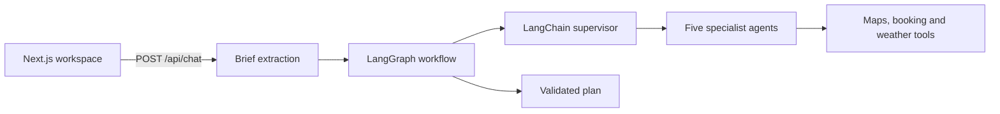

# AI Trip Planner

[](https://github.com/Lilstanie/AI_TRIP_PLANNER/actions/workflows/ci.yml)

AI Trip Planner is a single-user, multi-agent travel workspace. A user describes a trip in chat or a
preferences form; a LangGraph workflow delegates to five LangChain specialist agents and returns a
validated plan with itinerary, transport, accommodation, dining, destination guidance and budget,
each labelled with where its data came from. The user edits the plan by chatting or directly on the
day timeline and Google map, and saves trips in the browser.

Live demo: [elec5620-ai-trip-planner.vercel.app](https://elec5620-ai-trip-planner.vercel.app). The
top-bar toggle shows whether a request uses mock fixtures or live providers; place and hotel names
labelled “Mock …” come from mock mode, not a failed live integration. The demo may lag behind the
branch you are reading.

## How it works



The LangGraph graph owns control flow, conflict checks and revision rounds; the supervisor only
chooses which specialists to call. DeepSeek handles chat extraction, the specialists and the reply,
and any missing key or failed model call falls back to validated deterministic output, so requests
still complete. Details: [architecture](docs/architecture.md).

## Quick start

Requires Node.js 22+ and pnpm 9.15.0 (selected by `corepack enable`).

```bash
corepack enable
pnpm install
cp .env.example .env.local   # optional keys; mock tools and fallbacks work without them
pnpm dev                     # http://localhost:3000
```

Environment variables, Google Maps setup, the optional mock server, Docker and the CI checks
(`pnpm typecheck`, `pnpm lint`, `pnpm test`, `pnpm build`) are covered in
[development](docs/development.md).

## Repository layout

```text
apps/web/                 Next.js workspace UI and API routes
  components/{workspace,chat,trip,map,preferences,ui}
                          UI grouped by feature and shared primitives
  lib/{integrations,map,planning,trip,workspace}
                          integrations and domain rules grouped by responsibility
  tests/{app,components,lib,fixtures}
                          web tests kept separate from production code
packages/agents/          Five specialist LangChain agents, model routing and fallbacks
  src/                    production agent code by domain
  tests/                  agent tests by domain
packages/orchestrator/    LangGraph workflow, supervisor, chat intake, budget and conflicts
packages/shared/          Zod contracts, plan types and ports
packages/services/        memory and trip storage (Redis REST store or in-process), notify, auth
packages/tools/           Maps, booking, SerpApi and weather adapters, mock fixtures, tool gateway
docs/                     Documentation of the current system
.agents/                  Decision records, session logs, AI-tool skills and archived plans
```

## Documentation

| Document                                          | Contents                                                            |
| ------------------------------------------------- | ------------------------------------------------------------------- |
| [Architecture](docs/architecture.md)              | Runtime flow, LangGraph workflow, agents, models, contracts         |
| [API](docs/api.md)                                | The six API routes with requests, responses and errors              |
| [Development](docs/development.md)                | Setup, environment variables, Docker, verification                  |
| [Workspace UI](docs/workspace-ui.md)              | Current UI behaviour, storage, map and editing rules                |
| [Roadmap](docs/roadmap.md)                        | MVP sequence and status                                             |
| [Team workflow](docs/team-workflow.md)            | Ownership, branches, reviews and session logs                       |
| [UI guidelines](docs/design/ui-guidelines.md)     | Visual tokens, layout and component design rules                    |
| [DSH thinking UI](docs/design/dsh-thinking-ui.md) | The thinking surface this project imitates, and the gaps against it |

The ELEC5620 UML design model and SVG diagrams are in [`docs/design/`](docs/design/class-diagram.md).
Decision records, session logs and AI-tool skills are in [`.agents/`](.agents/README.md); where each
kind of content belongs is set out in [`docs/AGENTS.md`](docs/AGENTS.md).

## Scope

The product target is a single-user flow: describe a trip, inspect grounded recommendations, edit the
plan and save it. Saved trips live in the browser; chat turns, preferences and plans are also kept in
a Redis REST store when one is configured. Status is on the [roadmap](docs/roadmap.md). Multi-user
editing, social features, payments and booking fulfilment are out of scope.

## License

This is an ELEC5620 course project. No licence file is included, so no open-source licence has been
granted.
