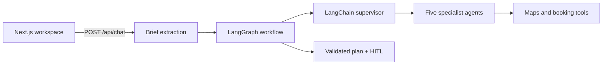

# AI Trip Planner

[](https://github.com/Lilstanie/AI_TRIP_PLANNER/actions/workflows/ci.yml)

AI Trip Planner is a single-user, multi-agent travel workspace. A user describes a trip in chat or a
preferences form; a LangGraph workflow delegates to five LangChain specialist agents and returns a
validated plan with itinerary, transport, accommodation, dining, destination guidance, budget and
human-in-the-loop (HITL) decisions. The user can review decisions, edit the day timeline on a Google
map and save trips in the browser.

Live demo: [elec5620-ai-trip-planner.vercel.app](https://elec5620-ai-trip-planner.vercel.app). The
hosted demo uses mock map and booking fixtures, so place and hotel names labelled “Mock …” are
expected there and are not a failed live integration. It may also lag behind the branch you are
reading.

## How it works



The LangGraph graph owns control flow, conflict checks and revision rounds; the supervisor only
chooses which specialists to call. DeepSeek handles chat extraction, the specialists and the reply,
and any missing key or failed model call falls back to validated deterministic output, so requests
still complete. The LangChain migration was merged in PR #10. Details:
[architecture](docs/architecture.md).

## Quick start

Requires Node.js 22+ and pnpm 9.15.0 (selected by `corepack enable`).

```bash
corepack enable
pnpm install
cp .env.example .env.local   # optional keys; mock tools and fallbacks work without them
pnpm dev                     # http://localhost:3000
```

Environment variables, Google Maps setup, the optional mock server, Docker and the CI checks
(`pnpm typecheck`, `pnpm lint`, `pnpm test`, `pnpm build`) are covered in
[development](docs/development.md).

## Repository layout

```text
apps/web/                 Next.js workspace UI and API routes
  components/{workspace,chat,trip,map,preferences,ui}
                          UI grouped by feature and shared primitives
  lib/{integrations,map,planning,trip,workspace}
                          integrations and domain rules grouped by responsibility
  tests/{app,components,lib,fixtures}
                          web tests kept separate from production code
packages/agents/          Five specialist LangChain agents, model routing and fallbacks
  src/                    production agent code by domain
  tests/                  agent tests by domain
packages/orchestrator/    LangGraph workflow, supervisor, chat intake, budget, conflicts, HITL
packages/shared/          Zod contracts, plan types and ports
packages/services/        memory (in-process MemoryStore), notify and auth adapters
packages/tools/           Maps and booking adapters, mock fixtures, tool gateway, optional mock server
docs/                     Project documentation
```

## Documentation

| Document                                             | Contents                                                            |
| ---------------------------------------------------- | ------------------------------------------------------------------- |
| [Architecture](docs/architecture.md)                 | Runtime flow, LangGraph workflow, agents, models, contracts         |
| [API](docs/api.md)                                   | The six API routes with requests, responses and errors              |
| [Development](docs/development.md)                   | Setup, environment variables, Docker, verification                  |
| [Workspace UI](docs/workspace-ui.md)                 | Current UI behaviour, storage, map and editing rules                |
| [Roadmap](docs/roadmap.md)                           | MVP sequence and status                                             |
| [Product closure TODO](docs/todo-product-closure.md) | Real providers, weather, UI polish and persistence                  |
| [Team workflow](docs/team-workflow.md)               | Ownership, branches, reviews and session logs                       |
| [UI guidelines](docs/design/ui-guidelines.md)        | Visual tokens, layout and component design rules                    |
| [DSH thinking UI](docs/design/dsh-thinking-ui.md)    | The thinking surface this project imitates, and the gaps against it |

Also in `docs/`:

- [`design/`](docs/design/class-diagram.md): the ELEC5620 UML design model and SVG diagrams.
- [`archive/`](docs/archive/): dated plans, audits and historical module handoffs; not current documentation.
- [`.agents/`](.agents/README.md): shared AI-tool material: decision records and repository skills.

## Scope

The product target is a single-user flow: describe a trip, inspect grounded recommendations, edit the
plan, confirm HITL decisions and save it. Saving is browser-local today; durable storage is next on
the [roadmap](docs/roadmap.md). Multi-user editing, social features, payments and booking fulfilment
are out of scope.

## License

This is an ELEC5620 course project. No licence file is included, so no open-source licence has been
granted.
