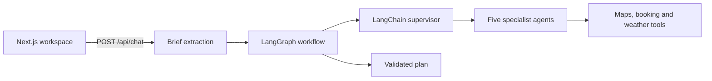

[English](README.md) | 简体中文

# AI Trip Planner

[](https://github.com/Lilstanie/AI_TRIP_PLANNER/actions/workflows/ci.yml)

AI Trip Planner 是一个面向单个用户的多智能体旅行工作区。用户可以在对话中描述行程，也可以通过顶部栏的信息标签修改行程事实。LangGraph 工作流会调度五个 LangChain 专家 agent，生成经过校验的旅行计划，包含日程、交通、住宿、餐饮、目的地指南和预算，并为每项信息标注数据来源。用户可以继续通过对话、按天排列的时间线和 Google 地图编辑计划，并将行程保存在浏览器中。

在线演示：[elec5620-ai-trip-planner.vercel.app](https://elec5620-ai-trip-planner.vercel.app)。顶部栏的切换开关会显示请求使用模拟数据还是实时数据提供方；地点和酒店名称中带有“Mock …”的内容来自模拟模式，并不表示实时集成失败。演示站点的版本可能落后于你正在查看的分支。

## 工作原理



LangGraph 图负责控制流程、冲突检查和修订轮次；supervisor 只负责选择要调用哪些专家。DeepSeek 负责从对话中提取需求、驱动专家并生成回复。如果缺少密钥或模型调用失败，系统会回退到经过校验的确定性结果，因此请求仍可完成。详情见[架构文档](docs/architecture.zh.md)。

## 快速开始

需要 Node.js 22 或更高版本，以及 pnpm 9.15.0（由 `corepack enable` 选择）。

```bash
corepack enable
pnpm install
cp .env.example .env.local   # optional keys; mock tools and fallbacks work without them
pnpm dev                     # http://localhost:3000
```

环境变量、Google Maps 配置、可选模拟服务器、Docker 和 CI 检查（`pnpm typecheck`、`pnpm lint`、`pnpm test`、`pnpm build`）详见[开发文档](docs/development.zh.md)。

## 仓库目录

```text
apps/web/                 Next.js workspace UI and API routes
  components/{workspace,chat,trip,map,preferences,account,agent-lab,pwa,ui}
                          UI grouped by feature and shared primitives
  lib/{workspace,chat,trip,map,planning,i18n,account,agent-lab,auth,db,integrations}, money.ts
                          integrations and domain rules grouped by responsibility
  tests/{app,components,lib,e2e,fixtures}
                          web tests kept separate from production code
packages/agents/          Five specialist LangChain agents, model routing and fallbacks
  src/                    production agent code by domain
  tests/                  agent tests by domain
packages/orchestrator/    LangGraph workflow, supervisor, chat intake, budget and conflicts
packages/shared/          Zod contracts, plan types and ports
packages/services/        memory and trip storage (Redis REST store or in-process)
packages/tools/           Maps, booking, SerpApi and weather adapters, mock fixtures, tool gateway
docs/                     Documentation of the current system; each package also has a README.md
.agents/                  Decision records, session logs, AI-tool skills and archived plans
```

## 文档

完整技术文档见[中文文档索引](docs/README.zh.md)。领域术语见[术语表](GLOSSARY.md)（英文）。

| 文档                                           | 内容                                           |
| ---------------------------------------------- | ---------------------------------------------- |
| [架构](docs/architecture.zh.md)                | 运行流程、LangGraph 工作流、agents、模型和契约 |
| [API](docs/api.zh.md)                          | 全部 API 路由的请求、响应和错误                |
| [开发](docs/development.zh.md)                 | 环境配置、环境变量、Docker 和验证              |
| [工作区界面](docs/workspace-ui.zh.md)          | 当前界面行为、存储、地图和编辑规则             |
| [路线图](docs/roadmap.zh.md)                   | MVP 阶段和当前状态                             |
| [团队工作流](docs/team-workflow.zh.md)         | 职责、分支、审查和 session logs                |
| [UI 设计指南](docs/design/ui-guidelines.zh.md) | 视觉 tokens、布局和组件设计规则                |

ELEC5620 UML 设计模型和 SVG 图表位于 [`docs/design/`](docs/design/class-diagram.zh.md)。决策记录、session logs 和 AI 工具技能位于 [`.agents/`](.agents/README.md)；各类内容的归属说明见 [`docs/AGENTS.md`](docs/AGENTS.md)。

## 项目范围

产品目标是支持单用户完成整个旅行规划流程：描述行程、查看有依据的建议、编辑计划并保存。已保存的行程位于浏览器中；配置 Redis REST store 后，对话轮次、偏好和计划也会保存在其中。当前状态见[路线图](docs/roadmap.zh.md)。多人协作编辑、社交功能、支付和实际预订履约不在项目范围内。

## 许可

本项目以 MIT 许可发布，见 [LICENSE](LICENSE)。版权归 AI Trip Planner 贡献者（ELEC5620 小组）所有。第三方代码及其许可见 [THIRD_PARTY_NOTICES.md](THIRD_PARTY_NOTICES.md)。
