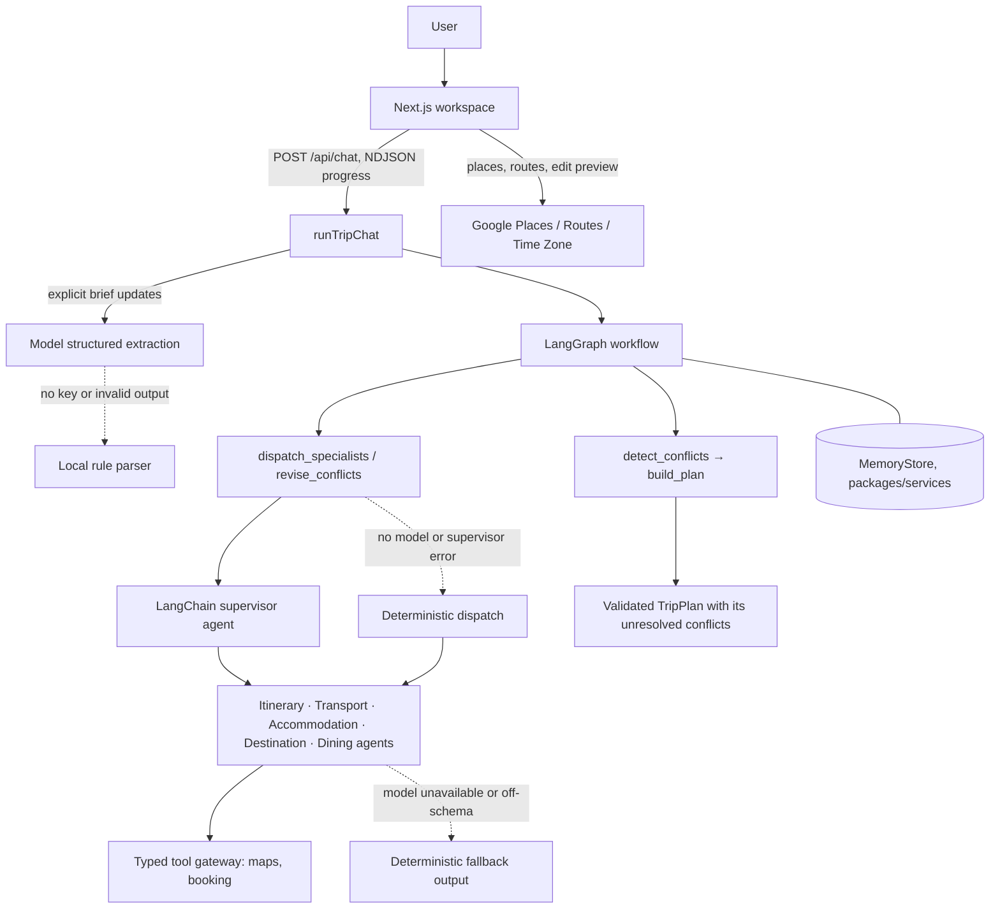
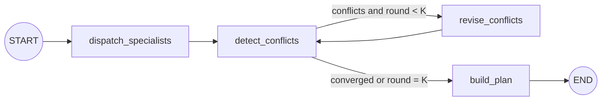

# Architecture

AI Trip Planner is one Next.js deployable backed by workspace packages. A deterministic LangGraph
workflow owns the planning control flow; LangChain agents do role-specific reasoning inside it.

## Runtime flow



The LangGraph workflow drives the supervisor, not the other way round: the graph decides when to
dispatch, revise and stop, and the supervisor only chooses which specialist tools a node needs. The
control path, budget red lines and stopping condition never depend on a model improvising the next
step.

1. `POST /api/chat` calls `runTripChat` (`packages/orchestrator/src/chat.ts`). It extracts only
   explicit `TripBrief` updates from the message. `mode: "plan"` skips extraction and plans the
   submitted brief; `mode: "start"` requires every brief field in the message (see
   [API](api.md)).
2. The workflow runs the specialists, detects conflicts, revises targeted specialists for up to
   `maxRounds` rounds and assembles a `TripPlan` whose sections carry their own draft/needs-you state
   and whose `conflicts` list any request still unresolved.
3. Progress events stream to the browser as NDJSON; the final frame carries `{ reply, plan }`.
4. There is no confirmation step: the traveller changes a plan by saying so in chat or editing the
   itinerary, and nothing in the product asks them to approve a checkpoint. Map lookups and itinerary
   edit previews use the Google routes in `apps/web` and never re-run the planner.

## LangGraph workflow



The compiled graph lives in `packages/orchestrator/src/workflow.ts`. It carries `brief`, `round`,
`proposals`, `conflicts` and the final `plan`. Shared contracts and the internal `StateSchema` both use Zod 4
(`zod` 4.5); `packages/shared` imports the `zod` entry point and the orchestrator imports `zod/v4`.
Specialist proposals, the brief and the final plan are re-validated at the graph boundaries with
`AgentProposalSchema.parse`, `TripBriefSchema.parse` and `TripPlanSchema.parse`.

- `dispatch_specialists` asks the supervisor to delegate to the registered specialists. When no
  model is configured or the supervisor fails, it invokes every specialist directly with
  `Promise.all`.
- `detect_conflicts` combines budget overruns, structured cross-agent schedule overlaps and geography
  conflicts reported after itinerary route-duration checks.
- `revise_conflicts` runs only targeted specialists with `supportsRevision`, passing an immutable
  `revision` request through the same `invoke` entry point, through the revision supervisor or
  directly.
- A conditional edge repeats detection and revision up to `maxRounds` (default `3`).
- `build_plan` rolls up costs (`budget.ts`), marks each section `needs_you` when a revision request
  still targets it and `draft` otherwise, and assembles the plan.
- Specialists, tools, memory and the round limit are injectable through `OrchestratorOptions`.

`packages/orchestrator/tests/budget.test.ts` shows the loop firing: the orchestrator's `DEMO_BRIEF` is
over budget in round 1 and converges in round 2, while a much lower budget stops at `K = 3` with an
unresolved conflict request. `plan.round` records how many rounds ran.

## Agents and models

Every specialist implements the framework-neutral `Specialist` contract
(`packages/shared/src/agent.ts`): one immutable `invoke({ brief, context, revision? })` entry point for
initial plans and revisions. An agent owns a durable role definition: model, `name`,
`systemPrompt`, tools and output schema. The supervisor must not rewrite the brief or invent facts.

| Agent         | Responsibility                                                        | Implementation                         |
| ------------- | --------------------------------------------------------------------- | -------------------------------------- |
| Itinerary     | Grounded day-by-day schedule, pacing and route feasibility            | Model agent with evidence tools        |
| Destination   | Attractions, customs, safety, entry/health checks and packing context | Model agent with evidence tools        |
| Dining        | Grounded venues, dietary preferences and meal budget                  | Model agent with evidence tools        |
| Transport     | Flights, inter-city/local routes and timing                           | Agent around deterministic calculators |
| Accommodation | Lodging search, comparison and room allocation                        | Agent around deterministic calculators |

Transport and accommodation wrap calculators so models cannot invent prices, routes or properties.

Model routing (`MODEL_ROUTING` in `packages/agents/src/models.ts` and `chat.ts`):

- **DeepSeek** (`DEEPSEEK_API_KEY`): everything that runs a model — brief extraction from chat, all
  five specialists, the supervisor, the revision supervisor and the natural-language chat reply —
  through LangChain's OpenAI-compatible adapter.
- **MiniMax**: configured but not routed; it was too slow for page-level planning. See
  `.env.example` for its account caveats.

Dates are read by the model, not by patterns: extraction converts whatever shape the traveller writes
into `YYYY-MM-DD`, takes the next occurrence for a date written without a year, and leaves the dates
unset when only one end is given or the day and month cannot be told apart (`01/10/2026`), so the
traveller is asked instead of planned a trip on a guessed month. Without a key, or when a model call
fails, a small English/Chinese rule parser handles extraction instead; it only reads ISO dates.

A blank conversation that has not stated everything needed to plan is a question, not a failure:
`runTripChat` throws `IncompleteBriefError` carrying the fields understood so far and a follow-up
question written by the reply model in the traveller's own language. `/api/chat` streams it as a
`needs_info` frame, the client shows it as an assistant message, fills the preferences form with what
was understood, and sends those fields back as `ChatRequest.known` with the next message, which is
merged under that message's own extraction. So "悉尼三日游" is answered with a question about dates,
travellers and budget, and the reply only has to supply those.

When a key is missing, a model call fails or output is off-schema, the step falls back to validated
deterministic output, so planning requests still complete. Schema, budget, schedule and route checks
gate every proposal before aggregation.

## Contracts and dependency injection

Shared contracts live in `packages/shared/src/`:

- `contracts.ts`: `TripBrief`, `AgentProposal`, `ProposalItem`, `RevisionRequest`.
- `plan.ts`: `TripPlan`, `TripSection` and `TripProposal`.
- `chat.ts`: `ChatRequest`, `ChatResponse` and progress events.
- `ports.ts`: `ToolGateway`, `MapsPort`, `BookingPort`, `WeatherPort` and `MemoryStore`.

Agents receive `ctx.tools` (`ToolGateway`) and `ctx.mem` (`MemoryStore`) through `AgentContext`. Do
not import the singletons; take them from `ctx` so tests can pass fakes. The tool gateway
(`packages/tools/src/gateway.ts`) chooses in-process fixtures (`USE_MOCK_TOOLS=true`) or the real
OpenStreetMap and Google maps adapters; booking routes through SerpApi Google Hotels/Flights when
configured, with Google Places estimates or fixtures as explicitly labelled fallbacks. `MemoryStore`
(`packages/services/src/memory`) uses the Redis REST store when configured and process memory
otherwise. Each package's exports and configuration are in its own `README.md`.

Do not change `packages/shared` without telling the team; every package depends on it.

## Design rules

1. Use LangChain JS/TypeScript `createAgent`; do not add a Python runtime or another agent framework.
2. Keep prompts limited to durable role and safety instructions. Pass trip data as messages, context
   or typed tool results.
3. Keep LangGraph responsible for state, retries and conflict validation.
4. Preserve deterministic fallbacks and validate every model and tool boundary.
5. Keep the public `TripBrief`, `AgentProposal` and `TripPlan` contracts stable.

## Verification

```bash
pnpm --filter @trip/orchestrator test
pnpm --filter @trip/agents test
pnpm typecheck
pnpm build
```

The workflow tests cover the named graph topology, stable `TripPlan` output, concurrent targeted
revisions, round-limit escalation and invalid configuration.

## Design model

The ELEC5620 UML design model is in [`design/class-diagram.md`](design/class-diagram.md), with the
rendered diagrams in [`design/diagrams/`](design/diagrams/): structural spine, domain model,
specialists and orchestration, ports and adapters, class model with use cases, combined architecture
map and use-case diagram.
