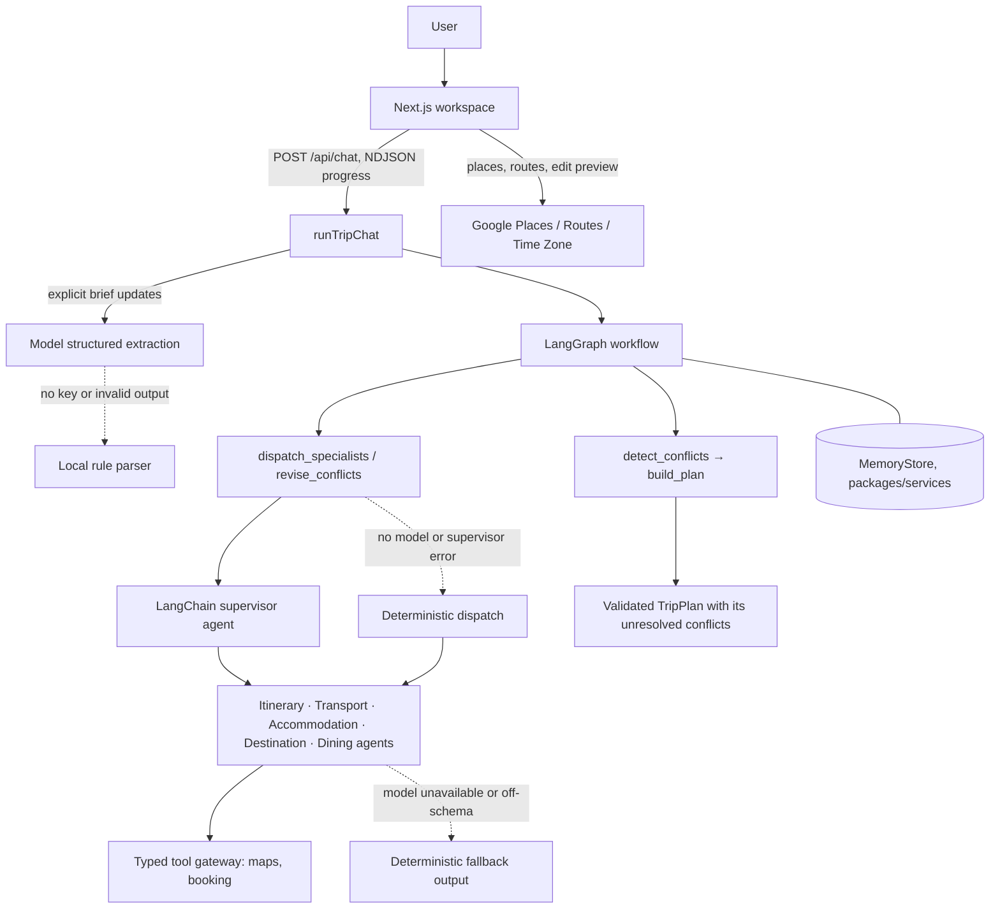
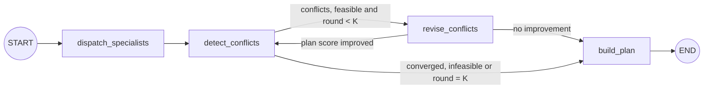

# Architecture

AI Trip Planner is one Next.js deployable backed by workspace packages. A deterministic LangGraph
workflow owns the planning control flow; LangChain agents do role-specific reasoning inside it.

## Change entry points

Use this map to find the owner of a change before editing. Package READMEs document their exports and
configuration; [development](development.md) owns setup, directory and verification rules.

| Change area                                        | Start here                                 | Follow through                                                                                                                                     |
| -------------------------------------------------- | ------------------------------------------ | -------------------------------------------------------------------------------------------------------------------------------------------------- |
| Chat requests and streamed replies                 | `apps/web/app/api/chat/route.ts`           | `packages/orchestrator/src/chat.ts`, shared chat contract, and the chat UI                                                                         |
| Planning state, conflict checks or specialist flow | `packages/orchestrator/src/workflow.ts`    | `packages/agents/src/`, validated plan contract, persistence and workspace consumer                                                                |
| Shared request, proposal or plan shape             | `packages/shared/src/`                     | Every producer and consumer; add an Agent Note in the same change                                                                                  |
| Maps, booking or weather evidence                  | `packages/tools/src/gateway.ts`            | Typed ports, provider adapters, fallback labels and agent consumers; use [add-provider](../.agents/skills/add-provider/SKILL.md) for provider work |
| Saved chats, preferences or trips                  | `packages/services/src/`                   | Browser storage, API routes and workspace restore behavior                                                                                         |
| Visible workspace or interaction behavior          | `apps/web/components/` and `apps/web/lib/` | [Workspace UI](workspace-ui.md), design rules and [ui-verification](../.agents/skills/ui-verification/SKILL.md)                                    |

For changes that cross these boundaries, trace the value from its producer to the final user-facing
consumer with [end-to-end-feature-wiring](../.agents/skills/end-to-end-feature-wiring/SKILL.md).

## Runtime flow



The LangGraph workflow drives the supervisor, not the other way round: the graph decides when to
dispatch, revise and stop, and the supervisor only chooses which specialist tools a node needs. The
control path, budget red lines and stopping condition never depend on a model improvising the next
step.

1. `POST /api/chat` calls `runTripChat` (`packages/orchestrator/src/chat.ts`). It extracts only
   explicit `TripBrief` updates from the message. `mode: "plan"` skips extraction and plans the
   submitted brief; `mode: "start"` requires every brief field in the message (see
   [API](api.md)).
2. The workflow runs the specialists, detects conflicts, revises targeted specialists for up to
   `maxRounds` rounds and assembles a `TripPlan` whose sections carry their own draft/needs-you state
   and whose `conflicts` list any request still unresolved.
3. Progress events stream to the browser as NDJSON; the final frame carries `{ reply, plan }`.
4. There is no confirmation step: the traveller changes a plan by saying so in chat or editing the
   itinerary, and nothing in the product asks them to approve a checkpoint. Map lookups and itinerary
   edit previews use the Google routes in `apps/web` and never re-run the planner.

## LangGraph workflow



The compiled graph lives in `packages/orchestrator/src/workflow.ts`. It carries `brief`, `round`,
`proposals`, `conflicts`, `stalled` and the final `plan`. Shared contracts and the internal `StateSchema` both use Zod 4
(`zod` 4.5); `packages/shared` imports the `zod` entry point and the orchestrator imports `zod/v4`.
Specialist proposals, the brief and the final plan are re-validated at the graph boundaries with
`AgentProposalSchema.parse`, `TripBriefSchema.parse` and `TripPlanSchema.parse`.

- `dispatch_specialists` asks the supervisor to delegate to the registered specialists. When no
  model is configured or the supervisor fails, it invokes every specialist directly. Either way each
  call runs through the planning board (`packages/orchestrator/src/board.ts`): accommodation waits
  for transport, and itinerary and dining wait for both, but only for specialists already started in
  the same turn. Each call receives the others' proposals as `board` and, for accommodation,
  itinerary and dining, an `allocation`: its share (0.4, 0.4, 0.2) of the budget left after the
  stages it waited for. On a multi-city trip the itinerary takes each day's city from the inter-city
  hop transport scheduled (`citiesByDay`); a hop day allows both cities, and a draft with a stop in
  another city is sent back to the model with that reason.
- `detect_conflicts` combines budget overruns, structured cross-agent schedule overlaps and geography
  conflicts reported after itinerary route-duration checks. An overrun is spread in AUD
  (`targetSaving`) over each section's room to cut, its cost less its `floorCost`. When the sum of
  floors already exceeds the budget it returns one `infeasible budget` conflict naming that minimum,
  and the graph stops revising.
- `revise_conflicts` runs only targeted specialists with `supportsRevision`, passing an immutable
  `revision` request, the specialist's `previous` proposal, the `board` and, for a budget cut, an
  `allocation` of its last cost less `targetSaving`, through the revision supervisor or directly.
  A round is kept only when `planScore` (AUD over budget plus a tenth of the budget per other
  conflict) improves; otherwise the previous proposals stand and the loop stops.
- A conditional edge repeats detection and revision up to `maxRounds` (default `3`).
- `build_plan` rolls up costs (`budget.ts`), marks each section `needs_you` when a revision request
  still targets it and `draft` otherwise, and assembles the plan.
- Specialists, tools, memory and the round limit are injectable through `OrchestratorOptions`.

The coordinator's reply reads a digest of the plan that includes every unresolved conflict with its
fix (`planDigest` in `packages/orchestrator/src/chat.ts`), so an infeasible budget is answered with
the estimated total and the minimum budget it needs. Without a model, and in `mode: "plan"`, the
fallback reply states the same minimum.

`packages/orchestrator/tests/budget.test.ts` shows the staging at work: the orchestrator's
`DEMO_BRIEF` fits its budget in round 1, and a much lower budget stops in round 1 with one
`infeasible budget` conflict naming the minimum. `plan.round` records how many rounds ran. The
decision is recorded in
[Specialists plan in stages over a shared board](../.agents/notes/implemented/architecture/2026-09-26-coordinated-specialist-planning.md).

## Agents and models

Every specialist implements the framework-neutral `Specialist` contract
(`packages/shared/src/agent.ts`): one immutable `invoke({ brief, context, revision? })` entry point for
initial plans and revisions. An agent owns a durable role definition: model, `name`,
`systemPrompt`, tools and output schema. The supervisor must not rewrite the brief or invent facts.

| Agent         | Responsibility                                                        | Implementation                         |
| ------------- | --------------------------------------------------------------------- | -------------------------------------- |
| Itinerary     | Grounded day-by-day schedule, pacing and route feasibility            | Model agent with evidence tools        |
| Destination   | Attractions, customs, safety, entry/health checks and packing context | Model agent with evidence tools        |
| Dining        | Grounded venues, dietary preferences and meal budget                  | Model agent with evidence tools        |
| Transport     | Flights, inter-city/local routes and timing                           | Agent around deterministic calculators |
| Accommodation | Lodging search, comparison and room allocation                        | Agent around deterministic calculators |

Transport and accommodation wrap calculators so models cannot invent prices, routes or properties.

Model routing (`MODEL_ROUTING` in `packages/agents/src/models.ts` and `chat.ts`):

- **DeepSeek** (`DEEPSEEK_API_KEY`): everything that runs a model — brief extraction from chat, all
  five specialists, the supervisor, the revision supervisor and the natural-language chat reply —
  through LangChain's OpenAI-compatible adapter.
- **MiniMax**: configured but not routed; it was too slow for page-level planning. See
  `.env.example` for its account caveats.

Dates are read by the model, not by patterns: extraction converts whatever shape the traveller writes
into `YYYY-MM-DD`, takes the next occurrence for a date written without a year, and leaves the dates
unset when only one end is given or the day and month cannot be told apart (`01/10/2026`), so the
traveller is asked instead of planned a trip on a guessed month. Without a key, or when a model call
fails, a small English/Chinese rule parser handles extraction instead; it only reads ISO dates.

A blank conversation that has not stated everything needed to plan is a question, not a failure:
`runTripChat` throws `IncompleteBriefError` carrying the fields understood so far and a follow-up
question written by the reply model in the traveller's own language. `/api/chat` streams it as a
`needs_info` frame, the client shows it as an assistant message, fills the top-bar trip fact chips with what
was understood, and sends those fields back as `ChatRequest.known` with the next message, which is
merged under that message's own extraction. So "悉尼三日游" is answered with a question about dates,
travellers and budget, and the reply only has to supply those.

`TripBrief.preferences` (and the same field on `known`) carries the traveller's own trip
preferences, written in the top bar's Trip preferences editor. The coordinator's `update_trip_brief`
tool has no field for them, so a model cannot rewrite the list; `BriefPatchSchema` carries them from
`known` into the planned brief. The supervisor is told to pass each one into the objectives it bears
on, and every specialist receives them in its evidence or payload with one shared rule
(`packages/agents/src/prompts/traveller-preferences.ts`): weigh them where the evidence allows, say
when one could not be met, and never treat one as a verified fact.

A message can carry up to four attachments. Images reach the coordinator as content blocks and text
files are inlined into its message; only the coordinator sees them, the specialists' inputs are
unchanged, and the offline path ignores images while still reading the inlined text. Sizes and
accepted media types are enforced in `packages/shared/src/chat.ts` and listed in [API](api.md).

For a genuine ambiguity with concrete choices, the coordinator can instead call `ask_user_question`
(`packages/orchestrator/src/chat.ts`), which throws `AskUserError` and streams a `ChatAskUser` frame
(`type: "ask_user"`, 1–4 questions, `known`, and the client's `plan` unchanged); the client renders a
question card in the composer's place and sends the traveller's answers as the next message. See
[DSH thinking UI §3.2](design/dsh-thinking-ui.md#32-asking-the-traveller).

When a key is missing, a model call fails or output is off-schema, the step falls back to validated
deterministic output, so planning requests still complete. Schema, budget, schedule and route checks
gate every proposal before aggregation.

## Contracts and dependency injection

Shared contracts live in `packages/shared/src/`:

- `contracts.ts`: `TripBrief`, `AgentProposal`, `ProposalItem`, `RevisionRequest`.
- `plan.ts`: `TripPlan`, `TripSection` and `TripProposal`.
- `chat.ts`: `ChatRequest`, `ChatResponse`, progress events, the `ChatAskUser` structured-question frame, and `Attachment` with its limits.
- `ports.ts`: `ToolGateway`, `MapsPort`, `BookingPort`, `WeatherPort` and `MemoryStore`.

Agents receive `ctx.tools` (`ToolGateway`) and `ctx.mem` (`MemoryStore`) through `AgentContext`. Do
not import the singletons; take them from `ctx` so tests can pass fakes. The tool gateway
(`packages/tools/src/gateway.ts`) chooses in-process fixtures (`USE_MOCK_TOOLS=true`) or the real
OpenStreetMap and Google maps adapters; booking routes through SerpApi Google Hotels/Flights when
configured, with Google Places estimates or fixtures as explicitly labelled fallbacks. `MemoryStore`
(`packages/services/src/memory`) uses the Redis REST store when configured and process memory
otherwise. Each package's exports and configuration are in its own `README.md`.

Do not change `packages/shared` without telling the team; every package depends on it.

## Design rules

1. Use LangChain JS/TypeScript `createAgent`; do not add a Python runtime or another agent framework.
2. Keep prompts limited to durable role and safety instructions. Pass trip data as messages, context
   or typed tool results.
3. Keep LangGraph responsible for state, retries and conflict validation.
4. Preserve deterministic fallbacks and validate every model and tool boundary.
5. Keep the public `TripBrief`, `AgentProposal` and `TripPlan` contracts stable.

## Verification

The commands below are existing package regression checks. For new complex user-facing behavior,
follow the [E2E-first testing approach](development.md#testing-approach) and retain a repeatable
artifact.

```bash
pnpm --filter @trip/orchestrator test
pnpm --filter @trip/agents test
pnpm typecheck
pnpm build
```

The workflow tests cover the named graph topology, stable `TripPlan` output, concurrent targeted
revisions, round-limit escalation and invalid configuration.

## Design model

The ELEC5620 UML design model is in [`design/class-diagram.md`](design/class-diagram.md), with the
rendered diagrams in [`design/diagrams/`](design/diagrams/): structural spine, domain model,
specialists and orchestration, ports and adapters, class model with use cases, combined architecture
map and use-case diagram.
