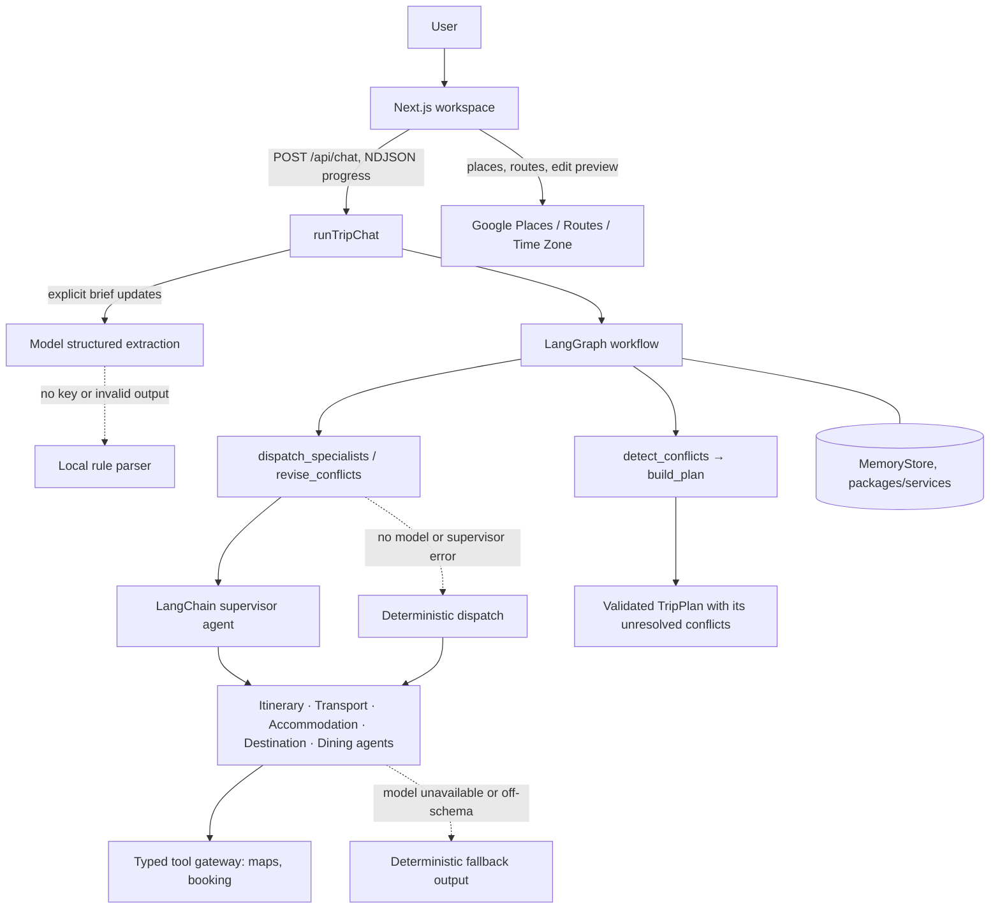
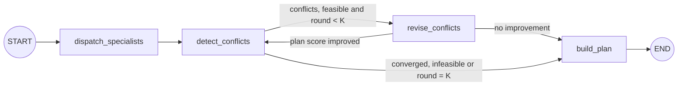

# Architecture

English | [中文](architecture.zh.md)

AI Trip Planner is one Next.js deployable backed by workspace packages. A deterministic LangGraph
workflow owns the planning control flow; LangChain agents do role-specific reasoning inside it.
For interactive views of the request, agent, provider, persistence and workspace flows, see the
[architecture diagram index](architecture-diagrams.md).

## Change entry points

Use this map to find the owner of a change before editing. Package READMEs document their exports and
configuration; [development](development.md) owns setup, directory and verification rules.

| Change area                                        | Start here                                 | Follow through                                                                                                                                     |
| -------------------------------------------------- | ------------------------------------------ | -------------------------------------------------------------------------------------------------------------------------------------------------- |
| Chat requests and streamed replies                 | `apps/web/app/api/chat/route.ts`           | `packages/orchestrator/src/chat.ts`, shared chat contract, and the chat UI                                                                         |
| Planning state, conflict checks or specialist flow | `packages/orchestrator/src/workflow.ts`    | `packages/agents/src/`, validated plan contract, persistence and workspace consumer                                                                |
| Shared request, proposal or plan shape             | `packages/shared/src/`                     | Every producer and consumer; add an Agent Note in the same change                                                                                  |
| Maps, booking or weather evidence                  | `packages/tools/src/gateway.ts`            | Typed ports, provider adapters, fallback labels and agent consumers; use [add-provider](../.agents/skills/add-provider/SKILL.md) for provider work |
| Saved chats, preferences or trips                  | `packages/services/src/`                   | Browser storage, API routes and workspace restore behavior                                                                                         |
| Visible workspace or interaction behavior          | `apps/web/components/` and `apps/web/lib/` | [Workspace UI](workspace-ui.md), design rules and [ui-verification](../.agents/skills/ui-verification/SKILL.md)                                    |

For changes that cross these boundaries, trace the value from its producer to the final user-facing
consumer with [end-to-end-feature-wiring](../.agents/skills/end-to-end-feature-wiring/SKILL.md).

## Runtime flow


```mermaid
flowchart TB
    U[User] --> UI[Next.js workspace]
    UI -->|POST /api/chat, NDJSON progress| CHAT[runTripChat]
    CHAT -->|explicit brief updates| EX[Model structured extraction]
    EX -.->|no key or invalid output| LP[Local rule parser]
    CHAT --> WF[LangGraph workflow]
    WF --> DISPATCH[dispatch_specialists / revise_conflicts]
    DISPATCH --> SUP[LangChain supervisor agent]
    DISPATCH -.->|no model or supervisor error| DIRECT[Deterministic dispatch]
    SUP --> SPEC[Itinerary · Transport · Accommodation · Destination · Dining agents]
    DIRECT --> SPEC
    SPEC --> TOOLS[Typed tool gateway: maps, booking]
    SPEC -.->|model unavailable or off-schema| FB[Deterministic fallback output]
    WF --> CONF[detect_conflicts → build_plan]
    WF --- MEM[(MemoryStore, packages/services)]
    CONF --> PLAN[Validated TripPlan with its unresolved conflicts]
    UI -->|places, routes, edit preview| GOOGLE[Google Places / Routes / Time Zone]
```

The LangGraph workflow drives the supervisor, not the other way round: the graph decides when to
dispatch, revise and stop, and the supervisor only chooses which specialist tools a node needs. The
control path, budget red lines and stopping condition never depend on a model improvising the next
step.

1. `POST /api/chat` calls `runTripChat` (`packages/orchestrator/src/chat.ts`). It extracts only
   explicit `TripBrief` updates from the message. `mode: "plan"` skips extraction and plans the
   submitted brief; `mode: "start"` requires every brief field in the message (see
   [API](api.md)).
2. The workflow runs the specialists, detects conflicts, revises targeted specialists for up to
   `maxRounds` rounds and assembles a `TripPlan` whose sections carry their own draft/needs-you state
   and whose `conflicts` list any request still unresolved.
3. Progress events stream to the browser as NDJSON; the final frame carries `{ reply, plan }`.
4. There is no confirmation step: the traveller changes a plan by saying so in chat or editing the
   itinerary, and nothing in the product asks them to approve a checkpoint. Map lookups and itinerary
   edit previews use the map routes in `apps/web` and never re-run the planner.

## Web map providers

The web workspace's place search, place details, place photos, leg routes, route from the
traveller's location and destination time zone go through one `MapProvider` interface in
`apps/web/lib/map-provider/`. Google Maps Platform answers first. When Google cannot answer, a free
OpenStreetMap-based provider answers instead: Photon/Nominatim supply search and details, Commons
supplies optional licensed photos, OSRM supplies walking/cycling/driving, Transitous supplies public
transport, and coordinates resolve time zones offline. The
[completion decision](../.agents/notes/implemented/architecture/2026-10-10-complete-map-fallback.md)
records the boundary.

- **Unavailable** means: no `MAPS_API_KEY`; Google refuses access (401, 403, an invalid key, the API
  disabled or billing off); the quota is exhausted (429, or a Time Zone `OVER_QUERY_LIMIT`); a Google
  server error (5xx); a timeout or network failure. An empty search, an unknown place (400 or 404) or
  an authored refusal is an answer and never falls back.
- **Cool-down:** after an access or quota failure the server skips Google for
  `GOOGLE_MAPS_COOLDOWN_SECONDS` (default 300) and then tries it again. The cool-down is held in each
  server process's memory.
- **Selection:** `WEB_MAPS_PROVIDER` is `google-with-fallback` (default), `google` (never falls
  back) or `osm`. It is separate from the agents' `MAPS_PROVIDER`.
- **Place ids** are provider-scoped strings: `osm:node/123`, `osm:way/456`, `osm:relation/789`; an id
  without a prefix is Google's. Details, photos and routes for an id go only to the provider that
  issued it.
- **Provenance:** `/api/places/search` and `/api/places/details` answer with a `source` field
  (`google` or `osm`), `/api/places/photo` sends an `X-Map-Provider` header with its redirect, and
  every route result carries `source`. Paths and the rest of each response are unchanged.
- **Mock data mode:** `MOCK_GOOGLE_MAPS=unavailable` makes the Google provider fail as unavailable
  without calling Google, for requests in mock data mode (the `x-trip-data-mode` header, else
  `USE_MOCK_TOOLS`). It is ignored in live mode. Edit previews in mock mode keep their placeholder
  fixtures and never reach a provider, unless Google is simulated down or `WEB_MAPS_PROVIDER=osm`;
  then the provider answers from the OpenStreetMap fixtures and still calls nothing.

### Routes and time zones without Google

- **Walking and driving** come from OSRM. Walking asks the foot profile of `OSRM_FOOT_BASE_URL`
  (default `https://routing.openstreetmap.de/routed-foot`, the FOSSGIS foot instance) and driving asks
  `OSRM_BASE_URL` (default `https://router.project-osrm.org`). The public demo server routes cars only
  and ignores the profile it is asked for, so it is never used for walking. Either base URL can point at
  a self-hosted or paid OSRM instance.
- **Cycling** uses the bike profile of `OSRM_BIKE_BASE_URL` (default
  `https://routing.openstreetmap.de/routed-bike`), independently of the foot and car instances.
  The timeline stores the chosen mode as `cycle`; Google receives `BICYCLE` when available.
- **Transit** uses Transitous/MOTIS `GET /api/v6/plan`, with coordinates and a departure instant.
  Only an itinerary containing a transit leg supplies a duration; walking-only results mean no route.
  Empty results and provider failures never become estimated transit times. Transitous answers carry
  `source: "transitous"` and link its data sources in the interface.
- **Provenance:** a route answered by OSRM says `source: "osrm"`, and the timeline labels its time
  `OSRM` (Google's times are labelled `Google`). The route from the traveller's position says
  `OSRM routes` on the map. A leg saved in the plan keeps no service label, because `arriveBy` has no
  provider field, which would be a shared contract change; only routes answered by the current edit
  carry one.
- **Failures:** OSRM answering `NoRoute` is an answer, a leg with no route. A server error, a timeout,
  a network failure or an answer with no duration is unavailable; the leg keeps no time and shows a
  notice with a retry. Nothing is estimated in its place.
- **Cache and limits:** an answered leg is kept in server memory for 10 minutes, and a failure is not
  cached. The OSRM policy asks for at most one request a second; this client does not throttle itself,
  so the cache is the only brake, and a busy deployment should self-host.
- **Time zones** are worked out offline with `@photostructure/tz-lookup` (CC0 data, no network call)
  when Google's Time Zone call fails. Its borders are simplified, so a point a few kilometres from a
  border can get the neighbouring zone. A place without coordinates has no zone and is refused, never
  assumed to be UTC.
- **Mock data mode:** with `MOCK_GOOGLE_MAPS=unavailable`, edit previews route and time their legs
  through the provider, which answers OSRM from fixtures (straight-line distance at a walking or driving
  pace, `apps/web/lib/map-provider/mock-osm.ts`) and places from the same file. No OSRM request is sent.

### Free services: limits and terms

Checked on 2026-10-09 against each operator's published policy. These services offer no SLA, and
every one of them can throttle or block a client that ignores its policy.

| Service                                                                                                       | Used for                            | Limits and terms                                                                                                                                                                                                                                                        |
| ------------------------------------------------------------------------------------------------------------- | ----------------------------------- | ----------------------------------------------------------------------------------------------------------------------------------------------------------------------------------------------------------------------------------------------------------------------- |
| [OpenFreeMap](https://openfreemap.org/)                                                                       | Vector map tiles (MapLibre)         | No key, no registration and no published request limit; commercial use allowed; no SLA. MapLibre's attribution control satisfies the credit; other clients show "OpenFreeMap © OpenMapTiles Data from OpenStreetMap".                                                   |
| [Photon](https://github.com/komoot/photon) (`photon.komoot.io`)                                               | Place search                        | Free "as long as the number of requests stay in a reasonable limit"; extensive use is throttled or banned; no numeric limit published; no availability guarantee. Self-host for volume.                                                                                 |
| [Nominatim](https://operations.osmfoundation.org/policies/nominatim/)                                         | Search behind Photon, place details | At most 1 request per second for the whole application, all users together; an identifying `User-Agent` or `Referer` (library defaults refused); cache results; no client-side autocomplete; no bulk or systematic queries; ODbL attribution.                           |
| [OSRM demo server](https://github.com/Project-OSRM/osrm-backend/wiki/Demo-server) (`router.project-osrm.org`) | Driving times (cars only)           | At most 1 request per second; reasonable, non-commercial use only; no uptime or data-freshness guarantee.                                                                                                                                                               |
| [FOSSGIS OSRM](https://routing.openstreetmap.de/) (`routing.openstreetmap.de/routed-foot`)                    | Walking times                       | Public instance for fair, non-commercial use; no uptime or data-freshness guarantee; OpenStreetMap attribution. Answers are cached for 10 minutes; self-host for volume.                                                                                                |
| [Transitous](https://transitous.org/api/) (`api.transitous.org`)                                              | Public transport times              | Non-commercial, open-source projects only; a `User-Agent` naming the app, its version and a contact; ask the maintainers before heavy routing use; link [transitous.org/sources](https://transitous.org/sources/) visibly; service can stop for any client at any time. |

OpenStreetMap data is © OpenStreetMap contributors under the ODbL, so every surface that shows it
credits OpenStreetMap. The public OSRM demo and Transitous rule out commercial use: a commercial
deployment needs self-hosted or paid instances, which the base URL settings of spec #270 allow.

## Agent Lab

`/agent-lab` is a public, inspectable experiment surface separate from the saved workspace. It accepts
only registered values: the strategies (`single-agent-baseline`, `multi-agent-no-revision` and
`multi-agent-targeted-revision`), four scenarios (`tokyo-couple`, the same trip with a A$2,300 budget, a Paris
family trip and a Tokyo and Kyoto trip) and a data mode, fixture (the default) or live. `POST /api/agent-lab/runs` validates that closed request, calls `runAgentLab()` and
streams ordered NDJSON event envelopes before a final schema-versioned artifact.

The baseline is an experiment strategy above the five travel specialists, not a sixth specialist.
Its deterministic fixture produces a `TripPlan`, re-validates it against the shared contract and
records deterministic metrics. The metrics list each named check, such as budget, section count,
earliest activity start and vegetarian-marked meals, measured against the scenario's own rules, plus
the figures a comparison needs: planning rounds, tool calls, fallback sections, failed agents,
unresolved conflicts and latency. Latency excludes the pacing delay that keeps the stream watchable.

`multi-agent-no-revision` runs the real LangGraph workflow and planning board with the five registered
specialists for exactly one round (`maxRounds: 1`), so the graph assembles a plan and reports its
conflicts but never reaches `revise_conflicts`. The comparison therefore measures specialization, not
targeted revision. Each specialist's tool calls are attributed to it in the trace, the specialists
read only the scenario's own preferences through a read-only memory, and the graph's progress events
are published through the same envelope as the baseline's. The single-agent baseline replays a
scripted plan after loading its evidence once, so tool-call counts compare what each trace recorded,
not equal workloads. Fixture runs rely on an environment with no model or provider keys, where the
specialists take their deterministic path and the tools return mock fixtures; they do not read or
mutate workspace storage.

`multi-agent-targeted-revision` is the same workflow with the established bounded loop (at most three
rounds) switched on, so it reuses the workflow's conflict detection, targeted routing to the specialists
a conflict names, best-so-far scoring and infeasible-budget stop. On `tokyo-couple-tight-budget` the
first round is identical to the no-revision strategy's (same brief, evidence and specialists), finds a
feasible budget overrun, and transport alone is revised; on `tokyo-couple` there is no conflict and the
two multi-agent strategies produce the same plan. The loop's decisions reach the lab as typed facts
through the workflow's `onDecision` hook. The envelope carries the existing `AgentProgressEvent` union, so the
inspector can show graph stages, specialist lifecycle, objectives, constraints, tool summaries and
outcomes without publishing prompts or raw chain-of-thought.

Two benchmark scenarios extend the same registry. `paris-family-infeasible` asks for a Paris trip for four
travellers on A$3,000, while the shared booking evidence puts the cheapest round-trip flights (A$2,480) and
the cheapest two rooms for five nights (A$1,400) at A$3,880. The workflow finds the infeasible conflict in
round 1 and stops with `infeasible_budget`, naming that minimum, so neither multi-agent strategy spends a
revision round, and no strategy invents cheaper evidence or drops a section. Because no plan can fit, the
scenario's rules replace the `budget` and `no-conflicts` checks with `evidence-floor` and
`infeasibility-reported`, which measure whether a plan stays honest: the scripted single-agent baseline
prices the trip at the minimum but never states the shortfall, so it fails the second.
`tokyo-kyoto-multi-city` is seven nights in Tokyo and then Kyoto. Its rules add `hop-date`,
`itinerary-by-city`, `stay-transition`, `trip-dates` and `total-consistent`, derived from the cities in the
brief, which check that the train, the stays, each day's activities and the totals agree on one move.
Every artifact records the scenario's fixture version and the evaluator version (`scenario-rules-v2`); the
[Agent Note](../.agents/notes/implemented/architecture/2026-10-02-agent-lab-benchmark-scenarios.md) records the decision.

Artifact download and replay happen in the browser; no endpoint or server storage is involved. The
page saves the artifact it received, and `apps/web/lib/agent-lab/replay.ts` validates a chosen file
against the shared `AgentLabRunArtifact` contract (one schema version, contiguous events, a valid plan,
timing that never runs backwards) before replaying the recorded events at their recorded offsets. The
stored metrics are shown as recorded, not recomputed in the page; the
[Agent Note](../.agents/notes/implemented/architecture/2026-10-02-agent-lab-artifact-replay.md) explains why.

The live gate protects the public endpoint. A fixture run executes under a request-scoped mock data mode and with
models disabled (`runWithDataMode("mock")` and `runWithModelsDisabled`), both carried by AsyncLocalStorage and never
written to `process.env`, so no key and no data-mode default can make it reach a provider or a model. A live run is
allowed only when the deployment sets `AGENT_LAB_LIVE_ENABLED=true`, only for a strategy with a live implementation
(the scripted baseline has none), and only within the concurrency and hourly limits kept by
`apps/web/lib/agent-lab/live-gate.ts`; each refusal is a typed `rejected` frame sent before any run starts. A live run
executes under a live data mode with a usage collector captured when each model is built, so the usage in the artifact
is what the provider returned for every call, or is unavailable. The multi-agent strategy never publishes a model's
`agent_reasoning`. The [Agent Note](../.agents/notes/implemented/architecture/2026-10-02-agent-lab-live-gate.md) records the decision.

The Failure Lab runs five registered faults through the same strategy, trace, artifact and views. A
profile is a server-owned id bound to one scenario and strategy; the visitor never defines a fault, and
`POST /api/agent-lab/runs` rejects any other combination. Faults are wrappers around the specialists the
workflow already runs, applied outside the trace wrapper, so they pass through the same progress tools
and schema validation. The workflow itself gains only two optional facts (`agent_output_rejected`, with
field paths, and `delegation_fallback`) and an injectable `supervisorModel`. What each fault does is what
the workflow was observed to do. A flight search timeout leaves the transport section `unavailable`, unpriced,
with a conflict, and the run carries on with less. An empty stay search stops the run, because accommodation
refuses to invent a stay. An invalid dining output is rejected at the proposal schema and stops the run. A
supervisor that delegates to nobody falls back to deterministic dispatch. A revision that cannot improve the
plan leaves the best known plan and stops with `no_improvement`. A run a fault stops ends in a `failed`
artifact that keeps its trace and names the failing specialist, and that artifact downloads and replays like
any other. The [Agent Note](../.agents/notes/implemented/architecture/2026-10-02-agent-lab-failure-lab.md) records the decision.

The Trace view is the Agent Lab's reading surface for a run's ordered events. It lives only in the Agent Lab (the
chat's Think tree is unchanged) and changes no contract: everything is derived in the browser from the
`AgentLabRunEvent` envelopes the page already holds, so a replayed artifact draws the same view as the live run.
The events sit in a bounded, independently scrolling box that follows the newest event until the visitor scrolls
up. Above it, a time bar built by `apps/web/lib/agent-lab/trace-overview.ts` and drawn by
`apps/web/components/agent-lab/TraceOverview.tsx` shows the whole run as lanes in a fixed order (Run,
Coordinator, one lane per specialist, or a single Baseline lane for the single-agent strategy; empty lanes are
omitted). Each record takes one equal-width step: a tool call's start and its completion or failure merge into one
block (an in-flight call is a start marker only), failed tool calls, failed specialists and rejected output use the
error colour, and round boundaries are marked. The axis is steps, not time, because every event's `elapsedMs`
includes the stream's pacing delay; the [Agent Note](../.agents/notes/implemented/architecture/2026-10-07-agent-lab-trace-step-axis.md)
records why. Each block is a focusable button, and activating it scrolls the box to that record's row
(`data-trace-row`) and highlights it briefly. In the Compare view each strategy that produced events gets its own bar,
stacked in strategy order (baseline, no revision, targeted revision) above the columns on one shared step axis
sized to the longest run (the bar component's `domainSteps`). A step at the same index sits at the same horizontal
position in every bar, a shorter run visibly ends earlier, and a strategy that never ran (a cancelled comparison)
has no bar. Clicking a block scrolls only that strategy's own trace box. The panel still never ranks the strategies.

## LangGraph workflow


```mermaid
flowchart LR
    S((START)) --> D[dispatch_specialists]
    D --> C[detect_conflicts]
    C -->|conflicts, feasible and round < K| R[revise_conflicts]
    R -->|plan score improved| C
    R -->|no improvement| B[build_plan]
    C -->|converged, infeasible or round = K| B
    B --> E((END))
```

The compiled graph lives in `packages/orchestrator/src/workflow.ts`. It carries `brief`, `round`,
`proposals`, `conflicts`, `stalled` and the final `plan`. Shared contracts and the internal `StateSchema` both use Zod 4
(`zod` 4.5); `packages/shared` imports the `zod` entry point and the orchestrator imports `zod/v4`.
Specialist proposals, the brief and the final plan are re-validated at the graph boundaries with
`AgentProposalSchema.parse`, `TripBriefSchema.parse` and `TripPlanSchema.parse`.

- `dispatch_specialists` asks the supervisor to delegate to the registered specialists. When no
  model is configured or the supervisor fails, it invokes every specialist directly. Either way each
  call runs through the planning board (`packages/orchestrator/src/board.ts`): accommodation waits
  for transport, and itinerary and dining wait for both, but only for specialists already started in
  the same turn. Each call receives the others' proposals as `board` and, for accommodation,
  itinerary and dining, an `allocation`: its share (0.4, 0.4, 0.2) of the budget left after the
  stages it waited for. On a multi-city trip the itinerary takes each day's city from the inter-city
  hop transport scheduled (`citiesByDay`); a hop day allows both cities, and a draft with a stop in
  another city is sent back to the model with that reason. Accommodation reads the same hops
  (`scheduledHops` in `transport/legs.ts`), so each city's nights run from its arrival day to the
  next hop; without hops on the board the nights are split evenly.
- `detect_conflicts` combines budget overruns, structured cross-agent schedule overlaps and geography
  conflicts reported after itinerary route-duration checks. An overrun is spread in AUD
  (`targetSaving`) over each section's room to cut, its cost less its `floorCost`. When the sum of
  floors already exceeds the budget it returns one `infeasible budget` conflict naming that minimum,
  and the graph stops revising.
- `revise_conflicts` runs only targeted specialists with `supportsRevision`, passing an immutable
  `revision` request, the specialist's `previous` proposal, the `board` and, for a budget cut, an
  `allocation` of its last cost less `targetSaving`, through the revision supervisor or directly.
  A round is kept only when `planScore` (AUD over budget plus a tenth of the budget per other
  conflict) improves; otherwise the previous proposals stand and the loop stops.
- `OrchestratorOptions.onDecision` receives the loop's decisions as typed `WorkflowDecision` facts:
  conflicts detected (targets, reasons, score, infeasibility), revision started (objective and
  previous outcome), revision scored (before, after, kept) and loop stopped (round and reason). A
  consumer reads them instead of parsing progress prose. The hook never affects the plan, a consumer
  that throws is logged and ignored, and the chat progress protocol is unchanged. Two more facts serve the
  Failure Lab: `agent_output_rejected` when a specialist's output fails the proposal schema (field paths
  only, never values) and `delegation_fallback` when the supervisor could not delegate and the workflow
  dispatched or revised deterministically. `OrchestratorOptions.supervisorModel` delegates through a given
  model even for injected specialists.
- A conditional edge repeats detection and revision up to `maxRounds` (default `3`).
- `build_plan` rolls up costs (`budget.ts`), marks each section `needs_you` when a revision request
  still targets it and `draft` otherwise, and assembles the plan.
- Specialists, tools, memory and the round limit are injectable through `OrchestratorOptions`.

The coordinator's reply reads a digest of the plan that includes every unresolved conflict with its
fix (`planDigest` in `packages/orchestrator/src/chat.ts`), so an infeasible budget is answered with
the estimated total and the minimum budget it needs. Without a model, and in `mode: "plan"`, the
fallback reply states the same minimum.

`packages/orchestrator/tests/budget.test.ts` shows the staging at work: the orchestrator's
`DEMO_BRIEF` fits its budget in round 1, and a much lower budget stops in round 1 with one
`infeasible budget` conflict naming the minimum. `plan.round` records how many rounds ran. The
decision is recorded in
[Specialists plan in stages over a shared board](../.agents/notes/implemented/architecture/2026-09-26-coordinated-specialist-planning.md).

## Agents and models

Every specialist implements the framework-neutral `Specialist` contract
(`packages/shared/src/agent.ts`): one immutable `invoke({ brief, context, revision? })` entry point for
initial plans and revisions. An agent owns a durable role definition: model, `name`,
`systemPrompt`, tools and output schema. The supervisor must not rewrite the brief or invent facts.

| Agent         | Responsibility                                                        | Implementation                         |
| ------------- | --------------------------------------------------------------------- | -------------------------------------- |
| Itinerary     | Grounded day-by-day schedule, pacing and route feasibility            | Model agent with evidence tools        |
| Destination   | Attractions, customs, safety, entry/health checks and packing context | Model agent with evidence tools        |
| Dining        | Grounded venues, dietary preferences and meal budget                  | Model agent with evidence tools        |
| Transport     | Flights, inter-city/local routes and timing                           | Agent around deterministic calculators |
| Accommodation | Lodging search, comparison and room allocation                        | Agent around deterministic calculators |

Transport and accommodation wrap calculators so models cannot invent prices, routes or properties.
The itinerary likewise never prices a stop: Google Places publishes no admission prices, so an
activity's `estCost` is left unset and the plan says how many stops are unpriced.

Model routing (`MODEL_ROUTING` in `packages/agents/src/models.ts` and `chat.ts`):

- **DeepSeek** (`DEEPSEEK_API_KEY`): everything that runs a model — brief extraction from chat, all
  five specialists, the supervisor, the revision supervisor and the natural-language chat reply —
  through LangChain's OpenAI-compatible adapter.
- **MiniMax**: configured but not routed; it was too slow for page-level planning. See
  `.env.example` for its account caveats.

Dates are read by the model, not by patterns: extraction converts whatever shape the traveller writes
into `YYYY-MM-DD`, takes the next occurrence for a date written without a year, and leaves the dates
unset when only one end is given or the day and month cannot be told apart (`01/10/2026`), so the
traveller is asked instead of planned a trip on a guessed month. Without a key, or when a model call
fails, a small English/Chinese rule parser handles extraction instead; it only reads ISO dates.

A blank conversation that has not stated everything needed to plan is a question, not a failure:
`runTripChat` throws `IncompleteBriefError` carrying the fields understood so far and a follow-up
question written by the reply model in the traveller's own language. `/api/chat` streams it as a
`needs_info` frame, the client shows it as an assistant message, fills the top-bar trip fact chips with what
was understood, and sends those fields back as `ChatRequest.known` with the next message, which is
merged under that message's own extraction. So "悉尼三日游" is answered with a question about dates,
travellers and budget, and the reply only has to supply those.

`TripBrief.displayCurrency` (and the same field on `known`) is the last currency the traveller named for
the trip, with a budget or on its own. Both extraction paths set it: the coordinator's brief update takes
a currency without an amount, and the offline extractor uses `detectCurrency` on the message. The
browser reads one rule everywhere it picks a currency, `effectiveCurrency()` in
`packages/shared/src/money.ts`: `displayCurrency`, else `budgetSource.currency`, else the Settings
display currency. Planning, guardrails and stored amounts stay AUD; `budgetSource` keeps the stated
amount and currency; a trip never writes Settings. The server applies the same rule to the text it
writes: it takes the Settings currency from the chat request's optional `displayCurrency` (absent means
AUD), picks `effectiveCurrency(brief, request.displayCurrency ?? "AUD")` and passes the result to
`formatMoney` at every call site (specialist summaries, conflict reasons and constraints, coordinator
and specialist progress lines, budget allocation bases and the fallback replies). Specialists receive it
as `AgentContext.displayCurrency`. The facts handed to the reply model carry amounts already converted
and formatted, and its prompt says to quote them as given. Converted amounts group thousands like the
panels, and generated text for a non-AUD trip ends with an estimate note. Planning, guardrails,
conflict detection and the plan score stay AUD, and provider fares keep their own currency.

`TripBrief.preferences` (and the same field on `known`) carries the traveller's own trip
preferences, written in the top bar's Trip preferences editor. The coordinator's `update_trip_brief`
tool has no field for them, so a model cannot rewrite the list; `BriefPatchSchema` carries them from
`known` into the planned brief. The supervisor is told to pass each one into the objectives it bears
on, and every specialist receives them in its evidence or payload with one shared rule
(`packages/agents/src/prompts/traveller-preferences.ts`): weigh them where the evidence allows, say
when one could not be met, and never treat one as a verified fact.

`update_trip_brief` records what the conversation settles in three more fields:

- `learnedPreferences`: wishes the traveller states in chat, with the whole list replaced each time.
- `excludeFlights`: the traveller arranges flights.
- `bookedStay`: the traveller has booked their stay.

`specialistBrief` in `packages/orchestrator/src/supervisor.ts` appends the learned list to the
traveller's own for the specialists, deduplicated and capped at 12. The stored brief keeps the two
lists apart.

With `excludeFlights`, transport neither searches nor prices flights and raises no fare conflict.
With `bookedStay`, accommodation returns the booking unpriced without a search. The supervisor runs
the accommodation specialist even when the model skips it. Once either field is set, the coordinator
never asks about flights or other stays. The
[conversation scope note](../.agents/notes/implemented/feature/2026-09-27-conversation-scope.md)
explains why.

A message can carry up to four attachments. Images reach the coordinator as content blocks and text
files are inlined into its message; only the coordinator sees them, the specialists' inputs are
unchanged, and the offline path ignores images while still reading the inlined text. Sizes and
accepted media types are enforced in `packages/shared/src/chat.ts` and listed in [API](api.md).

For a genuine ambiguity with concrete choices, the coordinator can instead call `ask_user_question`
(`packages/orchestrator/src/chat.ts`), which throws `AskUserError` and streams a `ChatAskUser` frame
(`type: "ask_user"`, 1–4 questions, `known`, and the client's `plan` unchanged); the client renders a
question card in the composer's place and sends the traveller's answers as the next message. See
[DSH thinking UI §3.2](design/dsh-thinking-ui.md#32-asking-the-traveller).

When a key is missing, a model call fails or output is off-schema, the step falls back to validated
deterministic output, so planning requests still complete. Schema, budget, schedule and route checks
gate every proposal before aggregation.

## Contracts and dependency injection

Shared contracts live in `packages/shared/src/`:

- `contracts.ts`: `TripBrief`, `AgentProposal`, `ProposalItem`, `RevisionRequest`.
- `plan.ts`: `TripPlan`, `TripSection` and `TripProposal`.
- `chat.ts`: `ChatRequest`, `ChatResponse`, progress events, the `ChatAskUser` structured-question frame, and `Attachment` with its limits.
- `agent-lab.ts`: the closed experiment request, lifecycle event envelope, metrics and versioned run artifact.
- `ports.ts`: `ToolGateway`, `MapsPort`, `BookingPort`, `WeatherPort` and `MemoryStore`.

Agents receive `ctx.tools` (`ToolGateway`) and `ctx.mem` (`MemoryStore`) through `AgentContext`. Do
not import the singletons; take them from `ctx` so tests can pass fakes. The tool gateway
(`packages/tools/src/gateway.ts`) snapshots provider configuration once for a planning run and
composes its ports. The Maps port then privately selects in-process fixtures
(`USE_MOCK_TOOLS=true`), OpenStreetMap or Google and owns route/places capability plus transit,
inter-city rail and driving fallback. The Booking port privately selects fixture or live adapters
once per gateway. Live hotels use SerpApi first and retain the labelled Google Places estimate
fallback; live flights remain SerpApi-only and never receive a fictional fallback fare. Missing
credentials fail only when the corresponding Booking capability is called. The Weather port uses
the same captured configuration and clock to return fixture weather, Google Weather forecasts for
days 0–10, Open-Meteo forecasts for days 11–14, or Open-Meteo historical climate context after
day 14. A missing near-date credential fails only when that forecast is requested. `MemoryStore`
(`packages/services/src/memory`) uses the Redis REST store when configured and process memory
otherwise. Each package's exports and configuration are in its own `README.md`.

The `@trip/tools` package entry point exposes the zero-argument gateway factory and request-mode
helpers, but not raw Maps, Booking or Weather adapters. Production specialists use `ctx.tools` for
provider evidence; their remaining request-mode reads only label presentation-only fallback facts.
The [provider-selection decision](../.agents/notes/implemented/architecture/2026-10-03-deep-provider-selection.md)
records this boundary and its deliberately unchanged shared contracts.

Do not change `packages/shared` without telling the team; every package depends on it.

## Workspace state

The planning workspace (`apps/web/components/workspace/useWorkspace.ts`) hands its views four
groups and no raw state setters:

- `session`: the open chat and trip and its actions (`send`, `answer`, `retry`, `applyEdit`,
  `selectTrip`, `selectConversation`, `newChat`, `newTrip`, stop selection). Every change goes
  through the pure `session(state, event)` in `apps/web/lib/workspace/session.ts`; `applyEdit(next)`
  records the total it replaced, and opening a chat or trip resets the session in one event.
- `layout`: the Surface from `layout()` in `apps/web/lib/workspace/layout.ts`, its actions, panel
  sizes and the phone map's day.
- `itinerary`: the open trip's Itinerary (`apps/web/lib/trip/itinerary.ts`).
- `history`: saved chats and trips, search, rename, delete and the storage state.

An action that changes two groups, such as opening a trip (which also decides what is on screen) or
picking a phone map day (which drops a stop selected on another day), is written once in the hook.
Phone components call these actions instead of setting state.

## Design rules

1. Use LangChain JS/TypeScript `createAgent`; do not add a Python runtime or another agent framework.
2. Keep prompts limited to durable role and safety instructions. Pass trip data as messages, context
   or typed tool results.
3. Keep LangGraph responsible for state, retries and conflict validation.
4. Preserve deterministic fallbacks and validate every model and tool boundary.
5. Keep the public `TripBrief`, `AgentProposal` and `TripPlan` contracts stable.

## Verification

The commands below are existing package regression checks. For new complex user-facing behavior,
follow the [E2E-first testing approach](development.md#testing-approach) and retain a repeatable
artifact.

```bash
pnpm --filter @trip/orchestrator test
pnpm --filter @trip/agents test
pnpm typecheck
pnpm build
```

The workflow tests cover the named graph topology, stable `TripPlan` output, concurrent targeted
revisions, round-limit escalation and invalid configuration.

## Design model

The ELEC5620 UML design model is in [`design/class-diagram.md`](design/class-diagram.md), with the
rendered diagrams in [`design/diagrams/`](design/diagrams/): structural spine, domain model,
specialists and orchestration, ports and adapters, class model with use cases, combined architecture
map and use-case diagram.

### Completed free map path

The browser tries Google first, then loads MapLibre with OpenFreeMap vector tiles when its key, SDK or
authorization fails. Explicit OSM selection bypasses Google. Both renderers share framing, numbered
markers, selection, nearby routes, responsive resizing and theme controls; satellite is Google-only.
MapLibre workers are bundled locally. Mock fallback maps use a tile-free local style.

Photon searches are scoped to the resolved destination. Photon failures use Nominatim; valid empty
answers stay empty. Chinese requests use Nominatim with `accept-language=zh`. Nominatim search and
lookup share a process-wide queue with starts at least one second apart, a ten-minute answer cache,
and an identifying contact header. Details receive the interface language too, and their cache keys include it. Multi-instance deployments need a shared limiter or a self-hosted
endpoint. `PHOTON_BASE_URL`, `NOMINATIM_BASE_URL` and `OSM_USER_AGENT` configure them.

OSM cards expose only available address, category, opening hours, website and phone, with OSM credit;
ratings are absent. A tagged Wikimedia file or Wikidata P18 image is optional and requires an author,
license and license link. Photo failures leave a complete text card. Photo names and metadata remain
in memory. A saved stop keeps only its provider ID and `savedPlace` name, address and coordinates, so
a Google stop can still be displayed and routed by coordinates while Google is unavailable.
