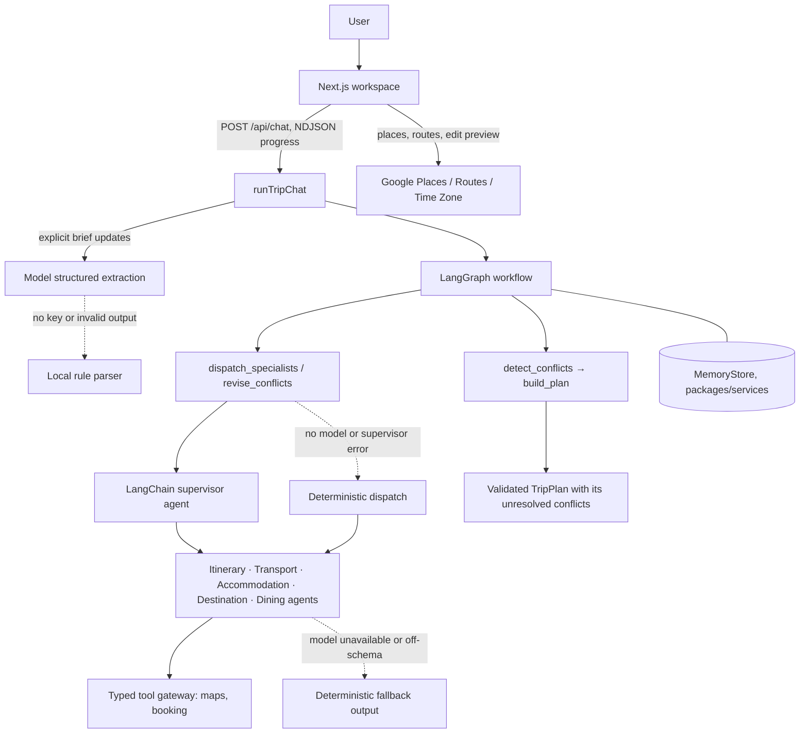
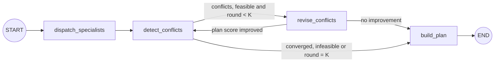

<a id="architecture"></a>

# 架构

[English](architecture.md) | 中文

AI Trip Planner 是一个由工作区包支撑的 Next.js 可部署单元。确定性的 LangGraph 工作流
负责规划控制流程，LangChain agent（智能体）在其中执行各自角色的推理。

<a id="change-entry-points"></a>

## 更改入口

编辑前，使用这张表找到更改所属的模块。各包 README 说明其导出和配置；
[开发指南](development.zh.md)负责环境设置、目录和验证规则。

| 更改领域                             | 从这里开始                                | 继续追踪                                                                                                                    |
| ------------------------------------ | ----------------------------------------- | --------------------------------------------------------------------------------------------------------------------------- |
| 聊天请求与流式回复                   | `apps/web/app/api/chat/route.ts`          | `packages/orchestrator/src/chat.ts`、共享聊天约定和聊天 UI                                                                  |
| 规划状态、冲突检查或 specialist 流程 | `packages/orchestrator/src/workflow.ts`   | `packages/agents/src/`、经过验证的计划约定、持久化和工作区消费方                                                            |
| 共享请求、提案或计划的数据结构       | `packages/shared/src/`                    | 每个生产方和消费方；在同一更改中新增 Agent Note                                                                             |
| 地图、预订或天气依据                 | `packages/tools/src/gateway.ts`           | 带类型的端口、提供方适配器、回退标签和 agent 消费方；提供方工作使用 [add-provider](../.agents/skills/add-provider/SKILL.md) |
| 保存的聊天、偏好或旅行               | `packages/services/src/`                  | 浏览器存储、API 路由和工作区恢复行为                                                                                        |
| 可见工作区或交互行为                 | `apps/web/components/` 和 `apps/web/lib/` | [工作区 UI](workspace-ui.zh.md)、设计规则和 [ui-verification](../.agents/skills/ui-verification/SKILL.md)                   |

跨越这些边界的更改，使用
[end-to-end-feature-wiring](../.agents/skills/end-to-end-feature-wiring/SKILL.md)
从值的生产方一路追踪到最终面向用户的消费方。

<a id="runtime-flow"></a>

## 运行时流程



LangGraph 工作流驱动 supervisor，而不是反过来：图决定何时分派、修订和停止，
supervisor 只选择某个节点需要哪些 specialist 工具。控制路径、预算红线和停止条件
从不依赖模型临时决定下一步。

1. `POST /api/chat` 调用 `runTripChat`（`packages/orchestrator/src/chat.ts`），只从消息中
   提取明确的 `TripBrief` 更新。`mode: "plan"` 跳过提取，规划提交的行程需求；
   `mode: "start"` 要求消息中包含所有行程需求字段（见 [API](api.zh.md)）。
2. 工作流运行 specialist、检测冲突、对目标 specialist 最多执行 `maxRounds` 轮修订，
   然后组装 `TripPlan`。计划的各部分分别携带自己的草稿/需要用户处理状态，
   `conflicts` 列出仍未解决的请求。
3. 进度事件以 NDJSON 流式发送到浏览器；最终帧携带 `{ reply, plan }`。
4. 没有确认步骤：旅行者通过聊天说明或编辑行程来修改计划，产品不会要求他们批准某个检查点。
   地图查询和行程编辑预览使用 `apps/web` 中的 Google 路由，绝不会重新运行规划器。

<a id="langgraph-workflow"></a>

## LangGraph 工作流



编译后的图位于 `packages/orchestrator/src/workflow.ts`，携带 `brief`、`round`、
`proposals`、`conflicts`、`stalled` 和最终 `plan`。共享约定和内部 `StateSchema` 都使用
Zod 4（`zod` 4.5）；`packages/shared` 导入 `zod` 入口，编排器导入 `zod/v4`。
Specialist 提案、行程需求和最终计划在图边界上分别通过 `AgentProposalSchema.parse`、
`TripBriefSchema.parse` 和 `TripPlanSchema.parse` 再次验证。

- `dispatch_specialists` 要求 supervisor 将工作委派给已注册的 specialist。
  没有配置模型或 supervisor 失败时，它直接调用所有 specialist。无论哪种路径，每次调用都经过
  规划协作板（`packages/orchestrator/src/board.ts`）：住宿等待交通，行程和餐饮等待两者，
  但只等待在同一轮次中已经启动的 specialist。每次调用都收到其他 specialist 的提案，字段为 `board`；
  住宿、行程和餐饮还会收到 `allocation`，分别占它们所等待阶段结束后剩余预算的 0.4、0.4、0.2。
  多城市旅行中，行程按照交通安排的城际移动（`citiesByDay`）确定每天所在的城市；
  移动日允许两个城市，如果草稿包含其他城市的停留点，就附带该原因交回模型。
  住宿读取相同的移动安排（`transport/legs.ts` 中的 `scheduledHops`），
  因此各城市的住宿夜晚从抵达日延续到下一次移动；协作板上没有移动安排时，夜晚均分。
- `detect_conflicts` 汇总预算超支、结构化的跨 agent 日程重叠，以及行程路线耗时检查后报告的
  地理冲突。超支额以 AUD（`targetSaving`）按各部分可削减空间分配，即该部分费用减去 `floorCost`。
  如果最低费用之和已经超过预算，它返回一个 `infeasible budget` 冲突，注明该最低费用，
  图随即停止修订。
- `revise_conflicts` 只运行支持 `supportsRevision` 的目标 specialist，通过修订 supervisor
  或直接调用，传入不可变的 `revision` 请求、该 specialist 的 `previous` 提案、`board`，
  以及预算削减时的 `allocation`（上次费用减去 `targetSaving`）。
  只有 `planScore`（以 AUD 计的超支额，加上每个其他冲突对应的预算十分之一）改善时，
  才保留这一轮；否则保留先前的提案并停止循环。
- 条件边重复执行检测和修订，最多 `maxRounds` 轮（默认 `3`）。
- `build_plan` 汇总费用（`budget.ts`）；若某部分仍是修订请求的目标，则标记为 `needs_you`，
  否则标记为 `draft`，随后组装计划。
- Specialist、工具、记忆和轮数限制都可通过 `OrchestratorOptions` 注入。

协调器的回复读取计划摘要，其中包含每个未解决冲突及其解决方法
（`packages/orchestrator/src/chat.ts` 中的 `planDigest`），因此面对不可行预算时，
回复会说明估算总额及所需的最低预算。没有模型时，以及在 `mode: "plan"` 下，回退回复也说明相同的最低预算。

`packages/orchestrator/tests/budget.test.ts` 展示了分阶段规划的运行情况：
编排器的 `DEMO_BRIEF` 在第 1 轮满足预算；预算大幅降低时，则在第 1 轮停止，
并给出一个注明最低预算的 `infeasible budget` 冲突。`plan.round` 记录实际运行轮数。
决策记录见
[Specialist 通过共享协作板分阶段规划](../.agents/notes/implemented/architecture/2026-09-26-coordinated-specialist-planning.md)。

<a id="agents-and-models"></a>

## Agent 与模型

每个 specialist 都实现与框架无关的 `Specialist` 约定
（`packages/shared/src/agent.ts`）：初次规划和修订共用一个不可变的
`invoke({ brief, context, revision? })` 入口。Agent 拥有持久的角色定义：模型、`name`、
`systemPrompt`、工具和输出 schema。Supervisor 不得改写行程需求或编造事实。

| Agent         | 职责                                          | 实现                     |
| ------------- | --------------------------------------------- | ------------------------ |
| Itinerary     | 有事实依据的每日安排、节奏和路线可行性        | 配有依据工具的模型 agent |
| Destination   | 景点、习俗、安全、入境/健康检查和行李准备背景 | 配有依据工具的模型 agent |
| Dining        | 有事实依据的场所、饮食偏好和餐饮预算          | 配有依据工具的模型 agent |
| Transport     | 航班、城际/市内路线和时间安排                 | 包装确定性计算器的 agent |
| Accommodation | 住宿搜索、比较和房间分配                      | 包装确定性计算器的 agent |

交通和住宿包装计算器，使模型无法编造价格、路线或住宿设施。行程同样从不为停留点定价：
Google Places 不提供门票价格，因此活动的 `estCost` 保持未设置，计划会说明有多少停留点尚未定价。

模型路由（`packages/agents/src/models.ts` 和 `chat.ts` 中的 `MODEL_ROUTING`）：

- **DeepSeek**（`DEEPSEEK_API_KEY`）：所有运行模型的步骤，包括从聊天提取行程需求、五个
  specialist、supervisor、修订 supervisor 和自然语言聊天回复，都通过 LangChain 的
  OpenAI 兼容适配器调用。
- **MiniMax**：已配置但未路由；它用于页面级规划时过慢。账户相关注意事项见 `.env.example`。

日期由模型读取，而非由模式匹配读取：提取会将旅行者书写的各种日期形式转换为 `YYYY-MM-DD`，
对于未写年份的日期，采用下一次出现的日期；如果只给出一端，或无法区分日和月（`01/10/2026`），
则保持日期未设置，向旅行者询问，而不是按猜测的月份规划旅行。
没有密钥或模型调用失败时，改用一个简单的中英文规则解析器提取；它只读取 ISO 日期。

尚未说明规划所需全部信息的空白对话应当触发提问，而非失败：`runTripChat` 抛出
`IncompleteBriefError`，携带目前已理解的字段，以及回复模型用旅行者自己的语言编写的追问。
`/api/chat` 将其作为 `needs_info` 帧流式发送，客户端显示为助手消息，并将已理解的信息填入
顶栏旅行信息标签；下一条消息会将这些字段作为 `ChatRequest.known` 发回，
以该条消息自身的提取结果为优先进行合并。因此，“悉尼三日游”会得到关于日期、旅行者和预算的追问，
用户回复只需补充这些信息。

`TripBrief.preferences`（以及 `known` 中的同名字段）携带旅行者自己的旅行偏好，
通过顶栏的 Trip preferences 编辑器填写。协调器的 `update_trip_brief` 工具没有这些偏好的字段，
因此模型无法改写列表；`BriefPatchSchema` 将它们从 `known` 带入用于规划的行程需求。
Supervisor 收到指令，将每条偏好传入它所影响的目标；每个 specialist 都会在依据或载荷中接收这些偏好，
并遵循同一条共享规则（`packages/agents/src/prompts/traveller-preferences.ts`）：
在依据允许的范围内权衡偏好，说明无法满足的偏好，且绝不把偏好当作已验证的事实。

一条消息最多携带四个附件。图片以内容块传给协调器，文本文件内联到消息中；
只有协调器能看到附件，specialist 的输入不变，离线路径忽略图片但仍读取内联文本。
大小和允许的媒体类型在 `packages/shared/src/chat.ts` 中强制执行，并列于 [API](api.zh.md)。

对于存在具体选项的真实歧义，协调器也可以调用 `ask_user_question`
（`packages/orchestrator/src/chat.ts`）；该调用抛出 `AskUserError`，并流式发送
`ChatAskUser` 帧（`type: "ask_user"`、1–4 个问题、`known`，且客户端的 `plan` 保持不变）。
客户端在输入框的位置渲染问题卡片，将旅行者的答案作为下一条消息发送。见
[DSH 思考 UI §3.2](design/dsh-thinking-ui.zh.md#32-asking-the-traveller)。

缺少密钥、模型调用失败或输出不符合 schema 时，该步骤会回退到经过验证的确定性输出，
因此规划请求仍能完成。汇总前，每个提案都必须通过 schema、预算、日程和路线检查。

<a id="contracts-and-dependency-injection"></a>

## 约定与依赖注入

共享约定位于 `packages/shared/src/`：

- `contracts.ts`：`TripBrief`、`AgentProposal`、`ProposalItem`、`RevisionRequest`。
- `plan.ts`：`TripPlan`、`TripSection` 和 `TripProposal`。
- `chat.ts`：`ChatRequest`、`ChatResponse`、进度事件、`ChatAskUser` 结构化提问帧，
  以及 `Attachment` 和它的限制。
- `ports.ts`：`ToolGateway`、`MapsPort`、`BookingPort`、`WeatherPort` 和 `MemoryStore`。

Agent 通过 `AgentContext` 接收 `ctx.tools`（`ToolGateway`）和 `ctx.mem`（`MemoryStore`）。
不要导入单例；从 `ctx` 获取它们，以便测试传入替身。工具网关
（`packages/tools/src/gateway.ts`）选择进程内的 fixture（测试前置数据）
（`USE_MOCK_TOOLS=true`）或真实的 OpenStreetMap 和 Google 地图适配器；
配置后，预订通过 SerpApi Google Hotels/Flights 路由，Google Places 估算或 fixture
作为明确标注的回退。`MemoryStore`（`packages/services/src/memory`）在配置后使用
Redis REST 存储，否则使用进程内存。各包的导出和配置位于各自的 `README.md`。

不要在未通知团队的情况下更改 `packages/shared`；每个包都依赖它。

<a id="design-rules"></a>

## 设计规则

1. 使用 LangChain JS/TypeScript `createAgent`；不要新增 Python 运行时或另一种 agent 框架。
2. 将提示词限定为持久的角色和安全指令。旅行数据通过消息、上下文或带类型的工具结果传入。
3. 由 LangGraph 负责状态、重试和冲突验证。
4. 保留确定性回退，并验证每个模型和工具边界。
5. 保持公开的 `TripBrief`、`AgentProposal` 和 `TripPlan` 约定稳定。

<a id="verification"></a>

## 验证

以下命令是现有的包回归检查。对于复杂的新用户可见行为，遵循
[E2E 优先的测试方法](development.zh.md#testing-approach)，并保留可重复执行的产物。

```bash
pnpm --filter @trip/orchestrator test
pnpm --filter @trip/agents test
pnpm typecheck
pnpm build
```

工作流测试覆盖具名图拓扑、稳定的 `TripPlan` 输出、并发定向修订、轮数上限升级处理和无效配置。

<a id="design-model"></a>

## 设计模型

ELEC5620 UML 设计模型位于 [`design/class-diagram.md`](design/class-diagram.zh.md)，
渲染后的图位于 [`design/diagrams/`](design/diagrams/)：结构主干、领域模型、
specialist 与编排、端口与适配器、带用例的类模型、综合架构图和用例图。
