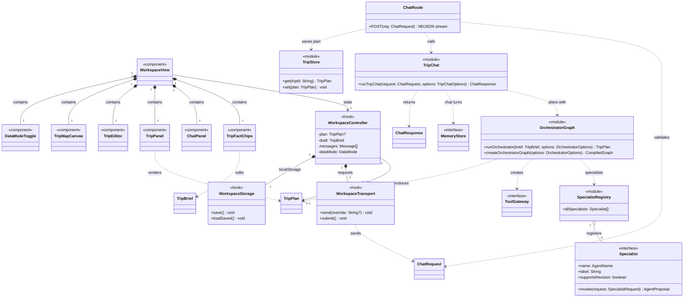
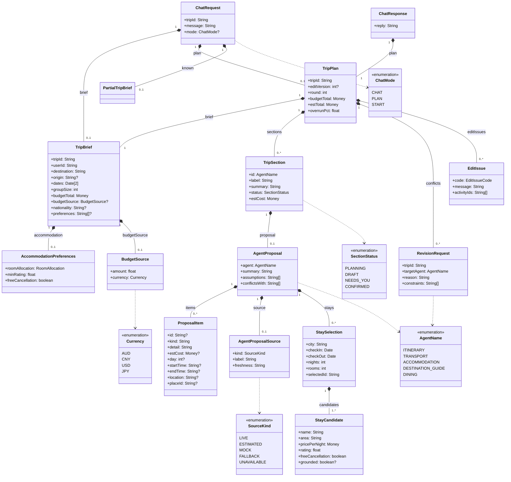
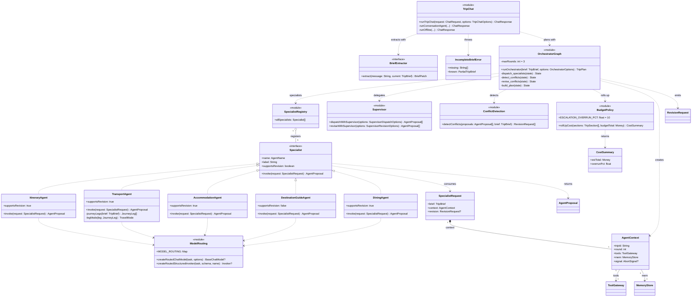
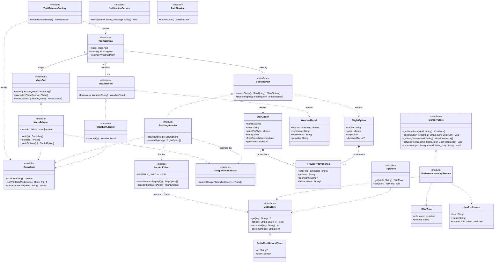
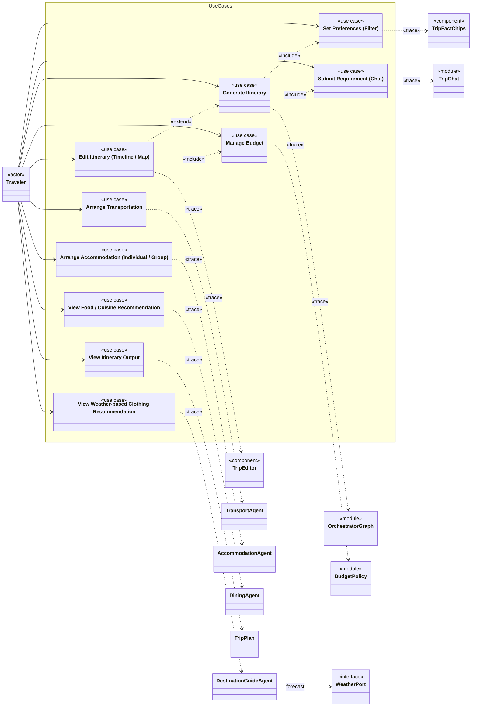

# Class model

ELEC5620 Lab 4 Part 2. Static structure of `AI_TRIP_PLANNER` as five UML 2.5 class diagrams that
share one namespace, drawn from the code on `main`. Rendered diagrams are in
[`diagrams/`](diagrams/) (start with
[`combined-architecture-map.svg`](diagrams/combined-architecture-map.svg)); the relationship,
multiplicity, interface and rationale tables are below.

TypeScript modules that export functions rather than classes appear as classes with the `«module»`
stereotype, and React components and hooks as `«component»` and `«hook»`. Operations are
asynchronous where the code returns a `Promise`; the diagrams show the resolved type. Supporting
types used in signatures but not expanded: `Date` (an ISO `YYYY-MM-DD` string), `Money` (an AUD
amount), `AbortSignal`, `BaseChatModel`, `TravelMode`, and the query DTOs `RouteQuery`, `PlaceQuery`,
`StayQuery`, `FlightQuery` and `WeatherQuery`.

## Notation

| Mark                         | Relationship   | Meaning                                                        |
| ---------------------------- | -------------- | -------------------------------------------------------------- |
| solid line, hollow triangle  | generalisation | subclass → superclass ("is a kind of")                         |
| dashed line, hollow triangle | realisation    | class → interface ("implements")                               |
| solid line, filled diamond   | composition    | whole ◆ part; part cannot outlive the whole                    |
| solid line, hollow diamond   | aggregation    | whole ◇ part, shared; part has an independent lifetime         |
| solid line, open arrow       | association    | source holds a stored reference to the target                  |
| dashed line, open arrow      | dependency     | transient use only (parameter, return, local); no stored field |

---

## Diagram 1 — Structural spine

Load-bearing classes across every layer: the browser workspace that holds plan state, the chat route,
the chat intake and planning graph, the specialist registry, and the two interfaces injected into
every specialist.

---

## Diagram 2 — Domain model

The value types carried between the browser, the chat route, the planning graph and the
specialists. Every type is a Zod schema in `packages/shared`, validated at each boundary.

---

## Diagram 3 — Specialists & orchestration

`OrchestratorGraph` is a compiled LangGraph `StateGraph` whose nodes dispatch the specialists, detect
conflicts, revise the targeted specialists for up to `maxRounds` rounds and build the plan. It calls
conflict detection and the budget policy as functions, and the supervisor helpers choose which
specialists to call. Each specialist receives its dependencies through `AgentContext` and calls
models only through the shared routing module.

---

## Diagram 4 — Ports, adapters & infrastructure

The hexagonal boundary. Ports live in `packages/shared`; the adapter modules in `packages/tools`
implement them, choosing fixtures or live providers per request through the data mode. Server state
goes through one key-value store that uses a Redis REST API when configured and process memory
otherwise.

---

## Diagram 5 — Use cases traced onto the model

The ten `«use case»` from the use case model: the actor `Traveler` is associated with every use case;
`«include»` / `«extend»` hold between use cases; and a `«trace»` dependency runs from each use case to
the class or module that realises it. Members are omitted; they are in diagrams 1–4.

| Use case                                   | «trace» → class                                                                          | Owner |
| ------------------------------------------ | ---------------------------------------------------------------------------------------- | ----- |
| Set Preferences (Filter)                   | `TripFactChips` (edits the `TripBrief` sent with the next request)                       | E     |
| Submit Requirement (Chat)                  | `TripChat.runTripChat` (extracts brief updates from the message)                         | E     |
| Generate Itinerary                         | `OrchestratorGraph`                                                                      | A     |
| Edit Itinerary (Timeline / Map)            | `TripEditor` with `previewEdit` (`/api/trip/preview-edit`), re-checking route and budget | E     |
| Manage Budget                              | `BudgetPolicy.rollUpCost`                                                                | C     |
| Arrange Transportation                     | `TransportAgent`                                                                         | B     |
| Arrange Accommodation                      | `AccommodationAgent`                                                                     | C     |
| View Weather-based Clothing Recommendation | `DestinationGuideAgent`, using `WeatherPort`                                             | D     |
| View Food / Cuisine Recommendation         | `DiningAgent`                                                                            | D     |
| View Itinerary Output                      | `TripPlan` (rendered by `TripPanel` and `TripMapCanvas`)                                 | E     |

---

## Key associations & multiplicity

Read _source → target_.

| Source                                  | Target                                            | Type        | Mult.          | Meaning                                                                |
| --------------------------------------- | ------------------------------------------------- | ----------- | -------------- | ---------------------------------------------------------------------- |
| `WorkspaceView`                         | panels, editor, map, data-mode toggle             | composition | 1 → 1          | the workspace renders one of each view                                 |
| `WorkspaceController`                   | `TripPlan`                                        | association | 1 → 0..1       | holds the current plan; none before the first plan                     |
| `WorkspaceController`                   | `WorkspaceTransport` / `WorkspaceStorage`         | composition | 1 → 1          | request and `localStorage` hooks used only by this controller          |
| `ChatRoute`                             | `TripChat`, `TripStore`                           | dependency  | —              | handles one request, then saves the resulting plan                     |
| `ChatResponse`                          | `TripPlan`                                        | composition | 1 → 1          | a response carries a full plan                                         |
| `ChatRequest`                           | `TripBrief` / `TripPlan` / `PartialTripBrief`     | composition | 1 → 0..1       | the browser sends its current state with each message                  |
| `OrchestratorGraph`                     | `Supervisor`, `ConflictDetection`, `BudgetPolicy` | dependency  | —              | functions called from graph nodes                                      |
| `SpecialistRegistry`                    | `Specialist`                                      | aggregation | 1 → 5          | references module-level agents; no lifecycle ownership                 |
| `SpecialistRequest`                     | `AgentContext`                                    | composition | 1 → 1          | each call carries its own context                                      |
| `AgentContext`                          | `ToolGateway` / `MemoryStore`                     | association | 1 → 1          | injected — the specialist's only route to tools and memory             |
| `TripPlan`                              | `TripBrief`                                       | composition | 1 → 1          | embeds the brief it answers                                            |
| `TripPlan`                              | `TripSection`                                     | composition | 1 → 0..*       | one section per specialist that returned a proposal                    |
| `TripPlan`                              | `RevisionRequest`                                 | composition | 1 → 0..*       | conflicts still unresolved after the last round                        |
| `TripSection`                           | `AgentProposal`                                   | composition | 1 → 0..1       | the proposal the section was built from, for drill-down                |
| `AgentProposal`                         | `ProposalItem`                                    | composition | 1 → 0..*       | a proposal is its list of line items                                   |
| `AgentProposal`                         | `AgentProposalSource`                             | composition | 1 → 0..1       | where the data came from: live, estimated, mock, fallback, unavailable |
| `StaySelection`                         | `StayCandidate`                                   | composition | 1 → 1..*       | the chosen stay and its alternatives                                   |
| `ToolGateway`                           | `MapsPort` / `BookingPort` / `WeatherPort`        | aggregation | 1 → 1, 1, 0..1 | one port of each kind; weather is optional                             |
| `StayOption` / `FlightOption`           | `ProviderProvenance`                              | composition | 1 → 0..1       | which provider answered and whether it was a fallback                  |
| `PreferenceMemoryService` / `TripStore` | `JsonStore`                                       | dependency  | —              | every read and write goes through the store                            |

## Interfaces & realisation

| Interface        | Realised by                                                                                      | Note                                                                      |
| ---------------- | ------------------------------------------------------------------------------------------------ | ------------------------------------------------------------------------- |
| `Specialist`     | `ItineraryAgent`, `TransportAgent`, `AccommodationAgent`, `DestinationGuideAgent`, `DiningAgent` | one `invoke(SpecialistRequest)`; only the destination guide cannot revise |
| `ToolGateway`    | object returned by `createToolGateway()`                                                         | one per planning run                                                      |
| `MapsPort`       | `MapsAdapter` (`maps.ts`)                                                                        | owner B; fixtures, OpenStreetMap or Google                                |
| `BookingPort`    | `BookingAdapter` (`booking.ts`)                                                                  | owner C; SerpApi, then Google Places estimate, or fixtures; no payment    |
| `WeatherPort`    | `WeatherAdapter` (`weather.ts`)                                                                  | owner D; Google Weather, Open-Meteo or climate context                    |
| `MemoryStore`    | `PreferenceMemoryService` (`memory`)                                                             | owner E                                                                   |
| `JsonStore`      | `RedisRestOrLocalStore` (`createJsonStore()`)                                                    | owner E; Redis REST when configured, process memory otherwise             |
| `BriefExtractor` | model extractor in `chat.ts`, or `extractBriefPatchLocally` without a key                        | owner A                                                                   |

`NotificationService` and `AuthService` are stubs: notifications are logged, and every request is the
demo user.

## Design rationale

- **`Specialist` is the framework-neutral interface** — the graph iterates `Specialist[]` and calls
  `invoke(SpecialistRequest)` without knowing the concrete agent or whether it uses a model. The
  decision is in the [LangGraph note](../../.agents/notes/implemented/architecture/2026-09-08-langgraph-orchestration.md).
- **Control and function are separate** — the graph owns state, rounds and ordering; conflict
  detection and the budget policy are plain functions it calls, testable without the graph.
- **`SpecialistRegistry → Specialist` is aggregation** — agents are module-level values; the registry
  lists them but does not own their lifecycle.
- **Dependencies are injected through `AgentContext`** — specialists never import concrete services,
  so a unit test passes a fake `ToolGateway` or `MemoryStore`.
- **Ports in `packages/shared` (hexagonal)** — the core never names a concrete adapter, so providers
  can change without touching specialist or graph code. Mock or live is chosen per request by
  `DataMode` ([note](../../.agents/notes/implemented/feature/2026-09-21-request-scoped-data-mode.md)).
- **Provenance travels with the data** — `ProviderProvenance` on tool results becomes
  `AgentProposalSource` on proposals, so the UI can say whether a price is live, estimated or mock
  ([note](../../.agents/notes/implemented/bug-fix/2026-09-21-proposal-source-kind.md)).
- **`TripPlan` composes a `TripBrief` snapshot** — a plan answers one brief; a later edit to the brief
  cannot silently change what an existing plan claims.
- **The traveller edits rather than approves** — there is no checkpoint to confirm; changes are made
  in chat or through `TripEditor`, whose previews re-run route and budget checks
  ([note](../../.agents/notes/implemented/simplification/2026-09-22-remove-hitl-decisions.md)).
