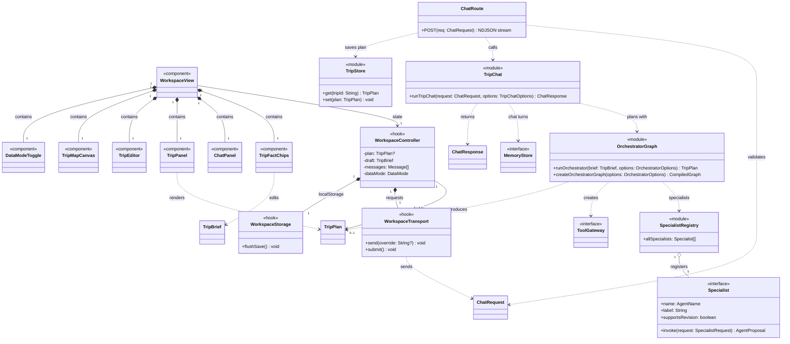
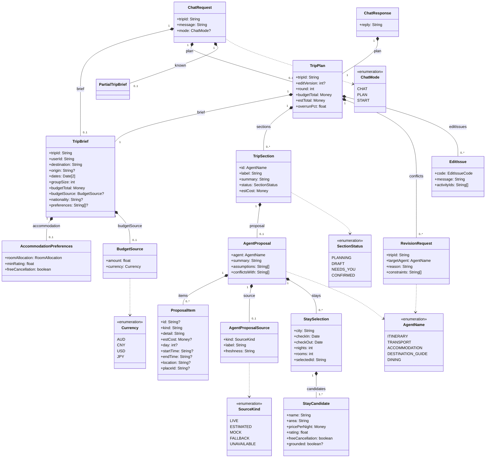
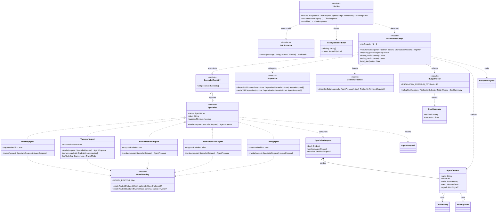
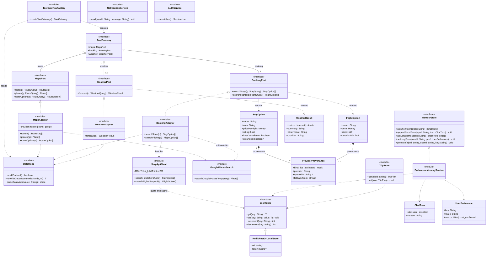
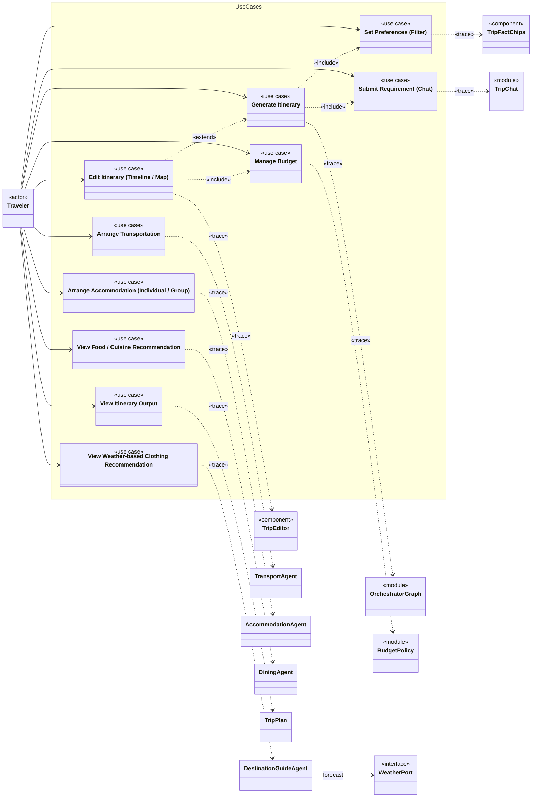

# 类模型

[English](class-diagram.md) | 中文

ELEC5620 Lab 4 Part 2。本文以 5 张共享同一命名空间的 UML 2.5 类图描述 `AI_TRIP_PLANNER` 的静态结构，依据 `main` 上的代码绘制。渲染后的图位于 [`diagrams/`](diagrams/)（从 [`combined-architecture-map.svg`](diagrams/combined-architecture-map.svg) 开始查看）；关系、多重性、接口和设计理由表见下文。

导出函数而非类的 TypeScript 模块以带 `«module»` 构造型的类表示，React 组件和钩子分别使用 `«component»` 和 `«hook»`。当代码返回 `Promise` 时，操作为异步操作；图中展示的是解析后的类型。签名中使用但未展开的辅助类型包括：`Date`（ISO `YYYY-MM-DD` 字符串）、`Money`（AUD 金额）、`AbortSignal`、`BaseChatModel`、`TravelMode`，以及查询 DTO `RouteQuery`、`PlaceQuery`、`StayQuery`、`FlightQuery` 和 `WeatherQuery`。

## 记法

| 标记           | 关系 | 含义                                               |
| -------------- | ---- | -------------------------------------------------- |
| 实线、空心三角 | 泛化 | 子类 → 父类（「是一种」）                          |
| 虚线、空心三角 | 实现 | 类 → 接口（「实现」）                              |
| 实线、实心菱形 | 组合 | 整体 ◆ 部分；部分的生命周期不能超过整体            |
| 实线、空心菱形 | 聚合 | 整体 ◇ 部分，共享；部分拥有独立生命周期            |
| 实线、开放箭头 | 关联 | 源持有指向目标的已存储引用                         |
| 虚线、开放箭头 | 依赖 | 仅临时使用（参数、返回值、局部变量）；没有存储字段 |

---

## 图 1 — 结构主干

跨越各层的核心类：持有计划状态的浏览器工作区、聊天路由、聊天请求入口与规划图、专职 agent（智能体）注册表，以及注入每个专职 agent 的两个接口。

---

## 图 2 — 领域模型

在浏览器、聊天路由、规划图和专职 agent 之间传递的值类型。每种类型都是 `packages/shared` 中的 Zod schema，并在每个边界进行验证。

---

## 图 3 — 专职 agent 与编排

`OrchestratorGraph` 是编译后的 LangGraph `StateGraph`：节点派发专职 agent、检测冲突、针对指定专职 agent 执行最多 `maxRounds` 轮修订，并构建计划。它以函数形式调用冲突检测和预算策略，supervisor 辅助函数决定调用哪些专职 agent。每个专职 agent 通过 `AgentContext` 接收依赖，且仅通过共享路由模块调用模型。

---

## 图 4 — 端口、适配器与基础设施

六边形架构边界。端口位于 `packages/shared`；`packages/tools` 中的适配器模块实现这些端口，并根据每次请求的数据模式选择 fixture（测试前置数据）或实时提供方。服务端状态统一通过一个键值存储访问；配置 Redis REST API 时使用它，否则使用进程内存。

---

## 图 5 — 用例在模型中的追踪关系

用例模型中的 10 个 `«use case»`：参与者 `Traveler` 与每个用例关联；用例之间存在 `«include»` / `«extend»` 关系；每个用例通过 `«trace»` 依赖指向实现它的类或模块。成员省略，见图 1–4。

| 用例                      | «trace» → 类                                                                    | 负责人 |
| ------------------------- | ------------------------------------------------------------------------------- | ------ |
| 设置偏好（筛选）          | `TripFactChips`（编辑随下一次请求发送的 `TripBrief`）                           | E      |
| 提交需求（聊天）          | `TripChat.runTripChat`（从消息中提取 brief 更新）                               | E      |
| 生成行程                  | `OrchestratorGraph`                                                             | A      |
| 编辑行程（时间线 / 地图） | `TripEditor` 配合 `previewEdit`（`/api/trip/preview-edit`），重新检查路线与预算 | E      |
| 管理预算                  | `BudgetPolicy.rollUpCost`                                                       | C      |
| 安排交通                  | `TransportAgent`                                                                | B      |
| 安排住宿                  | `AccommodationAgent`                                                            | C      |
| 查看基于天气的穿衣建议    | `DestinationGuideAgent`，使用 `WeatherPort`                                     | D      |
| 查看餐饮 / 美食建议       | `DiningAgent`                                                                   | D      |
| 查看行程输出              | `TripPlan`（由 `TripPanel` 和 `TripMapCanvas` 渲染）                            | E      |

---

## 主要关联与多重性

按 _源 → 目标_ 阅读。

| 源                                      | 目标                                              | 类型 | 多重性         | 含义                                                |
| --------------------------------------- | ------------------------------------------------- | ---- | -------------- | --------------------------------------------------- |
| `WorkspaceView`                         | 面板、编辑器、地图、数据模式开关                  | 组合 | 1 → 1          | 工作区各渲染一个视图                                |
| `WorkspaceController`                   | `TripPlan`                                        | 关联 | 1 → 0..1       | 持有当前计划；首次生成计划前为空                    |
| `WorkspaceController`                   | `WorkspaceTransport` / `WorkspaceStorage`         | 组合 | 1 → 1          | 仅由该控制器使用的请求与 `localStorage` 钩子        |
| `ChatRoute`                             | `TripChat`, `TripStore`                           | 依赖 | —              | 处理一次请求，然后保存生成的计划                    |
| `ChatResponse`                          | `TripPlan`                                        | 组合 | 1 → 1          | 响应携带完整计划                                    |
| `ChatRequest`                           | `TripBrief` / `TripPlan` / `PartialTripBrief`     | 组合 | 1 → 0..1       | 浏览器随每条消息发送其当前状态                      |
| `OrchestratorGraph`                     | `Supervisor`, `ConflictDetection`, `BudgetPolicy` | 依赖 | —              | 从图节点调用的函数                                  |
| `SpecialistRegistry`                    | `Specialist`                                      | 聚合 | 1 → 5          | 引用模块级 agent；不拥有其生命周期                  |
| `SpecialistRequest`                     | `AgentContext`                                    | 组合 | 1 → 1          | 每次调用携带自己的上下文                            |
| `AgentContext`                          | `ToolGateway` / `MemoryStore`                     | 关联 | 1 → 1          | 通过注入提供，是专职 agent 访问工具与记忆的唯一途径 |
| `TripPlan`                              | `TripBrief`                                       | 组合 | 1 → 1          | 内嵌该计划所回应的 brief                            |
| `TripPlan`                              | `TripSection`                                     | 组合 | 1 → 0..*       | 每个返回提案的专职 agent 对应一个分节               |
| `TripPlan`                              | `RevisionRequest`                                 | 组合 | 1 → 0..*       | 最后一轮后仍未解决的冲突                            |
| `TripSection`                           | `AgentProposal`                                   | 组合 | 1 → 0..1       | 用于构建该分节的提案，可展开查看                    |
| `AgentProposal`                         | `ProposalItem`                                    | 组合 | 1 → 0..*       | 提案由其明细项列表组成                              |
| `AgentProposal`                         | `AgentProposalSource`                             | 组合 | 1 → 0..1       | 数据来源：实时、估算、mock、回退、不可用            |
| `StaySelection`                         | `StayCandidate`                                   | 组合 | 1 → 1..*       | 选定住宿及其备选项                                  |
| `ToolGateway`                           | `MapsPort` / `BookingPort` / `WeatherPort`        | 聚合 | 1 → 1, 1, 0..1 | 每种端口各一个；天气端口可选                        |
| `StayOption` / `FlightOption`           | `ProviderProvenance`                              | 组合 | 1 → 0..1       | 哪个提供方作出响应，以及是否使用了回退              |
| `PreferenceMemoryService` / `TripStore` | `JsonStore`                                       | 依赖 | —              | 所有读写都通过该存储                                |

## 接口与实现

| 接口             | 实现方                                                                                           | 说明                                                                        |
| ---------------- | ------------------------------------------------------------------------------------------------ | --------------------------------------------------------------------------- |
| `Specialist`     | `ItineraryAgent`, `TransportAgent`, `AccommodationAgent`, `DestinationGuideAgent`, `DiningAgent` | 一个 `invoke(SpecialistRequest)`；只有目的地指南不能修订                    |
| `ToolGateway`    | `createToolGateway()` 返回的对象                                                                 | 每次规划运行一个                                                            |
| `MapsPort`       | `MapsAdapter`（`maps.ts`）                                                                       | 负责人 B；fixture、OpenStreetMap 或 Google                                  |
| `BookingPort`    | `BookingAdapter`（`booking.ts`）                                                                 | 负责人 C；先用 SerpApi，再用 Google Places 估算，或使用 fixture；不涉及支付 |
| `WeatherPort`    | `WeatherAdapter`（`weather.ts`）                                                                 | 负责人 D；Google Weather、Open-Meteo 或气候上下文                           |
| `MemoryStore`    | `PreferenceMemoryService`（`memory`）                                                            | 负责人 E                                                                    |
| `JsonStore`      | `RedisRestOrLocalStore`（`createJsonStore()`）                                                   | 负责人 E；配置后使用 Redis REST，否则使用进程内存                           |
| `BriefExtractor` | `chat.ts` 中的模型提取器，或无密钥时的 `extractBriefPatchLocally`                                | 负责人 A                                                                    |

`NotificationService` 和 `AuthService` 是桩实现：通知仅写入日志，每次请求均使用演示用户。

## 设计理由

- **`Specialist` 是与框架无关的接口** — 图遍历 `Specialist[]` 并调用 `invoke(SpecialistRequest)`，无需了解具体 agent 或其是否使用模型。决策见 [LangGraph 说明](../../.agents/notes/implemented/architecture/2026-09-08-langgraph-orchestration.md)。
- **控制与功能分离** — 图负责状态、轮次和顺序；冲突检测和预算策略是它调用的普通函数，可脱离图测试。
- **`SpecialistRegistry → Specialist` 是聚合** — agent 是模块级值；注册表列出它们，但不拥有其生命周期。
- **依赖通过 `AgentContext` 注入** — 专职 agent 从不导入具体服务，因此单元测试可传入假的 `ToolGateway` 或 `MemoryStore`。
- **端口位于 `packages/shared`（六边形架构）** — 核心不引用具体适配器，因此可更换提供方而无需修改专职 agent 或图的代码。每次请求由 `DataMode` 选择 mock 或实时模式（[说明](../../.agents/notes/implemented/feature/2026-09-21-request-scoped-data-mode.md)）。
- **来源信息随数据传递** — 工具结果上的 `ProviderProvenance` 转换为提案上的 `AgentProposalSource`，使 UI 可说明价格是实时、估算还是 mock（[说明](../../.agents/notes/implemented/bug-fix/2026-09-21-proposal-source-kind.md)）。
- **`TripPlan` 组合一个 `TripBrief` 快照** — 一个计划回应一个 brief；之后编辑 brief，不能悄悄改变已有计划的声明。
- **旅行者编辑，而非批准** — 没有需要确认的检查点；修改通过聊天或 `TripEditor` 完成，其预览重新执行路线与预算检查（[说明](../../.agents/notes/implemented/simplification/2026-09-22-remove-hitl-decisions.md)）。
