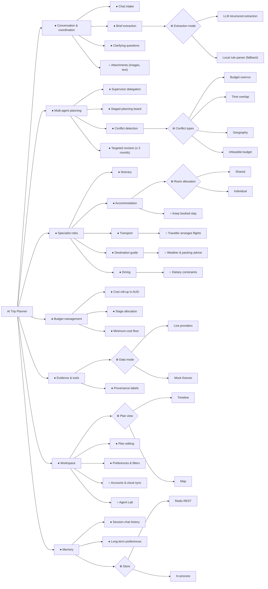

# 1. Requirements

English | [中文](01-requirements.zh.md)

## 1.1 Product statement

AI Trip Planner is a "one-person AI travel agency". A single human traveller, acting as the founder
and operator, describes a trip in chat. A coordinator agent turns the conversation into a structured
`TripBrief`, and five specialist AI roles plan the trip together over a shared planning board:
itinerary, transport, accommodation, destination guide and dining. A deterministic LangGraph
workflow checks their proposals against each other and against the budget, and sends targeted
revision requests until the plan converges or the round limit is reached. The traveller then refines
the plan in chat or in the timeline and map editor.

## 1.2 Ad hoc requirements (individual, at least one per member)

Informal statements in the stakeholder's own words, before any modelling.

| ID    | Member                | Ad hoc requirement                                                                                                                                                                                                                                                                                                                                                                                                                                                                                                                                                                                                      |
| ----- | --------------------- | ----------------------------------------------------------------------------------------------------------------------------------------------------------------------------------------------------------------------------------------------------------------------------------------------------------------------------------------------------------------------------------------------------------------------------------------------------------------------------------------------------------------------------------------------------------------------------------------------------------------------- |
| AH-C1 | C (`@HeadmasterEggy`) | "We're five friends going to Tokyo on a fixed budget. I want the planner to work out how many rooms we need, whether we share or each get our own, and pick a hotel I'd actually stay in: decent rating, free cancellation if I asked for it. Flights get paid first, so the hotel has to fit in whatever money is left. If the whole trip ends up over budget, I want the hotel swapped for a cheaper one that still meets my rules rather than being told nothing fits. If no hotel can ever fit, tell me the minimum I'd need instead of making up a cheap one. And if I've already booked somewhere, just keep it." |
| AH-A1 | A                     | _to be written by A_                                                                                                                                                                                                                                                                                                                                                                                                                                                                                                                                                                                                    |
| AH-B1 | B (Tingsong Jin)      | “I'm travelling from Sydney to Tokyo and Kyoto with a friend, on fixed dates and a shared budget. Help us choose flights and work out when to move between cities, so the daily sightseeing fits around the journey. Use fares and journey times you actually found. If I ask for a train on one leg, use it if it is offered, or tell me clearly if it isn't. If a fare is missing, say it is unknown rather than treating it as free. If the trip is too expensive or the times clash, try a suitable cheaper option or adjust the schedule; if it still cannot work, show me what needs to change.”                  |
| AH-D1 | D                     | _to be written by D_                                                                                                                                                                                                                                                                                                                                                                                                                                                                                                                                                                                                    |
| AH-E1 | E                     | _to be written by E_                                                                                                                                                                                                                                                                                                                                                                                                                                                                                                                                                                                                    |

Group-level needs gathered in early lab discussion (from the team's design doc): clothing advice
from the weather, accommodation for individuals or groups, food recommendations, day-by-day
scheduling, luggage rules, transport, a budget, a chat window that splits a request into tasks and
merges the answers, and filters for party size, area and budget.

## 1.3 Requirement classification

AH-C1 is broken down into classified requirements below. FR = functional, NFR = non-functional,
C = constraint.

| ID    | Type               | Requirement                                                                                                                                 | Traced to                          |
| ----- | ------------------ | ------------------------------------------------------------------------------------------------------------------------------------------- | ---------------------------------- |
| R-C1  | FR                 | Compute the room count from party size and room allocation: `individual` gives one room per guest, `shared` gives ⌈guests / 2⌉.             | `accommodation/index.ts`           |
| R-C2  | FR                 | Filter stay candidates by minimum rating and, when requested, free cancellation; these are hard rules that a budget revision may not relax. | `planning.ts: eligibleOptions`     |
| R-C3  | FR                 | Choose the first stay preferring rating ≥ 8 and free cancellation, within the stay allocation left after transport.                         | `chooseInitial`, board allocation  |
| R-C4  | FR                 | Roll up section costs in AUD and compare the total with `budgetTotal`.                                                                      | `budget.ts: rollUpCost`            |
| R-C5  | FR                 | On any overrun, spread the required saving over the sections that can still be cut, and send each a targeted revision request.              | `conflicts.ts: detectConflicts`    |
| R-C6  | FR                 | When the cheapest options already exceed the budget, report one `infeasible budget` conflict naming the minimum, and stop revising.         | `minimumCost`, `INFEASIBLE_BUDGET` |
| R-C7  | FR                 | Keep a stay the traveller has already booked, unpriced and without a search.                                                                | `bookedStayProposal`               |
| R-C8  | NFR (accuracy)     | Money is summed in integer cents so totals never drift.                                                                                     | `sumMoney`, `stayCost`             |
| R-C9  | NFR (integrity)    | The model may choose only among searched candidate ids; it never invents a property, rate or policy.                                        | accommodation system prompt        |
| R-C10 | NFR (availability) | With no model key, or an off-schema answer, a deterministic fallback still produces a valid proposal.                                       | `planStays` fallback               |
| R-C11 | C                  | At most three revision rounds; a round is kept only if the plan score improves.                                                             | `workflow.ts`                      |

## 1.4 Feature diagram (group)

Notation: ● mandatory, ○ optional, ⊕ alternative (exactly one), ⊗ or (one or more).
Rendered: [`../diagrams/feature-diagram.svg`](../diagrams/feature-diagram.svg).

**Cross-tree constraints**

1. _Targeted revision_ requires _Conflict detection_.
2. _Budget overrun_ requires _Cost roll-up in AUD_; _Infeasible budget_ requires _Minimum-cost floor_.
3. _Keep booked stay_ excludes searching and pricing in _Accommodation_ for that trip.
4. _Traveller arranges flights_ excludes fare search in _Transport_ and any flight-fare conflict.
5. _Live providers_ requires provider keys; without them the system selects _Mock fixtures_.
6. _Accounts & cloud sync_ requires _Long-term preferences_.

**Non-functional requirements attached to features**

| Feature              | NFR                                                                                                                        |
| -------------------- | -------------------------------------------------------------------------------------------------------------------------- |
| Multi-agent planning | Every proposal is re-validated against the shared Zod schema at each graph boundary.                                       |
| Specialist roles     | Each specialist falls back to deterministic output when the model is missing or off-schema, so a request always completes. |
| Budget management    | AUD arithmetic in integer cents; overrun percentages are compared unrounded.                                               |
| Evidence & tools     | Prices and places come only from tools; every section shows whether its data is live, estimated, mock or fallback.         |
| Workspace            | Planning progress streams as NDJSON so the traveller sees each stage as it runs.                                           |
| Agent Lab            | Fixture runs can never reach a paid model or provider.                                                                     |

## 1.5 Member B requirement classification

AH-B1 is a coursework stakeholder-style statement, not an interview quotation. Its six classified requirements trace to the current transport and itinerary implementation.

| ID   | Type                | Requirement                                                                                                                                                                                                              | Current implementation evidence                                                                                                                                                                                                                                                                                                                                                                                            |
| ---- | ------------------- | ------------------------------------------------------------------------------------------------------------------------------------------------------------------------------------------------------------------------ | -------------------------------------------------------------------------------------------------------------------------------------------------------------------------------------------------------------------------------------------------------------------------------------------------------------------------------------------------------------------------------------------------------------------------- |
| R-B1 | FR                  | Derive ordered journey hops from origin, destinations and dates; gather flight and ground-route options and produce a timed transport proposal for the party.                                                            | [packages/agents/src/transport/index.ts:87](https://github.com/Lilstanie/AI_TRIP_PLANNER/blob/c59f751fc04766db9fcbcfe82d4a0c5b6ec3c0c6/packages/agents/src/transport/index.ts#L87); `journeyLegs` in `transport/legs.ts`                                                                                                                                                                                                   |
| R-B2 | FR                  | Use the transport schedule when planning daily activities and check that travel between different activity locations fits the available gap, including a 15-minute arrival buffer.                                       | [packages/orchestrator/src/board.ts:15](https://github.com/Lilstanie/AI_TRIP_PLANNER/blob/c59f751fc04766db9fcbcfe82d4a0c5b6ec3c0c6/packages/orchestrator/src/board.ts#L15); `citiesByDay`, `travelConflicts`: [packages/agents/src/itinerary/index.ts:342](https://github.com/Lilstanie/AI_TRIP_PLANNER/blob/c59f751fc04766db9fcbcfe82d4a0c5b6ec3c0c6/packages/agents/src/itinerary/index.ts#L342)                         |
| R-B3 | FR                  | Apply a traveller's per-hop mode choice when supported; explicitly report an unavailable choice and the route used instead.                                                                                              | `chosenModeFor`: [packages/agents/src/transport/legs.ts:106](https://github.com/Lilstanie/AI_TRIP_PLANNER/blob/c59f751fc04766db9fcbcfe82d4a0c5b6ec3c0c6/packages/agents/src/transport/legs.ts#L106); `scheduledLegs` and `layOutHop`: [packages/agents/src/transport/index.ts:306](https://github.com/Lilstanie/AI_TRIP_PLANNER/blob/c59f751fc04766db9fcbcfe82d4a0c5b6ec3c0c6/packages/agents/src/transport/index.ts#L306) |
| R-B4 | NFR — integrity     | Select only returned fare candidates; derive costs and durations from evidence. Preserve absent ground fares as unpriced and report unavailable required flights without inventing a price.                              | `planTransport`: [packages/agents/src/transport/index.ts:685](https://github.com/Lilstanie/AI_TRIP_PLANNER/blob/c59f751fc04766db9fcbcfe82d4a0c5b6ec3c0c6/packages/agents/src/transport/index.ts#L685); `assembleTransportProposal`: [packages/agents/src/transport/index.ts:470](https://github.com/Lilstanie/AI_TRIP_PLANNER/blob/c59f751fc04766db9fcbcfe82d4a0c5b6ec3c0c6/packages/agents/src/transport/index.ts#L470)   |
| R-B5 | NFR — resilience    | When no model is configured or its selection is invalid, use a deterministic evidence-based plan; retain availability gaps and source labels. Unrecoverable input/provider errors may still fail the run.                | `deterministicPlan`, `planTransport` catch path: [packages/agents/src/transport/index.ts:685](https://github.com/Lilstanie/AI_TRIP_PLANNER/blob/c59f751fc04766db9fcbcfe82d4a0c5b6ec3c0c6/packages/agents/src/transport/index.ts#L685)                                                                                                                                                                                      |
| R-B6 | C — bounded control | Under the default workflow, allow at most three total planning rounds (initial round plus at most two revision rounds); rerun only targeted revisable specialists and retain a revision only if the plan score improves. | [packages/orchestrator/src/workflow.ts:141](https://github.com/Lilstanie/AI_TRIP_PLANNER/blob/c59f751fc04766db9fcbcfe82d4a0c5b6ec3c0c6/packages/orchestrator/src/workflow.ts#L141); [packages/orchestrator/src/conflicts.ts:24](https://github.com/Lilstanie/AI_TRIP_PLANNER/blob/c59f751fc04766db9fcbcfe82d4a0c5b6ec3c0c6/packages/orchestrator/src/conflicts.ts#L24)                                                     |
