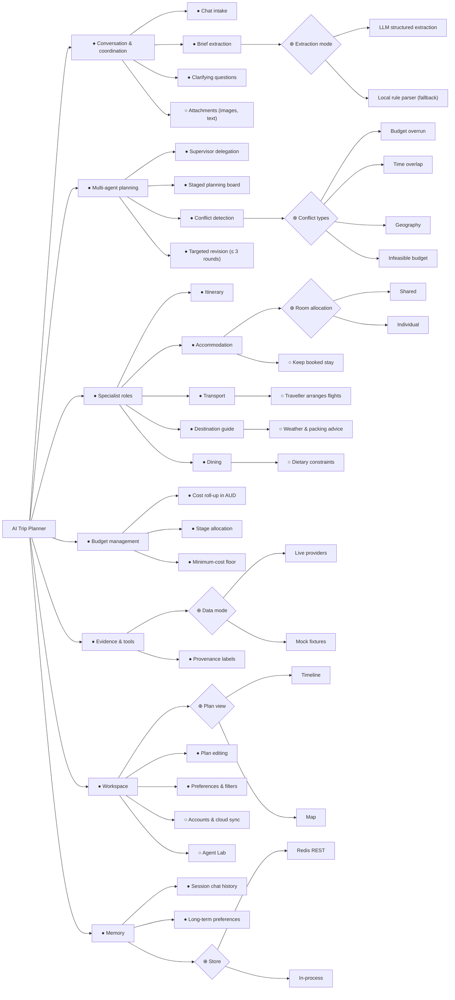

# 1. Requirements

English | [中文](01-requirements.zh.md)

## 1.1 Product statement

AI Trip Planner is a "one-person AI travel agency". A single human traveller, acting as the founder
and operator, describes a trip in chat. A coordinator agent turns the conversation into a structured
`TripBrief`, and five specialist AI roles plan the trip together over a shared planning board:
itinerary, transport, accommodation, destination guide and dining. A deterministic LangGraph
workflow checks their proposals against each other and against the budget, and sends targeted
revision requests until the plan converges or the round limit is reached. The traveller then refines
the plan in chat or in the timeline and map editor.

## 1.2 Ad hoc requirements (individual, at least one per member)

Informal statements in the stakeholder's own words, before any modelling.

| ID | Member | Ad hoc requirement |
| --- | --- | --- |
| AH-C1 | C (`@HeadmasterEggy`) | "We're five friends going to Tokyo on a fixed budget. I want the planner to work out how many rooms we need, whether we share or each get our own, and pick a hotel I'd actually stay in: decent rating, free cancellation if I asked for it. Flights get paid first, so the hotel has to fit in whatever money is left. If the whole trip ends up over budget, I want the hotel swapped for a cheaper one that still meets my rules rather than being told nothing fits. If no hotel can ever fit, tell me the minimum I'd need instead of making up a cheap one. And if I've already booked somewhere, just keep it." |
| AH-A1 | A (`@Lilstanie`) | "I don't want to fill in a form. I want to type 'me and my partner, Tokyo and Kyoto, 10th to 17th of November, about nine grand' and have it understood. If something's genuinely missing, ask me — once, with a few options I can click, not a page of questions, and don't invent a budget I never said. While it works I want to see what it's actually doing, not a spinner. If the plan comes back clashing with itself — two places an hour apart booked back to back — go and fix that part rather than handing me the problem. Fix it a couple of times, and if it's not getting better, stop and give me the best version you had instead of churning. And if it genuinely can't be done on my money, say so plainly." |
| AH-B1 | B | _to be written by B_ |
| AH-D1 | D | _to be written by D_ |
| AH-E1 | E | _to be written by E_ |

Group-level needs gathered in early lab discussion (from the team's design doc): clothing advice
from the weather, accommodation for individuals or groups, food recommendations, day-by-day
scheduling, luggage rules, transport, a budget, a chat window that splits a request into tasks and
merges the answers, and filters for party size, area and budget.

## 1.3 Requirement classification

AH-C1 is broken down into classified requirements below. FR = functional, NFR = non-functional,
C = constraint.

| ID | Type | Requirement | Traced to |
| --- | --- | --- | --- |
| R-C1 | FR | Compute the room count from party size and room allocation: `individual` gives one room per guest, `shared` gives ⌈guests / 2⌉. | `accommodation/index.ts` |
| R-C2 | FR | Filter stay candidates by minimum rating and, when requested, free cancellation; these are hard rules that a budget revision may not relax. | `planning.ts: eligibleOptions` |
| R-C3 | FR | Choose the first stay preferring rating ≥ 8 and free cancellation, within the stay allocation left after transport. | `chooseInitial`, board allocation |
| R-C4 | FR | Roll up section costs in AUD and compare the total with `budgetTotal`. | `budget.ts: rollUpCost` |
| R-C5 | FR | On any overrun, spread the required saving over the sections that can still be cut, and send each a targeted revision request. | `conflicts.ts: detectConflicts` |
| R-C6 | FR | When the cheapest options already exceed the budget, report one `infeasible budget` conflict naming the minimum, and stop revising. | `minimumCost`, `INFEASIBLE_BUDGET` |
| R-C7 | FR | Keep a stay the traveller has already booked, unpriced and without a search. | `bookedStayProposal` |
| R-C8 | NFR (accuracy) | Money is summed in integer cents so totals never drift. | `sumMoney`, `stayCost` |
| R-C9 | NFR (integrity) | The model may choose only among searched candidate ids; it never invents a property, rate or policy. | accommodation system prompt |
| R-C10 | NFR (availability) | With no model key, or an off-schema answer, a deterministic fallback still produces a valid proposal. | `planStays` fallback |
| R-C11 | C | At most three revision rounds; a round is kept only if the plan score improves. | `workflow.ts` |

AH-A1 is broken down below. FR = functional, NFR = non-functional, C = constraint.

| ID | Type | Requirement | Traced to |
| --- | --- | --- | --- |
| R-A1 | FR | Turn a free-text message into a validated `TripBrief`, merging it onto the facts earlier turns already stated. | `chat.ts: runTripChat`, `update_trip_brief` |
| R-A2 | FR | Record only facts the traveller stated; report a missing required field instead of defaulting it. | `IncompleteBriefError`, coordinator prompt |
| R-A3 | FR | Ask at most one clarifying question per turn, with 2-4 options written in the traveller's language. | `ask_user_question`, `ASK_USER_MAX_QUESTIONS` |
| R-A4 | FR | Delegate to the specialists over a staged planning board, each with a concrete objective. | `supervisor.ts`, `board.ts`, `dispatch_specialists` |
| R-A5 | FR | Stream one progress event per specialist so the traveller sees the work as it happens. | `AgentProgressEvent`, `withProgressTools` |
| R-A6 | FR | Route a round on the detected conflicts: revise only the targeted sections, and only while a round remains. | `workflow.ts: routeAfterDetection`, `reviseConflicts` |
| R-A7 | FR | Keep a revision round only if `planScore` improves; otherwise discard it and keep the earlier proposals. | `planScore`, `stalled`, `routeAfterRevision` |
| R-A8 | FR | Assemble the plan from validated proposals and mark each section `draft` or `needs_you`. | `build_plan`, `toSection` |
| R-A9 | C | At most three revision rounds per turn. | `DEFAULT_MAX_ROUNDS` |
| R-A10 | NFR (integrity) | A model-proposed brief change is re-validated through the Zod contract before any planning runs; the plan prose is never the plan. | `BriefPatchSchema`, `applyBriefPatch` |
| R-A11 | NFR (availability) | With no model key, or an off-schema answer, extraction, delegation and the reply each fall back to deterministic code and the turn still completes. | `fallbackReplyFor`, supervisor fallback |
| R-A12 | NFR (verifiability) | Orchestrator behaviour under injected model and provider faults is replayable and scored, so these rules are checked when the LLM misbehaves. | `orchestrator/src/agent-lab/` |

## 1.4 Feature diagram (group)

Notation: ● mandatory, ○ optional, ⊕ alternative (exactly one), ⊗ or (one or more).
Rendered: [`../diagrams/feature-diagram.svg`](../diagrams/feature-diagram.svg).

**Cross-tree constraints**

1. *Targeted revision* requires *Conflict detection*.
2. *Budget overrun* requires *Cost roll-up in AUD*; *Infeasible budget* requires *Minimum-cost floor*.
3. *Keep booked stay* excludes searching and pricing in *Accommodation* for that trip.
4. *Traveller arranges flights* excludes fare search in *Transport* and any flight-fare conflict.
5. *Live providers* requires provider keys; without them the system selects *Mock fixtures*.
6. *Accounts & cloud sync* requires *Long-term preferences*.

**Non-functional requirements attached to features**

| Feature | NFR |
| --- | --- |
| Multi-agent planning | Every proposal is re-validated against the shared Zod schema at each graph boundary. |
| Specialist roles | Each specialist falls back to deterministic output when the model is missing or off-schema, so a request always completes. |
| Budget management | AUD arithmetic in integer cents; overrun percentages are compared unrounded. |
| Evidence & tools | Prices and places come only from tools; every section shows whether its data is live, estimated, mock or fallback. |
| Workspace | Planning progress streams as NDJSON so the traveller sees each stage as it runs. |
| Agent Lab | Fixture runs can never reach a paid model or provider. |
