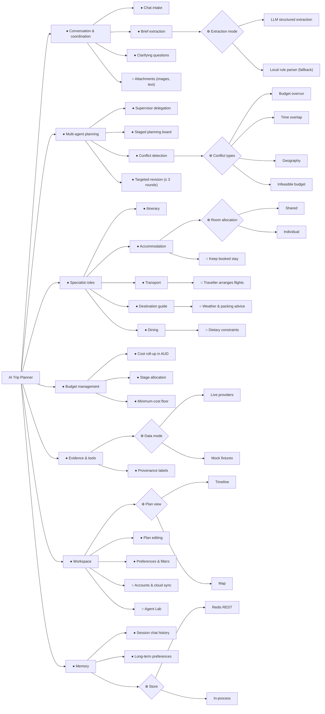

# 1. 需求

[English](01-requirements.md) | 中文

## 1.1 产品陈述

AI Trip Planner 是一家“一人 AI 旅行社”。唯一的人类旅行者同时是创始人和运营者，在聊天中描述一次旅行。协调 agent 把对话整理成结构化的
`TripBrief`，再由五个 specialist AI 角色在共享规划看板上协作规划：日程、交通、住宿、目的地向导和餐饮。确定性的 LangGraph
工作流对照预算并相互核对它们的提案，发出定向修订请求，直到计划收敛或达到轮数上限。之后旅行者可以在聊天中，或在时间线与地图编辑器里继续调整计划。

## 1.2 Ad hoc 需求（个人项，每人至少一条）

建模之前，用利益相关者自己的话写下的非正式陈述。

| 编号  | 成员                  | Ad hoc 需求                                                                                                                                                                                                                                                                                                                                                                                    |
| ----- | --------------------- | ---------------------------------------------------------------------------------------------------------------------------------------------------------------------------------------------------------------------------------------------------------------------------------------------------------------------------------------------------------------------------------------------- |
| AH-A1 | A (`@Lilstanie`)      | “我不想填表。我想直接打‘我和我对象，东京和京都，11 月 10 号到 17 号，大概九千’，剩下的让它自己算。真缺了什么就问我一次，给几个能点的选项。别自己编一个我没说过的预算。它干活的时候我想看见它在做什么，不是一个转圈的加载图标。如果计划回来是两个相隔一小时的地方排在一前一后，你自己去修，别丢回给我。试个两三次，还不见好就把你手上最好的那版给我。要是我这点钱办不到，直说就行。”            |
| AH-B1 | B (`@fonever2`)       | “我和一位朋友打算从悉尼去东京和京都，日期固定，共用一份预算。请帮我们挑选航班，并安排城市间的移动时间，让每天的观光与交通衔接起来。票价和行程时间要用实际查到的数据。如果我指定某一段坐火车，有这个选项就采用，没有就明确告诉我。查不到票价时要说价格未知，不能当作免费。如果总价太高或时间冲突，就尝试合适的便宜选项或调整日程；如果仍然不可行，请告诉我需要改什么。”                         |
| AH-C1 | C (`@HeadmasterEggy`) | “我们五个朋友去东京，预算是固定的。我希望规划器算出我们需要几间房、是合住还是每人一间，并挑一家我真愿意住的酒店：评分要过得去，我要求了的话还要能免费取消。机票先付，所以酒店得放进剩下的钱里。如果整趟行程超预算，我希望把酒店换成一家更便宜、但仍符合我规则的，而不是告诉我没有合适的。如果怎么都放不下，就告诉我至少需要多少钱，而不是编一家便宜的出来。要是我已经订好了住处，就直接保留。” |
| AH-D1 | D (`@jbia0391`)       | “我准备去京都玩几天，希望目的地指南能根据实际出行日期帮我准备衣物，而不是只按季节猜。我吃素，也对花生过敏，所以希望餐厅建议能考虑这些偏好。请尽可能使用真实地点和天气证据，并说明天气结果是历史气候背景还是暂时不可用；除非餐厅确认，否则不要向我保证某家店适合过敏者。”                                                                                                                       |
| AH-E1 | E (`@WhW0591`)        | “我想规划一次旅行，不只是在这个平台上从零开始，也希望有个助手帮我整理行程。我想能方便地修改行程的各种细节，同时让助手检查冲突、给出建议、核对路线和时间，并帮我确认预算。所有创建和调整完成后，我最终想拿到一份清晰、有条理的旅行日程。”                                                                                                                                                       |

早期实验课讨论中收集到的组级需求（来自小组设计文档）：根据天气给穿衣建议、个人或团体住宿、美食推荐、逐日日程、行李规定、交通、预算、能把需求拆成任务并汇总答案的聊天窗口，以及人数、区域和预算筛选。

## 1.3 需求分类

下面把 §1.2 的每条 ad hoc 需求拆分为已分类的需求。FR = 功能需求，NFR = 非功能需求，C = 约束。

### 成员 A（AH-A1）

| 编号  | 类型            | 需求                                                                                         | 追溯到                                                |
| ----- | --------------- | -------------------------------------------------------------------------------------------- | ----------------------------------------------------- |
| R-A1  | FR              | 把一条自由文本消息变成已校验的 `TripBrief`，并并到此前回合已陈述的事实之上。                 | `chat.ts: runTripChat`、`update_trip_brief`           |
| R-A2  | FR              | 只记录旅行者陈述过的事实；必填字段缺失时报告缺失，而不是取默认值。                           | `IncompleteBriefError`、协调器提示词                  |
| R-A3  | FR              | 每回合最多问一个澄清问题，给 2–4 个选项，用旅行者的语言书写。                                | `ask_user_question`、`ASK_USER_MAX_QUESTIONS`         |
| R-A4  | FR              | 通过分阶段的规划看板委派给各专家，每个专家拿到一句具体目标。                                 | `supervisor.ts`、`board.ts`、`dispatch_specialists`   |
| R-A5  | FR              | 每个专家推送一条进度事件，让旅行者看见工作正在发生。                                         | `AgentProgressEvent`、`withProgressTools`             |
| R-A6  | FR              | 按检测到的冲突决定路由：只修订被定向的区块，且仅在还有轮次时进行。                           | `workflow.ts: routeAfterDetection`、`reviseConflicts` |
| R-A7  | FR              | 只有 `planScore` 改善时才保留该修订轮；否则丢弃该轮并保留此前的提案。                        | `planScore`、`stalled`、`routeAfterRevision`          |
| R-A8  | FR              | 由已校验的提案组装计划，并把每个区块标为 `draft` 或 `needs_you`。                            | `build_plan`、`toSection`                             |
| R-A9  | C               | 每回合最多三轮修订。                                                                         | `DEFAULT_MAX_ROUNDS`                                  |
| R-A10 | NFR（完整性）   | 模型提出的摘要改动，必须先经 Zod 契约重新校验才会开始规划。回复文字从来不等于计划本身。      | `BriefPatchSchema`、`applyBriefPatch`                 |
| R-A11 | NFR（可用性）   | 没有模型密钥、或回答不合 schema 时，抽取、委派与回复各自回退到确定性代码，该回合仍然完成。   | `fallbackReplyFor`、supervisor 回退                   |
| R-A12 | NFR（可验证性） | 编排器在注入模型与 provider 故障下的行为可重放、可评分，因此这些规则是在故障条件下被检验的。 | `orchestrator/src/agent-lab/`                         |

### 成员 B（AH-B1）

AH-B1 是课程作业中以利益相关者口吻撰写的陈述，不是访谈引语。其六条分类需求追溯到当前交通和日程实现。

| 编号 | 类型         | 需求                                                                                                                             | 当前实现依据                                                                                                                                                                                                                                                                                                                                                                                                              |
| ---- | ------------ | -------------------------------------------------------------------------------------------------------------------------------- | ------------------------------------------------------------------------------------------------------------------------------------------------------------------------------------------------------------------------------------------------------------------------------------------------------------------------------------------------------------------------------------------------------------------------- |
| R-B1 | FR           | 根据出发地、目的地和日期生成有序行程段；收集航班和地面路线选项，为全体出行者生成带时间安排的交通提案。                           | [packages/agents/src/transport/index.ts:87](https://github.com/Lilstanie/AI_TRIP_PLANNER/blob/c59f751fc04766db9fcbcfe82d4a0c5b6ec3c0c6/packages/agents/src/transport/index.ts#L87); `journeyLegs`，位于 `transport/legs.ts`                                                                                                                                                                                               |
| R-B2 | FR           | 规划每日活动时使用交通日程，并检查不同活动地点间的移动能否放进可用时间间隔，包括 15 分钟的到达缓冲。                             | [packages/orchestrator/src/board.ts:15](https://github.com/Lilstanie/AI_TRIP_PLANNER/blob/c59f751fc04766db9fcbcfe82d4a0c5b6ec3c0c6/packages/orchestrator/src/board.ts#L15); `citiesByDay`, `travelConflicts`: [packages/agents/src/itinerary/index.ts:342](https://github.com/Lilstanie/AI_TRIP_PLANNER/blob/c59f751fc04766db9fcbcfe82d4a0c5b6ec3c0c6/packages/agents/src/itinerary/index.ts#L342)                        |
| R-B3 | FR           | 支持时采用旅行者为每段行程指定的交通方式；不可用时明确说明，并告知实际采用的路线。                                               | `chosenModeFor`: [packages/agents/src/transport/legs.ts:106](https://github.com/Lilstanie/AI_TRIP_PLANNER/blob/c59f751fc04766db9fcbcfe82d4a0c5b6ec3c0c6/packages/agents/src/transport/legs.ts#L106); `scheduledLegs` 和 `layOutHop`: [packages/agents/src/transport/index.ts:306](https://github.com/Lilstanie/AI_TRIP_PLANNER/blob/c59f751fc04766db9fcbcfe82d4a0c5b6ec3c0c6/packages/agents/src/transport/index.ts#L306) |
| R-B4 | NFR — 完整性 | 只选择返回的票价候选；费用和时长均来自证据。地面交通缺失的票价保持未定价；必需航班不可用时明确报告，不编造价格。                 | `planTransport`: [packages/agents/src/transport/index.ts:685](https://github.com/Lilstanie/AI_TRIP_PLANNER/blob/c59f751fc04766db9fcbcfe82d4a0c5b6ec3c0c6/packages/agents/src/transport/index.ts#L685); `assembleTransportProposal`: [packages/agents/src/transport/index.ts:470](https://github.com/Lilstanie/AI_TRIP_PLANNER/blob/c59f751fc04766db9fcbcfe82d4a0c5b6ec3c0c6/packages/agents/src/transport/index.ts#L470)  |
| R-B5 | NFR — 韧性   | 未配置模型或模型选择无效时，使用基于证据的确定性计划；保留可用性缺口和来源标签。无法恢复的输入或数据提供方错误仍可能使运行失败。 | `deterministicPlan`, `planTransport` 捕获异常后的路径： [packages/agents/src/transport/index.ts:685](https://github.com/Lilstanie/AI_TRIP_PLANNER/blob/c59f751fc04766db9fcbcfe82d4a0c5b6ec3c0c6/packages/agents/src/transport/index.ts#L685)                                                                                                                                                                              |
| R-B6 | C — 有界控制 | 默认工作流总共最多运行三轮（首轮加最多两轮修订）；仅重新运行被定向请求且支持修订的 specialist，只有规划评分改善时才保留修订。    | [packages/orchestrator/src/workflow.ts:141](https://github.com/Lilstanie/AI_TRIP_PLANNER/blob/c59f751fc04766db9fcbcfe82d4a0c5b6ec3c0c6/packages/orchestrator/src/workflow.ts#L141); [packages/orchestrator/src/conflicts.ts:24](https://github.com/Lilstanie/AI_TRIP_PLANNER/blob/c59f751fc04766db9fcbcfe82d4a0c5b6ec3c0c6/packages/orchestrator/src/conflicts.ts#L24)                                                    |

### 成员 C（AH-C1）

| 编号  | 类型          | 需求                                                                                        | 追溯到                             |
| ----- | ------------- | ------------------------------------------------------------------------------------------- | ---------------------------------- |
| R-C1  | FR            | 根据人数和分房方式计算房间数：`individual` 每位住客一间，`shared` 为 ⌈住客数 / 2⌉。         | `accommodation/index.ts`           |
| R-C2  | FR            | 按最低评分筛选住宿候选，要求时还按免费取消筛选；这些是硬性规则，预算修订不得放宽。          | `planning.ts: eligibleOptions`     |
| R-C3  | FR            | 首选评分 ≥ 8 且可免费取消的住宿，并控制在交通之后剩余的住宿分配额内。                       | `chooseInitial`，看板分配额        |
| R-C4  | FR            | 以澳元汇总各区段费用，并与 `budgetTotal` 比较。                                             | `budget.ts: rollUpCost`            |
| R-C5  | FR            | 一旦超支，把需要节省的金额分摊到仍可削减的区段，并向每个区段发出定向修订请求。              | `conflicts.ts: detectConflicts`    |
| R-C6  | FR            | 当最便宜的选项已经超出预算时，报告一个写明最低金额的 `infeasible budget` 冲突，并停止修订。 | `minimumCost`, `INFEASIBLE_BUDGET` |
| R-C7  | FR            | 保留旅行者已预订的住处，不定价、不搜索。                                                    | `bookedStayProposal`               |
| R-C8  | NFR（准确性） | 金额以整数分为单位求和，总额不会漂移。                                                      | `sumMoney`, `stayCost`             |
| R-C9  | NFR（完整性） | 模型只能在搜索到的候选 id 中选择，从不编造酒店、价格或政策。                                | 住宿系统提示词                     |
| R-C10 | NFR（可用性） | 没有模型密钥或回答不符合 schema 时，确定性回退仍会产出有效提案。                            | `planStays` 回退                   |
| R-C11 | C             | 最多三轮修订；只有规划评分改善时才保留该轮。                                                | `workflow.ts`                      |

### 成员 D（AH-D1）

| 编号 | 类型          | 需求                                                                                                                                   | 追溯到                                                                                                                |
| ---- | ------------- | -------------------------------------------------------------------------------------------------------------------------------------- | --------------------------------------------------------------------------------------------------------------------- |
| R-D1 | FR            | 对于有效的行程日期和目的地坐标，获取天气证据，并在目的地指南提案中提供基于天气的行李建议。                                             | `destination-guide/index.ts:planDestinationGuide`                                                                     |
| R-D2 | NFR（准确性） | 按实际时间范围标记天气：最多 14 天内提供天气预报，更远日期使用气候背景，不能称为预报。若有提供，保留数据提供方、观测时间和预报有效期。 | `weather.ts:weather.forecast`；`destination-guide/index.ts:planDestinationGuide`                                      |
| R-D3 | FR            | 使用有地图证据的餐厅候选和已存储的相关饮食偏好生成餐饮建议，并遵守餐饮预算上限。                                                       | `dining/index.ts:dietaryPreferences`；`dining/index.ts:budgetCeiling`                                                 |
| R-D4 | NFR（完整性） | 只接受与地图候选相符的景点和餐厅名称；不得把菜单、过敏原安全或饮食适配性说成已核实事实。                                               | `destination-guide/index.ts:validateDraft`；`dining/index.ts:validateDraft`；`dining/index.ts:createMiniMaxGenerator` |
| R-D5 | NFR（可用性） | 天气或模型证据不可用或无效时，尽可能返回确定性建议，并标明天气不可用或使用了回退来源，不得把它描述成实时预报。                         | `destination-guide/index.ts:fallbackDraft`；`destination-guide/index.ts:planDestinationGuide`                         |

### 成员 E（AH-E1）

| 编号 | 类型    | 需求                                                                            | 追溯到                                             |
| ---- | ------- | ------------------------------------------------------------------------------- | -------------------------------------------------- |
| R-E1 | FR      | 接受时间线/地图上的编辑，包括移动、改时间、替换、检查路线和撤销。               | `EditRequest`；`TripEditor`；`useTimelineEdits`    |
| R-E2 | FR      | 应用前先显示预览，包括差异、路线、阻断项、冲突、费用和预算状态。                | `EditPreview`；`EditPreviewPanel`；`previewEdit`   |
| R-E3 | FR      | 保留未改动的活动和想法，时间线与地图共享选中项，并标出未核实的价格。            | `TripPlan.editIssues`；共享的选中活动 id           |
| R-E4 | NFR     | 编辑后以确定性代码重新计算路线、日程冲突、区块冲突、费用和预算。                | `detectConflicts`；`rollUpCost`；Maps / Routes API |
| R-E5 | NFR     | 行程事实与偏好分开保存。当前聊天 LLM 只更新行程简报或重新规划，不调用编辑边界。 | `TripBrief`；协调者工具；记忆服务                  |
| R-E6 | C / NFR | 执行目的地分段规则，拒绝格式错误或过期的预览，不编造路线、价格或地点。          | `baseVersion`；Zod；身份与分段检查                 |

## 1.4 特征图（组项）

记号：● 必选，○ 可选，⊕ 互斥选择（恰好一个），⊗ 或选择（一个或多个）。
渲染图：[`../diagrams/feature-diagram.svg`](../diagrams/feature-diagram.svg)。

**跨树约束**

1. _Targeted revision_ 需要 _Conflict detection_。
2. _Budget overrun_ 需要 _Cost roll-up in AUD_；_Infeasible budget_ 需要 _Minimum-cost floor_。
3. _Keep booked stay_ 排除该行程中 _Accommodation_ 的搜索与定价。
4. _Traveller arranges flights_ 排除 _Transport_ 的机票搜索以及任何机票价格冲突。
5. _Live providers_ 需要数据提供方密钥；没有密钥时系统选择 _Mock fixtures_。
6. _Accounts & cloud sync_ 需要 _Long-term preferences_。

**附加在特征上的非功能需求**

| 特征                 | NFR                                                                                  |
| -------------------- | ------------------------------------------------------------------------------------ |
| Multi-agent planning | 每个提案在图的每个边界都会按共享 Zod schema 重新校验。                               |
| Specialist roles     | 模型缺失或输出不符合 schema 时，每个 specialist 回退到确定性输出，所以请求总能完成。 |
| Budget management    | 以整数分计算澳元；超支百分比不经四舍五入直接比较。                                   |
| Evidence & tools     | 价格和地点只来自工具；每个区段都标明数据是实时、估算、模拟数据还是回退。             |
| Workspace            | 规划进度以 NDJSON 流式输出，旅行者能看到每个阶段的进展。                             |
| Agent Lab            | fixture 运行永远不会调用付费模型或数据提供方。                                       |

