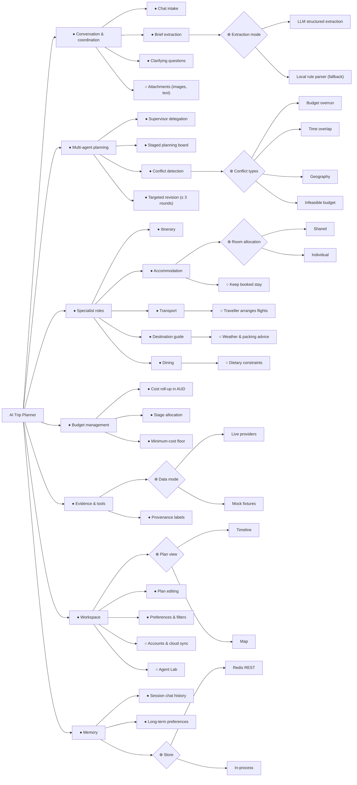

# 1. 需求

[English](01-requirements.md) | 中文

## 1.1 产品陈述

AI Trip Planner 是一家“一人 AI 旅行社”。唯一的人类旅行者同时是创始人和运营者，在聊天中描述一次旅行。协调 agent 把对话整理成结构化的
`TripBrief`，再由五个 specialist AI 角色在共享规划看板上协作规划：日程、交通、住宿、目的地向导和餐饮。确定性的 LangGraph
工作流对照预算并相互核对它们的提案，发出定向修订请求，直到计划收敛或达到轮数上限。之后旅行者可以在聊天中，或在时间线与地图编辑器里继续调整计划。

## 1.2 Ad hoc 需求（个人项，每人至少一条）

建模之前，用利益相关者自己的话写下的非正式陈述。

| 编号 | 成员 | Ad hoc 需求 |
| --- | --- | --- |
| AH-C1 | C (`@HeadmasterEggy`) | “我们五个朋友去东京，预算是固定的。我希望规划器算出我们需要几间房、是合住还是每人一间，并挑一家我真愿意住的酒店：评分要过得去，我要求了的话还要能免费取消。机票先付，所以酒店得放进剩下的钱里。如果整趟行程超预算，我希望把酒店换成一家更便宜、但仍符合我规则的，而不是告诉我没有合适的。如果怎么都放不下，就告诉我至少需要多少钱，而不是编一家便宜的出来。要是我已经订好了住处，就直接保留。” |
| AH-A1 | A | _由 A 填写_ |
| AH-B1 | B | _由 B 填写_ |
| AH-D1 | D | _由 D 填写_ |
| AH-E1 | E | _由 E 填写_ |

早期实验课讨论中收集到的组级需求（来自小组设计文档）：根据天气给穿衣建议、个人或团体住宿、美食推荐、逐日日程、行李规定、交通、预算、能把需求拆成任务并汇总答案的聊天窗口，以及人数、区域和预算筛选。

## 1.3 需求分类

下面把 AH-C1 拆分为已分类的需求。FR = 功能需求，NFR = 非功能需求，C = 约束。

| 编号 | 类型 | 需求 | 追溯到 |
| --- | --- | --- | --- |
| R-C1 | FR | 根据人数和分房方式计算房间数：`individual` 每位住客一间，`shared` 为 ⌈住客数 / 2⌉。 | `accommodation/index.ts` |
| R-C2 | FR | 按最低评分筛选住宿候选，要求时还按免费取消筛选；这些是硬性规则，预算修订不得放宽。 | `planning.ts: eligibleOptions` |
| R-C3 | FR | 首选评分 ≥ 8 且可免费取消的住宿，并控制在交通之后剩余的住宿分配额内。 | `chooseInitial`，看板分配额 |
| R-C4 | FR | 以澳元汇总各区段费用，并与 `budgetTotal` 比较。 | `budget.ts: rollUpCost` |
| R-C5 | FR | 一旦超支，把需要节省的金额分摊到仍可削减的区段，并向每个区段发出定向修订请求。 | `conflicts.ts: detectConflicts` |
| R-C6 | FR | 当最便宜的选项已经超出预算时，报告一个写明最低金额的 `infeasible budget` 冲突，并停止修订。 | `minimumCost`, `INFEASIBLE_BUDGET` |
| R-C7 | FR | 保留旅行者已预订的住处，不定价、不搜索。 | `bookedStayProposal` |
| R-C8 | NFR（准确性） | 金额以整数分为单位求和，总额不会漂移。 | `sumMoney`, `stayCost` |
| R-C9 | NFR（完整性） | 模型只能在搜索到的候选 id 中选择，从不编造酒店、价格或政策。 | 住宿系统提示词 |
| R-C10 | NFR（可用性） | 没有模型密钥或回答不符合 schema 时，确定性回退仍会产出有效提案。 | `planStays` 回退 |
| R-C11 | C | 最多三轮修订；只有规划评分改善时才保留该轮。 | `workflow.ts` |

## 1.4 特征图（组项）

记号：● 必选，○ 可选，⊕ 互斥选择（恰好一个），⊗ 或选择（一个或多个）。
渲染图：[`../diagrams/feature-diagram.svg`](../diagrams/feature-diagram.svg)。

**跨树约束**

1. *Targeted revision* 需要 *Conflict detection*。
2. *Budget overrun* 需要 *Cost roll-up in AUD*；*Infeasible budget* 需要 *Minimum-cost floor*。
3. *Keep booked stay* 排除该行程中 *Accommodation* 的搜索与定价。
4. *Traveller arranges flights* 排除 *Transport* 的机票搜索以及任何机票价格冲突。
5. *Live providers* 需要数据提供方密钥；没有密钥时系统选择 *Mock fixtures*。
6. *Accounts & cloud sync* 需要 *Long-term preferences*。

**附加在特征上的非功能需求**

| 特征 | NFR |
| --- | --- |
| Multi-agent planning | 每个提案在图的每个边界都会按共享 Zod schema 重新校验。 |
| Specialist roles | 模型缺失或输出不符合 schema 时，每个 specialist 回退到确定性输出，所以请求总能完成。 |
| Budget management | 以整数分计算澳元；超支百分比不经四舍五入直接比较。 |
| Evidence & tools | 价格和地点只来自工具；每个区段都标明数据是实时、估算、模拟数据还是回退。 |
| Workspace | 规划进度以 NDJSON 流式输出，旅行者能看到每个阶段的进展。 |
| Agent Lab | fixture 运行永远不会调用付费模型或数据提供方。 |
