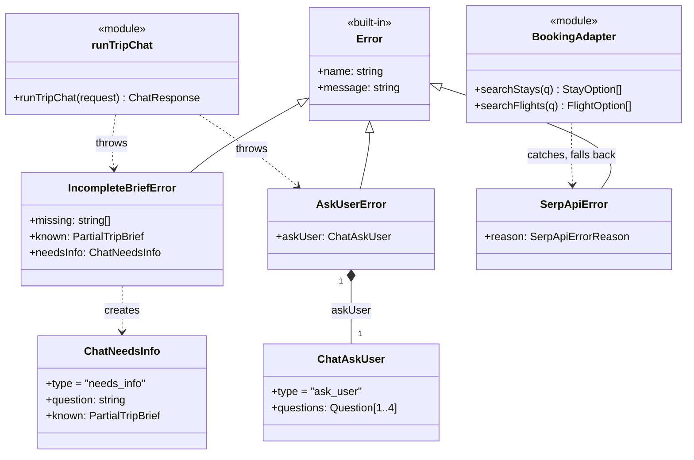
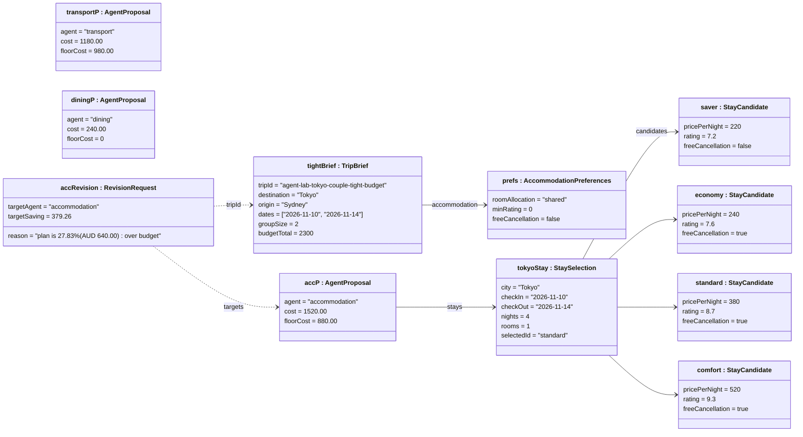
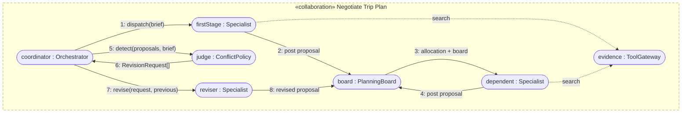
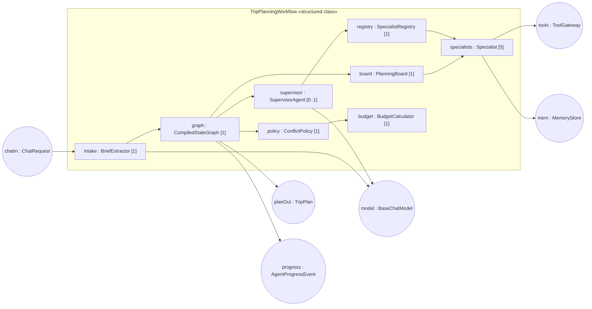

# 3. Structure models

English | [中文](03-structure.zh.md)

## 3.1 Elementary structure: generalisation added to the class model

The five class diagrams in [`../class-diagram.md`](../class-diagram.md)
already show composition, aggregation, multiplicity, interfaces and realisation
(`Specialist <|.. ItineraryAgent`, `MapsPort <|.. MapsAdapter`, …). The criteria also name
**generalisation**, which the existing diagrams do not draw. The code does have real inheritance:
the typed errors that turn a failed or unfinished turn into a specific response frame. This is
**Diagram 6** of the class model.
Rendered: [`../diagrams/class-6-generalisation.svg`](../diagrams/class-6-generalisation.svg).

| Relationship | Kind | Rationale |
| --- | --- | --- |
| `Error <\|-- IncompleteBriefError` | generalisation | "Not enough to plan yet" is a non-plan outcome, not a crash; the API route catches it by type and streams a `needs_info` frame with the fields understood so far. |
| `Error <\|-- AskUserError` | generalisation | A clarifying question with 1–4 concrete choices, streamed as `ask_user`. |
| `Error <\|-- SerpApiError` | generalisation | A provider failure with a typed `reason` (quota, no results, …) so the booking adapter can fall back to Google Places estimates and label the provenance. |

*Design note.* Subclassing `Error` lets `runTripChat` end a turn early from deep inside the
LangGraph or LangChain call stack, and lets the route handler distinguish outcomes with
`instanceof` instead of string matching.

## 3.2 Object diagram

A snapshot of the planning board at the end of round 1 of `detect_conflicts`, for the Agent Lab's
`tokyo-couple-tight-budget` brief. The brief and the four stay candidates are the real fixture values
(`agent-lab/scenarios.ts`, `tools/src/booking.ts`). **Transport and dining costs are illustrative**:
re-run the lab and replace them if you want exact figures.
Rendered: [`../diagrams/object-diagram.svg`](../diagrams/object-diagram.svg).

How to read it: the couple shares one room (⌈2 / 2⌉ = 1). The first choice is *standard*, the
cheapest candidate rated ≥ 8 with free cancellation, at 1 × 4 × 380 = AUD 1,520. The floor is
*saver*, at 4 × 220 = AUD 880. The total of AUD 2,940 is AUD 640 (27.83%) over the AUD 2,300 budget.
The overrun is spread over each section's room to cut (transport 200, accommodation 640, dining 240,
1,080 in total), so accommodation is asked to save 640 × 640 / 1,080 = AUD 379.26. In round 2 its
allocation is AUD 1,140.74. A budget revision takes the cheapest eligible candidate, which is
*saver* (AUD 880): free cancellation was not a confirmed preference, so *saver* is still eligible.
Had the traveller required free cancellation, *saver* would be filtered out and *economy*
(AUD 960) chosen instead.

## 3.3 Collaboration: «collaboration» Negotiate Trip Plan

Roles, not classes: any `Specialist` can play a role, and the connectors are the links the roles use
during one planning turn. Rendered: [`../diagrams/collaboration.svg`](../diagrams/collaboration.svg).

| Role | Played by (in `main`) | Responsibility in the collaboration |
| --- | --- | --- |
| coordinator | LangGraph workflow plus supervisor agent | Decides when to dispatch, detect, revise and stop. |
| board | `board.ts` | Orders the stages (transport → accommodation → itinerary and dining) and computes each allocation. |
| firstStage | Transport (also Destination guide, which has no budget share) | Plans without waiting for anyone. |
| dependent | Accommodation, Itinerary, Dining | Waits for earlier stages and plans within its allocation. |
| judge | `detectConflicts` and `rollUpCost` (member C) | Turns proposals into targeted `RevisionRequest`s. |
| reviser | Any specialist with `supportsRevision` | Revises only its own section, from its previous proposal. |
| evidence | `ToolGateway` (maps, booking, weather) | Supplies grounded places, prices and forecasts. |

## 3.4 Structured class: TripPlanningWorkflow

The internal structure of the orchestrator as a composite: its parts, the ports it exposes and
requires, and the connectors between parts.
Rendered: [`../diagrams/structured-class.svg`](../diagrams/structured-class.svg).

| Element | Kind | Notes |
| --- | --- | --- |
| `chatIn`, `planOut`, `progress` | provided ports | `POST /api/chat` request in; NDJSON progress frames and a final `{ reply, plan }` out. |
| `tools`, `mem`, `model` | required ports | Injected through `OrchestratorOptions` and `AgentContext`; tests pass fakes. |
| `supervisor [0..1]` | part | Absent when no model is configured; the graph then dispatches deterministically. |
| `specialists [5]` | part | Itinerary, Transport, Accommodation, Destination guide, Dining. |
| `policy`, `budget` | parts | Member C's `detectConflicts`, `rollUpCost` and `minimumCost`. |
