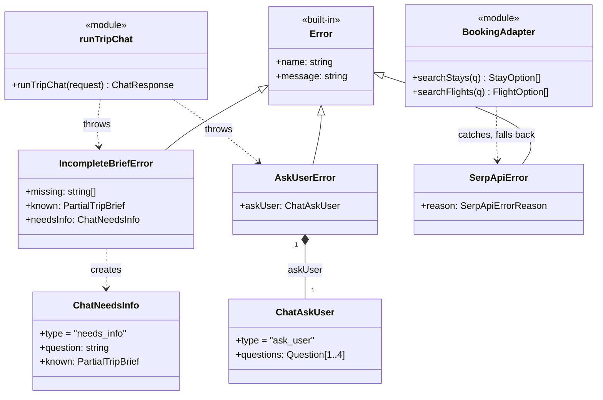
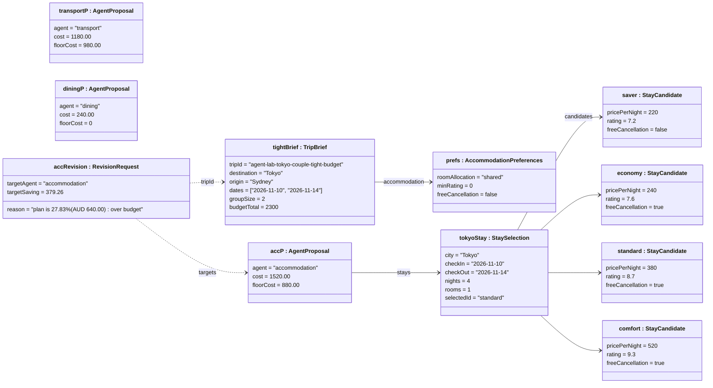
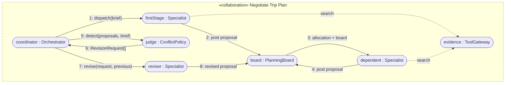
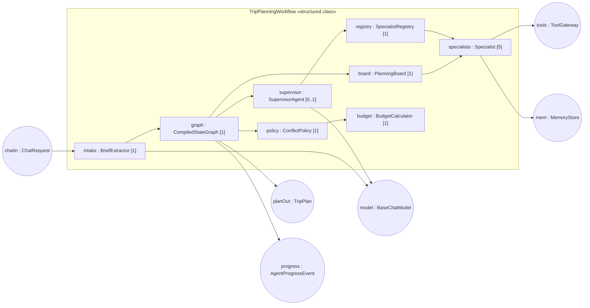

# 3. 结构模型

[English](03-structure.md) | 中文

## 3.1 基本结构：为类模型补充泛化

[`../class-diagram.md`](../class-diagram.zh.md) 中的五张类图已经画出了组合、聚合、多重性、接口和实现关系
（`Specialist <|.. ItineraryAgent`、`MapsPort <|.. MapsAdapter` 等）。评分标准还点名要求**泛化**，而现有类图没有画出。代码中确实存在真正的继承：把失败或未完成的一轮对话转成特定响应帧的类型化错误。这是类模型的**图 6**。
渲染图：[`../diagrams/class-6-generalisation.svg`](../diagrams/class-6-generalisation.svg)。

| 关系 | 类型 | 理由 |
| --- | --- | --- |
| `Error <\|-- IncompleteBriefError` | 泛化 | “信息还不够规划”是一种非计划结果，而不是崩溃；API 路由按类型捕获它，并流式发送一个带有已理解字段的 `needs_info` 帧。 |
| `Error <\|-- AskUserError` | 泛化 | 带 1–4 个具体选项的澄清问题，以 `ask_user` 流式发送。 |
| `Error <\|-- SerpApiError` | 泛化 | 带类型化 `reason`（配额、无结果等）的数据提供方故障，使预订适配器可以回退到 Google Places 估算并标注数据来源信息。 |

*设计说明。* 继承 `Error` 让 `runTripChat` 可以从 LangGraph 或 LangChain 调用栈深处提前结束这一轮，也让路由处理器用 `instanceof` 而不是字符串匹配来区分结果。

## 3.2 对象图

Agent Lab 的 `tokyo-couple-tight-budget` 行程需求在 `detect_conflicts` 第 1 轮结束时规划看板的快照。行程需求和四个住宿候选是真实的 fixture 取值（`agent-lab/scenarios.ts`、`tools/src/booking.ts`）。**交通和餐饮费用是示意值**：如需精确数字，请重新运行 Agent Lab 并替换。
渲染图：[`../diagrams/object-diagram.svg`](../diagrams/object-diagram.svg)。

读图方法：两人合住一间房（⌈2 / 2⌉ = 1）。首选是 *standard*，即评分 ≥ 8 且可免费取消的最便宜候选，费用为 1 × 4 × 380 = AUD 1,520。底价是 *saver*，4 × 220 = AUD 880。总价 AUD 2,940，比 AUD 2,300 的预算超出 AUD 640（27.83%）。超支按各区段可削减的空间分摊（交通 200、住宿 640、餐饮 240，共 1,080），因此住宿被要求节省 640 × 640 / 1,080 = AUD 379.26。第 2 轮中它的分配额为 AUD 1,140.74。预算修订会选最便宜的合格候选，也就是 *saver*（AUD 880）：免费取消不是已确认的偏好，所以 *saver* 仍然合格。如果旅行者要求免费取消，*saver* 会被筛掉，改选 *economy*（AUD 960）。

## 3.3 协作：«collaboration» Negotiate Trip Plan

图中是角色而不是类：任何 `Specialist` 都可以扮演某个角色，连接器是这些角色在一轮规划中使用的链接。渲染图：[`../diagrams/collaboration.svg`](../diagrams/collaboration.svg)。

| 角色 | 扮演者（`main` 中） | 在协作中的职责 |
| --- | --- | --- |
| coordinator | LangGraph 工作流加 supervisor agent | 决定何时派发、检测、修订和停止。 |
| board | `board.ts` | 安排阶段顺序（交通 → 住宿 → 日程和餐饮），并计算各自的分配额。 |
| firstStage | Transport（还有没有预算份额的 Destination guide） | 不等待任何人就开始规划。 |
| dependent | Accommodation、Itinerary、Dining | 等待前面的阶段，并在自己的分配额内规划。 |
| judge | `detectConflicts` 和 `rollUpCost`（成员 C） | 把提案转换成定向的 `RevisionRequest`。 |
| reviser | 任何带 `supportsRevision` 的 specialist | 从上一版提案出发，只修订自己的区段。 |
| evidence | `ToolGateway`（地图、预订、天气） | 提供有依据的地点、价格和天气预报。 |

## 3.4 结构化类：TripPlanningWorkflow

把编排器的内部结构画成复合结构：它的部件、对外提供和需要的端口，以及部件之间的连接器。
渲染图：[`../diagrams/structured-class.svg`](../diagrams/structured-class.svg)。

| 元素 | 类型 | 说明 |
| --- | --- | --- |
| `chatIn`, `planOut`, `progress` | 提供端口 | 输入 `POST /api/chat` 请求；输出 NDJSON 进度帧和最终的 `{ reply, plan }`。 |
| `tools`, `mem`, `model` | 需要端口 | 通过 `OrchestratorOptions` 和 `AgentContext` 注入；测试传入替身。 |
| `supervisor [0..1]` | 部件 | 未配置模型时不存在；此时图以确定性方式派发。 |
| `specialists [5]` | 部件 | Itinerary、Transport、Accommodation、Destination guide、Dining。 |
| `policy`, `budget` | 部件 | 成员 C 的 `detectConflicts`、`rollUpCost` 和 `minimumCost`。 |
