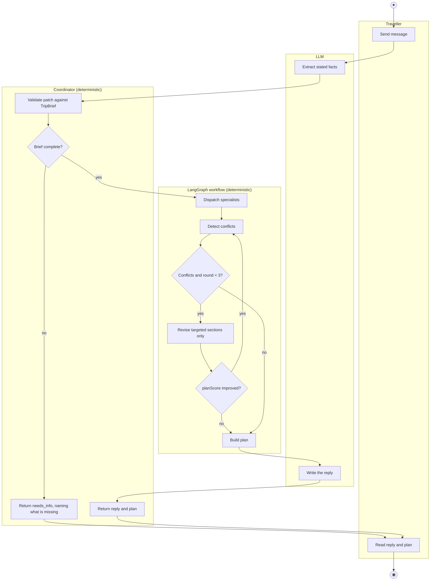
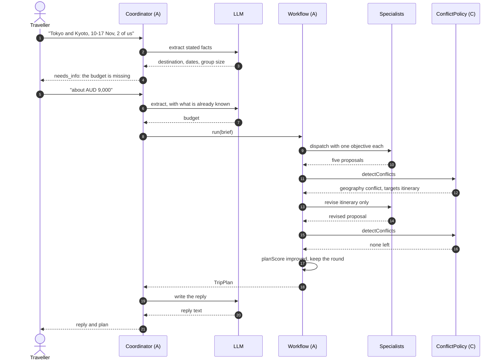
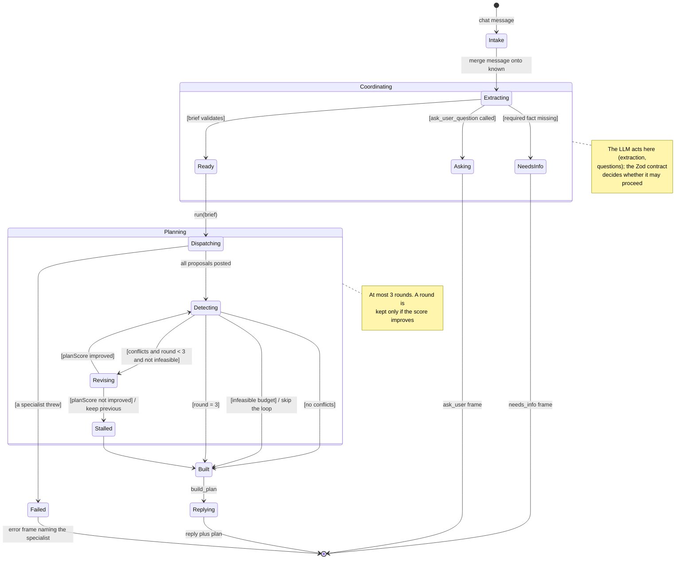

# 4. Behaviour models: member A (`@Lilstanie`, coordination and orchestration)

English | [中文](04-member-a-behaviour.zh.md)

All three diagrams are built from ad hoc requirement **AH-A1** and use case **UC-A1 Generate
Itinerary** (`01-requirements.md`, `02-use-cases.md`). Each one marks where the LLM acts and which
code validates what it returns.

One planning turn makes three LLM calls. Each has a deterministic path that takes over when the
model is unavailable or returns invalid output:

| LLM call | What it decides | Deterministic guard |
| --- | --- | --- |
| Brief extraction (`update_trip_brief`) | Which trip facts the message states | `BriefPatchSchema` → `applyBriefPatch` → `TripBrief` Zod parse. Facts the traveller did not state are reported as missing, not inferred |
| Supervisor delegation | Which specialists to call, with what objective | Fixed specialist registry. The itinerary specialist is always delegated, and a failed supervisor falls back to dispatching all five |
| Reply writing | The prose the traveller reads | With no model configured, `fallbackReplyFor(plan)` writes it from the plan |

The plan is not generated by the model. `build_plan` assembles it from the validated proposals.

## 4.1 Activity diagram: Generate Itinerary (UC-A1)

The swimlanes are the five participants. Rounds 2 and 3 re-enter *Detect conflicts*.
Rendered: [`stage1-member-a-activity.svg`](../diagrams/stage1-member-a-activity.svg).

Without a model key, only the three LLM boxes drop out. Extraction uses the facts already stated,
delegation dispatches all five specialists, and `fallbackReplyFor` writes the reply.

## 4.2 Sequence diagram: one turn with a clarifying question, then a revised plan (UC-A1, extensions 3a and 7a)

The first message leaves out the budget, so the coordinator asks for it before planning starts. The
first round returns a geography conflict, one targeted revision fixes it, and the plan score improves.
Rendered: [`stage1-member-a-sequence.svg`](../diagrams/stage1-member-a-sequence.svg).

If the score had not improved, `revise_conflicts` sets `stalled` and the previous proposals are
kept. If the conflict had been `infeasible budget`, `routeAfterDetection` skips the loop.

## 4.3 State machine: one planning turn (UC-A1)

This is the turn as the orchestrator sees it. Member C's state machine covers a single *section*
inside `Detecting`. This one covers the whole turn.
Rendered: [`stage1-member-a-state.svg`](../diagrams/stage1-member-a-state.svg).

| State | What the traveller sees | Entry / exit behaviour |
| --- | --- | --- |
| Intake, Extracting | "thinking" | The message is merged onto `known`, so a follow-up does not repeat earlier facts. |
| NeedsInfo | The question in chat | No plan exists yet. `IncompleteBriefError` names the missing fields, and required facts are not given default values. |
| Asking | 2–4 clickable options | At most one question per turn, and no other tool runs after it. |
| Dispatching | A progress row per subagent | The supervisor chooses which specialists run. The itinerary specialist always runs. |
| Detecting | "checking budget and schedules" | Member C's `detectConflicts` returns the revision requests. |
| Revising | "revising affected sections" | Only the targeted agents re-run, each given its previous proposal. |
| Stalled | — | The round is discarded and the earlier proposals are kept. |
| Built | Sections `draft` or `needs_you` | The plan is assembled from the validated proposals. |
| Failed | Error naming the specialist | No partial plan is returned. |

## 4.4 How this behaviour is measured

`packages/orchestrator/src/agent-lab/` replays fixed scenarios against the orchestrator with
injected faults: a specialist timing out, a provider failing, a model returning output that does not
match the schema. Each run records the number of rounds, the conflicts raised, token usage and an
evaluator score (R-A12). This is how the transitions above are tested under failure conditions.
