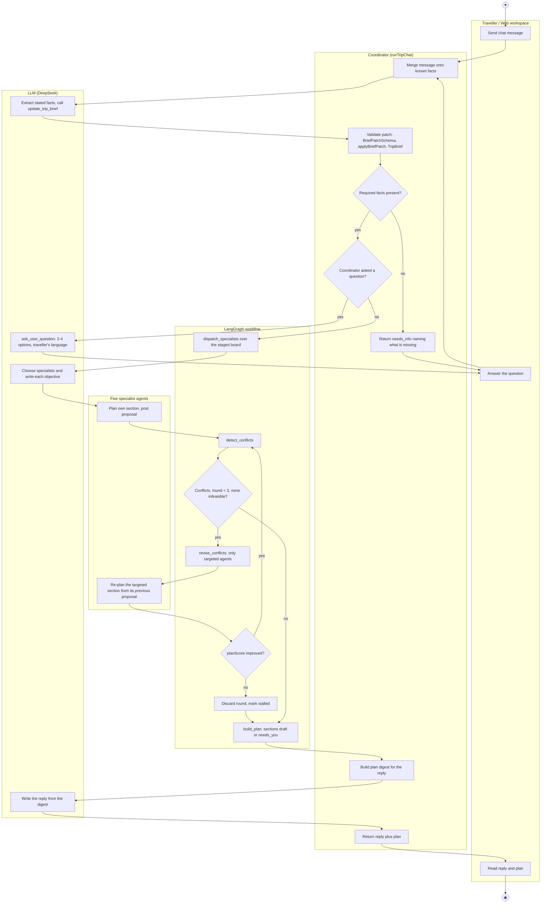
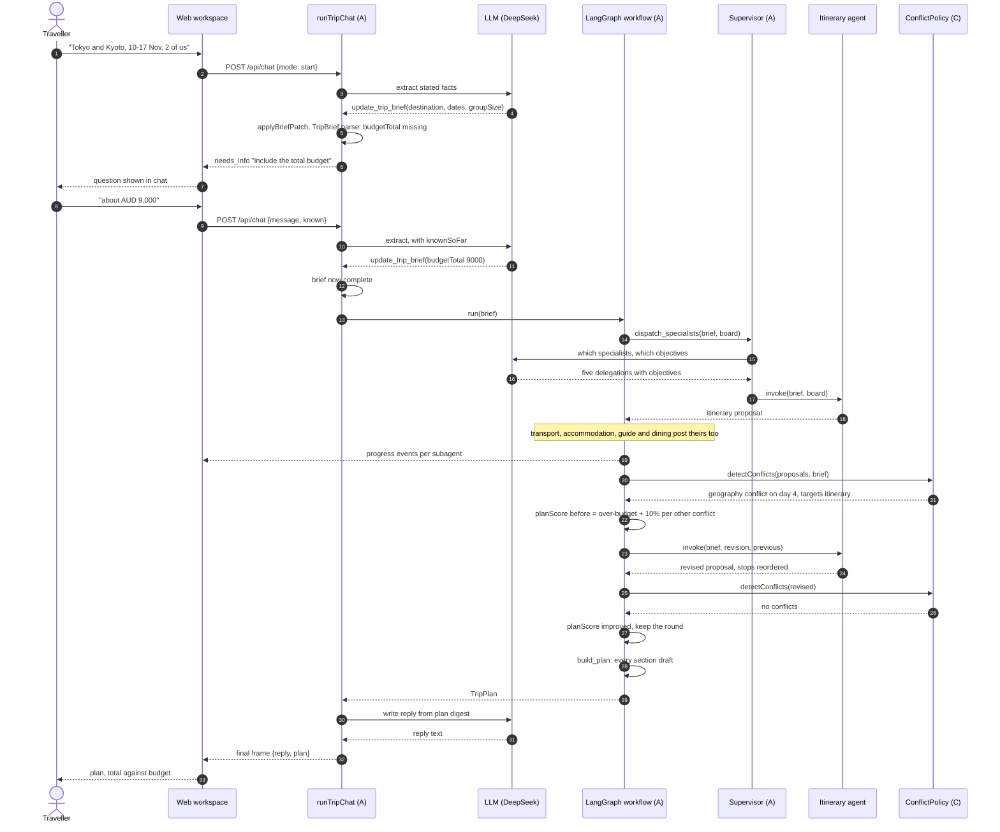
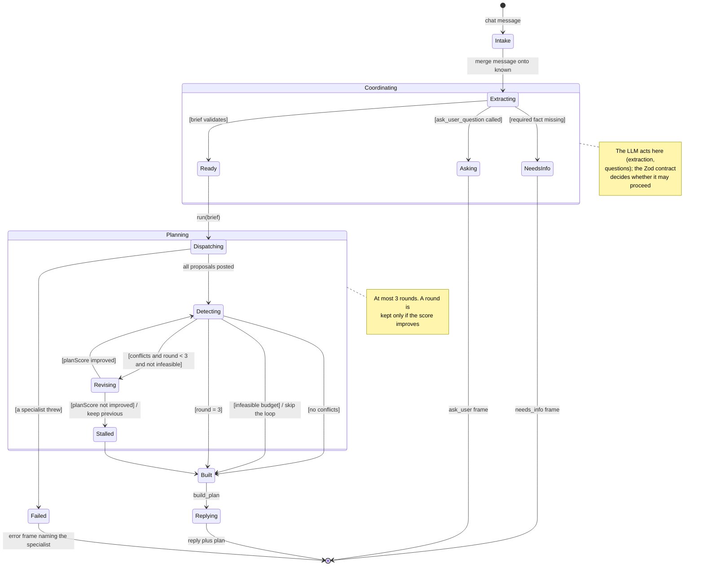

# 4. Behaviour models: member A (`@Lilstanie`, coordination and orchestration)

English | [中文](04-member-a-behaviour.zh.md)

All three diagrams come from ad hoc requirement **AH-A1** and the use case specification **UC-A1
Generate Itinerary** (`01-requirements.md`, `02-use-cases.md`). Each marks where the LLM acts and
which deterministic code checks it, as the brief asks.

Three LLM calls happen in one planning turn, and each is fenced by code that can replace it:

| LLM call | What it decides | Deterministic guard |
| --- | --- | --- |
| Brief extraction (`update_trip_brief`) | Which trip facts the message states | `BriefPatchSchema` → `applyBriefPatch` → `TripBrief` Zod parse; unstated facts are reported missing, never inferred |
| Supervisor delegation | Which specialists to call, with what objective | Fixed specialist registry; the itinerary specialist is always delegated; a failed supervisor falls back to dispatching all five |
| Reply writing | The prose the traveller reads | `fallbackReplyFor(plan)` writes it from the plan when the model is absent or silent |

The plan itself is never written by a model: `build_plan` assembles it from validated proposals.

## 4.1 Activity diagram: Generate Itinerary (UC-A1)

Swimlanes are the five participants. Rounds 2–3 re-enter *Detect conflicts*.
Rendered: [`stage1-member-a-activity.svg`](../diagrams/stage1-member-a-activity.svg).

A missing model key removes the three LLM boxes only: extraction falls to the stated-facts path,
delegation dispatches all five specialists, and `fallbackReplyFor` writes the reply.

## 4.2 Sequence diagram: one turn with a clarifying question, then a revised plan (UC-A1, extensions 3a and 7a)

The traveller's first message omits the budget, so the coordinator asks before planning. The first
round then returns a geography conflict, one targeted revision fixes it, and the score improves.
Rendered: [`stage1-member-a-sequence.svg`](../diagrams/stage1-member-a-sequence.svg).

Had the score not improved, `revise_conflicts` would set `stalled` and the previous proposals would
be kept, so a revision can never make the plan worse. Had the conflict been `infeasible budget`,
`routeAfterDetection` would skip the loop entirely.

## 4.3 State machine: one planning turn (UC-A1)

The turn as the orchestrator sees it. Member C's state machine covers one *section* inside
`Detecting`; this one covers the turn that contains it.
Rendered: [`stage1-member-a-state.svg`](../diagrams/stage1-member-a-state.svg).

| State | What the traveller sees | Entry / exit behaviour |
| --- | --- | --- |
| Intake, Extracting | "thinking" | The message is merged onto `known` so a follow-up need not repeat earlier facts. |
| NeedsInfo | The question in chat | No plan exists yet; `IncompleteBriefError` names the missing fields. Required facts are never defaulted. |
| Asking | 2–4 clickable options | At most one question per turn; no other tool runs after it. |
| Dispatching | A progress row per subagent | The supervisor chooses who runs; the itinerary specialist always does. |
| Detecting | "checking budget and schedules" | Member C's `detectConflicts` returns the revision requests. |
| Revising | "revising affected sections" | Only targeted agents re-run, each given its previous proposal. |
| Stalled | — | The round is discarded; the better earlier proposals are kept. |
| Built | Sections `draft` or `needs_you` | The plan is assembled from validated proposals, never written by a model. |
| Failed | Error naming the specialist | Nothing partial is presented as a plan. |

## 4.4 How this behaviour is measured

`packages/orchestrator/src/agent-lab/` replays fixed scenarios against the orchestrator with faults
injected on purpose — a specialist timing out, a provider failing, a model returning off-schema
output — and records rounds, conflicts, token usage and an evaluator score per run (R-A11). It is
how the transitions above are shown to hold when the LLM misbehaves, rather than only when it
behaves.
