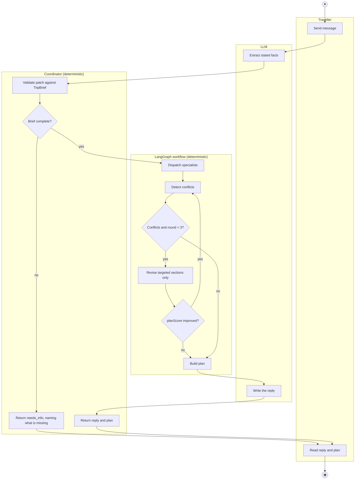
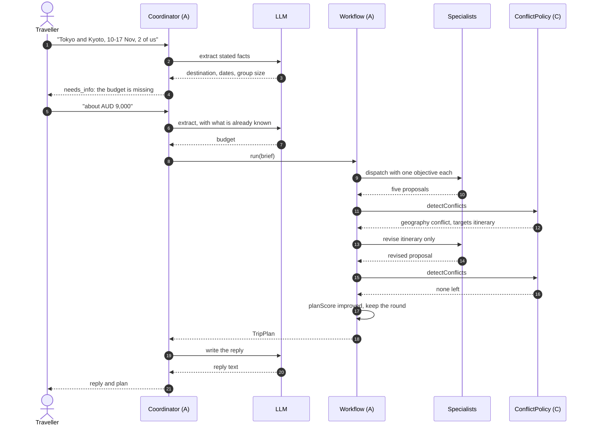
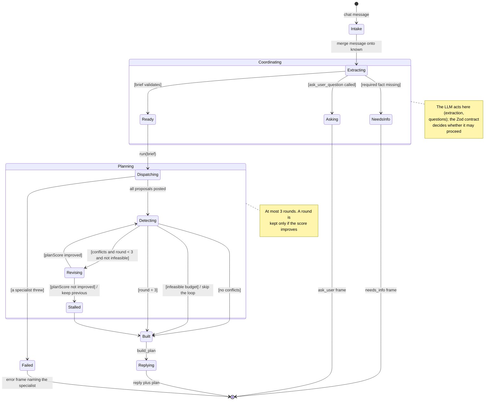

# 4. 行为模型：成员 A（`@Lilstanie`，协调与编排）

[English](04-member-a-behaviour.md) | 中文

三张图都来自 ad hoc 需求 **AH-A1** 以及用例规格 **UC-A1 Generate Itinerary**（`01-requirements.md`、`02-use-cases.md`）。按项目说明的要求，每张图都标出 LLM 在哪一步动作，以及由哪些确定性代码对它把关。

一次规划回合里有三处 LLM 调用，每一处都有能够取代它的代码围住：

| LLM 调用 | 它决定什么 | 确定性把关 |
| --- | --- | --- |
| 行程摘要抽取（`update_trip_brief`） | 这条消息陈述了哪些出行事实 | `BriefPatchSchema` → `applyBriefPatch` → `TripBrief` Zod 校验；未陈述的事实只会被报为缺失，绝不推断 |
| Supervisor 委派 | 调用哪些专家、给出什么目标 | 固定的专家注册表；行程专家始终会被委派；supervisor 失败时回退为派发全部五个 |
| 撰写回复 | 旅行者读到的文字 | 模型缺席或沉默时，由 `fallbackReplyFor(plan)` 从计划本身写出 |

计划本身从不由模型撰写：`build_plan` 完全由已校验的提案组装而成。

## 4.1 活动图：Generate Itinerary（UC-A1）

五条泳道对应五个参与者。第 2–3 轮会重新进入 *Detect conflicts*。
渲染图：[`stage1-member-a-activity.svg`](../diagrams/stage1-member-a-activity.svg)。

缺少模型 key 时，只有那三个 LLM 方框消失：抽取退回到"只用已陈述事实"的路径，委派改为派发全部五个专家，回复由 `fallbackReplyFor` 写出。

## 4.2 时序图：一次含澄清提问、随后修订的回合（UC-A1，扩展 3a 与 7a）

旅行者第一条消息没给预算，于是协调器先问再规划。第一轮返回一条地理冲突，一次定向修订把它解决，分数随之改善。
渲染图：[`stage1-member-a-sequence.svg`](../diagrams/stage1-member-a-sequence.svg)。

若分数没有改善，`revise_conflicts` 会置 `stalled` 并保留此前的提案，因此一次修订永远不会让计划变差。若冲突是 `infeasible budget`，`routeAfterDetection` 会直接跳过整个循环。

## 4.3 状态机：一次规划回合（UC-A1）

这是编排器眼中的一个回合。成员 C 的状态机描述 `Detecting` 内部的单个**区块**；这张图描述包住它的那个回合。
渲染图：[`stage1-member-a-state.svg`](../diagrams/stage1-member-a-state.svg)。

| 状态 | 旅行者看到什么 | 进入 / 退出行为 |
| --- | --- | --- |
| Intake、Extracting | "thinking" | 消息会并到 `known` 上，因此追问时无需重复此前已给的事实。 |
| NeedsInfo | 聊天里的提问 | 此时还没有计划；`IncompleteBriefError` 指明缺了哪些字段。必填事实绝不取默认值。 |
| Asking | 2–4 个可点选项 | 每回合最多问一次；问完之后不再运行其他工具。 |
| Dispatching | 每个子代理一行进度 | 由 supervisor 决定谁运行；行程专家始终运行。 |
| Detecting | "checking budget and schedules" | 由成员 C 的 `detectConflicts` 给出修订请求。 |
| Revising | "revising affected sections" | 只重跑被定向的代理，并把它上一轮的提案一并交回。 |
| Stalled | — | 丢弃该轮，保留此前更好的提案。 |
| Built | 区块为 `draft` 或 `needs_you` | 计划由已校验的提案组装，绝不由模型写出。 |
| Failed | 指名失败专家的错误 | 不会把残缺的东西当作计划呈现。 |

## 4.4 这些行为如何被测量

`packages/orchestrator/src/agent-lab/` 会在编排器上重放固定场景，并**故意注入故障** —— 某个专家超时、某个 provider 失败、模型返回不合 schema 的输出 —— 记录每次运行的轮次、冲突、token 用量和评估分（R-A12）。它用来证明上面这些状态迁移在 LLM **行为异常**时同样成立，而不只是在它表现正常时成立。
