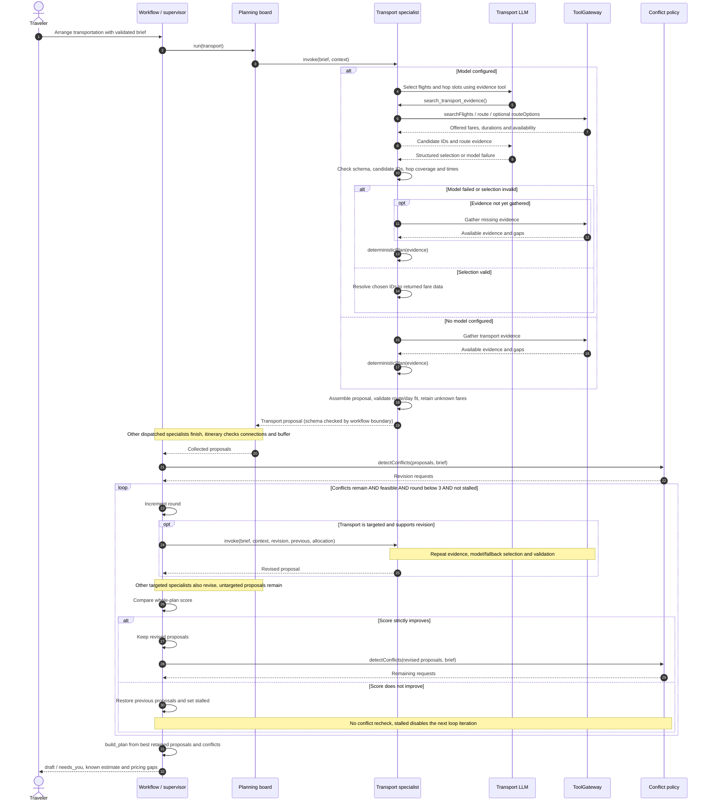
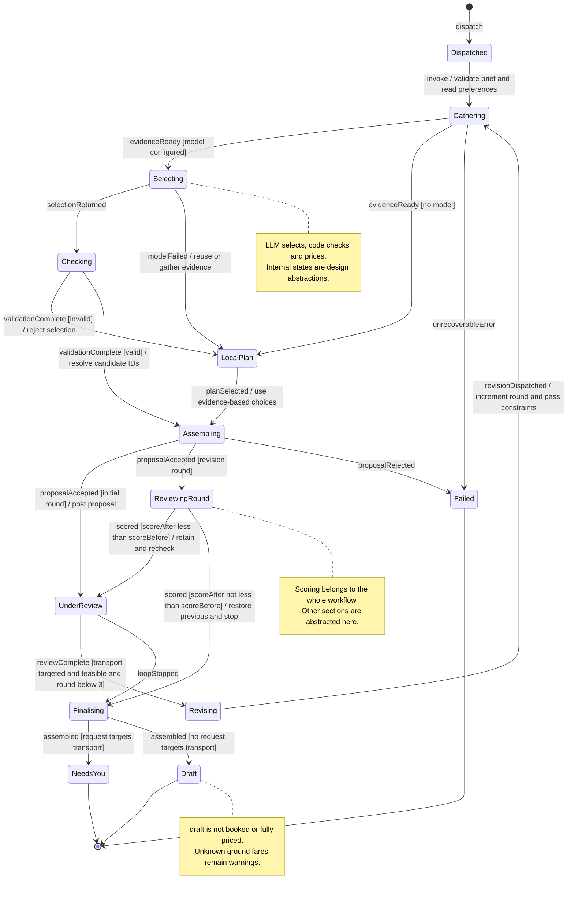

# 4. Behaviour models: member B — itinerary and transport

English | [中文](04-member-b-behaviour.zh.md)

These models derive from **AH-B1 / R-B1–R-B6** in [Requirements](01-requirements.md#15-member-b-requirement-classification) and **UC-B1 Arrange Transportation** in [Use cases](02-use-cases.md#24-uc-b1-arrange-transportation). They describe the current team implementation in B's assigned domain, not exclusive code authorship. The specialist boundary is `Specialist.invoke`.

## 4.1 Activity diagram

Rounded actions, guarded decisions, a filled initial node and a double-ring final node express the activity model in Mermaid. Responsibility regions separate the Transport LLM from deterministic code and the workflow. The revision action expands the targeted specialist's planning operation; it does not imply rerunning every agent. Cancellation can terminate any executing action and is omitted for readability.

[PNG](../diagrams/member-b/b-activity.png) · [Editable source](../diagrams/member-b/b-activity.mmd)

```mermaid
flowchart TB
  S(( )) --> A("Receive UC-B1 transport dispatch")
  subgraph TR["Transport specialist / deterministic code"]
    A --> M{"Model configured?"}
    G("Gather fares and routes via ToolGateway")
    V{"Selection valid?"}
    F("Use deterministic evidence-based plan")
    P("Validate route and day fit, copy evidence prices, record gaps")
    G0("Gather evidence without a model")
  end
  subgraph LM["Transport LLM"]
    L("Call search_transport_evidence")
    C("Choose offered flight IDs and hop departure slots")
  end
  M -- "[yes]" --> L --> G --> C --> V
  M -- "[no]" --> G0 --> F
  L -- "[model failure]" --> H("Reuse evidence or gather it if absent") --> F
  C -- "[model failure]" --> H
  V -- "[invalid IDs, coverage, day or time]" --> F
  V -- "[valid]" --> P
  F --> P
  subgraph WF["Workflow / planning board / related specialists"]
    B("Validate proposal schema and store on board")
    I("Coordinate itinerary with transport and stays, verify route gaps")
    D("Detect budget, time and geography conflicts")
    R{"Conflicts and feasible budget and round below 3?"}
    T("Increment round, invoke only targeted revisable specialists")
    Q{"Whole-plan score improves?"}
    K("Keep revised proposals")
    O("Restore previous proposals and stop")
    Z("Build draft or needs_you sections, retain pricing warnings")
  end
  P --> B --> I --> D --> R
  R -- "[yes]" --> T --> Q
  Q -- "[yes]" --> K --> D
  Q -- "[no]" --> O --> Z
  R -- "[no]" --> Z --> E(((●)))
  B -- "[schema rejected]" --> X("Report run failure") --> E
  G -- "[unrecoverable error]" --> X
  G0 -- "[unrecoverable error]" --> X
  style S fill:#18334d,stroke:#18334d
  style E fill:#ffffff,stroke:#18334d
```

## 4.2 Sequence diagram

The model-call branch shows rejected output falling back after validation. A separate no-model branch gathers evidence directly. The nested optional fragment invokes Transport only when targeted. A non-improving revision restores the previous proposals and exits the revision loop before final assembly; it does not recheck rejected proposals. A model failure before its search tool is called skips that tool exchange and gathers evidence in the fallback. Provider and cancellation errors that end the run are specified in UC-B1 rather than expanded here.

[PNG](../diagrams/member-b/b-sequence.png) · [Editable source](../diagrams/member-b/b-sequence.mmd)

## 4.3 State machine

The subject is the transport proposal within one planning run. Transition labels follow event [guard] / action. Internal states are conceptual, not persisted enums; only `draft` and `needs_you` map to final section status. Whole-plan score comparison and round limits belong to the workflow. While other sections revise, an untargeted transport proposal remains under review until the workflow stops. An abort can terminate any non-final state; those repeated transitions are omitted.

[PNG](../diagrams/member-b/b-state.png) · [Editable source](../diagrams/member-b/b-state.mmd)

## 4.4 Implementation boundaries

- The LLM chooses offered flight IDs and hop departure slots. Deterministic code checks candidate membership, one fare per priced hop, required hop coverage, day bounds, time format and route/day fit before assembling a proposal.
- Unknown ground fares omit `estCost` and remain warnings; a required flight without a valid fare still records a conflict. Traveller-arranged flights are exempt. An unavailable chosen ground mode is explicitly disclosed rather than silently substituted.
- Itinerary planning checks connections against provider durations plus a 15-minute arrival buffer. Transport durations are gathered before model scheduling; a model-changed departure time does not trigger another time-sensitive route search.
- The default limit is three total rounds, including the first. Only targeted revisable specialists rerun. Non-improving rounds are discarded. There is no purchase, booking or approval checkpoint in this use case.
- Generated figures are for full-size report viewing; use the SVGs for zooming. Their detailed labels are not intended to be read as three tiny slide thumbnails.

## 4.5 AI acknowledgement

OpenAI Codex assisted with source inspection, the requirement and use-case draft, and diagram preparation. Tingsong Jin must review the individual submission and be able to explain the models. This statement does not assert that all current team code was implemented by B.
