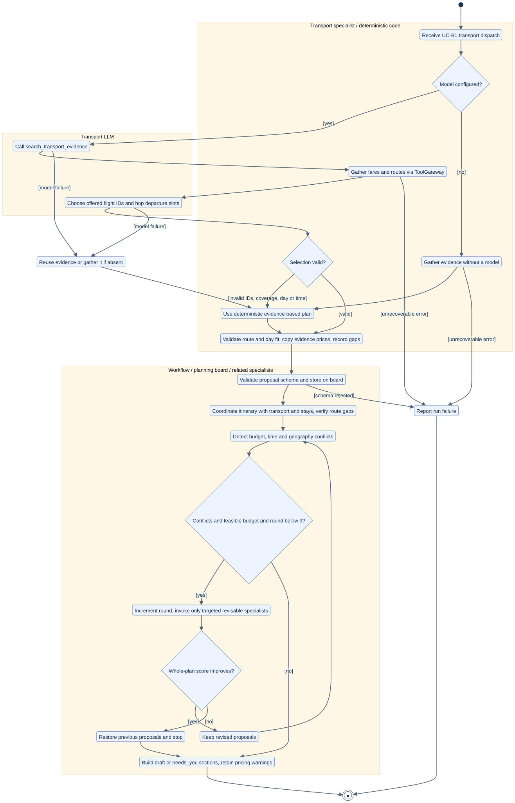
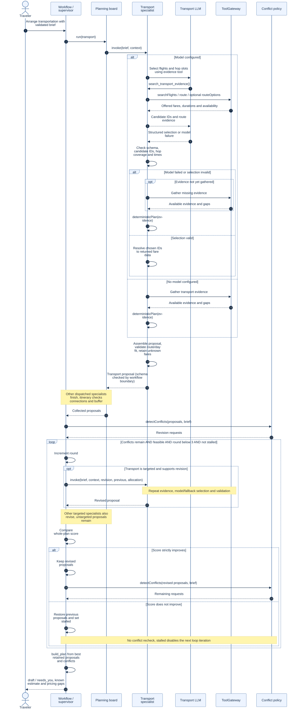
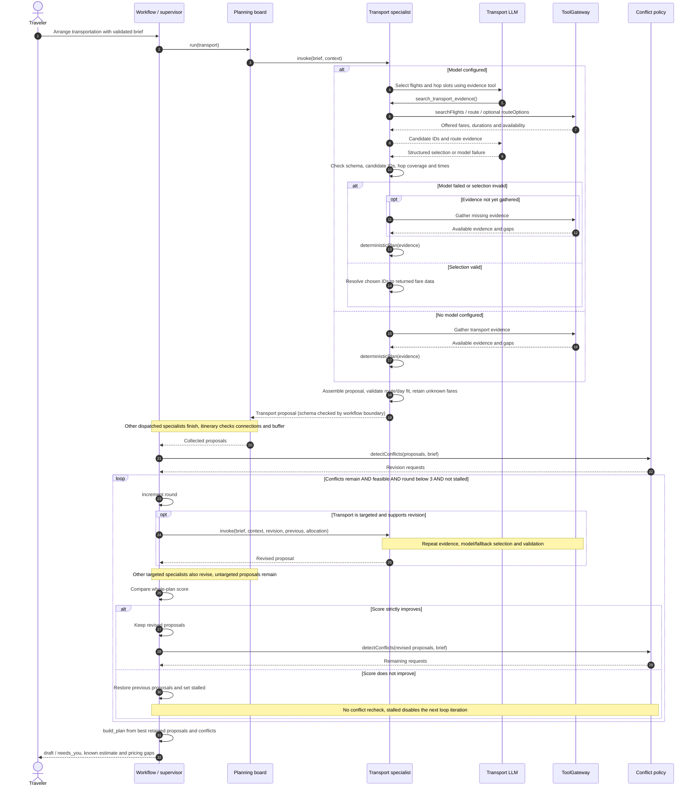
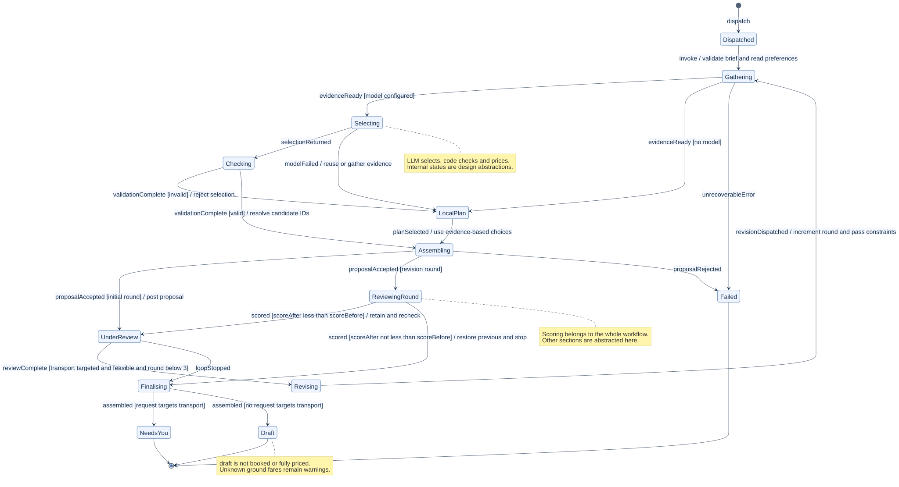
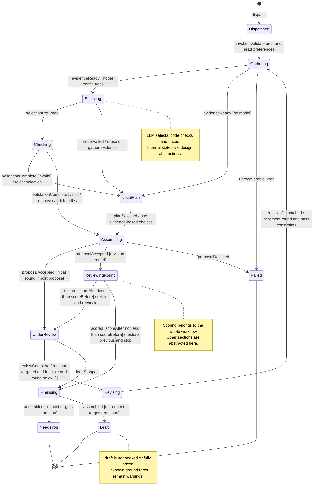

# 4. 行为模型：成员 B — 日程与交通

[English](04-member-b-behaviour.md) | 中文

这些模型源自[需求](01-requirements.zh.md#member-b-ah-b1)中的 **AH-B1 / R-B1–R-B6** 和[用例](02-use-cases.zh.md#uc-b1-arrange-transportation)中的 **UC-B1 Arrange Transportation**。它们描述 B 所分配领域的当前团队实现，不代表代码完全由 B 编写。specialist 边界为 `Specialist.invoke`。

## 4.1 活动图

圆角动作、带守卫条件的决策、实心初始节点和双环终止节点在 Mermaid 中表达活动模型。责任分区将 Transport LLM、确定性代码和工作流分开。修订动作展开的是被定向请求的 specialist 的规划操作，不表示重新运行所有 agent。取消可终止任何执行中的动作；为便于阅读，图中省略该路径。

[PNG](../diagrams/member-b/b-activity.png) · [可编辑源文件](../diagrams/member-b/b-activity.mmd)

```mermaid
flowchart TB
  S(( )) --> A("Receive UC-B1 transport dispatch")
  subgraph TR["Transport specialist / deterministic code"]
    A --> M{"Model configured?"}
    G("Gather fares and routes via ToolGateway")
    V{"Selection valid?"}
    F("Use deterministic evidence-based plan")
    P("Validate route and day fit, copy evidence prices, record gaps")
    G0("Gather evidence without a model")
  end
  subgraph LM["Transport LLM"]
    L("Call search_transport_evidence")
    C("Choose offered flight IDs and hop departure slots")
  end
  M -- "[yes]" --> L --> G --> C --> V
  M -- "[no]" --> G0 --> F
  L -- "[model failure]" --> H("Reuse evidence or gather it if absent") --> F
  C -- "[model failure]" --> H
  V -- "[invalid IDs, coverage, day or time]" --> F
  V -- "[valid]" --> P
  F --> P
  subgraph WF["Workflow / planning board / related specialists"]
    B("Validate proposal schema and store on board")
    I("Coordinate itinerary with transport and stays, verify route gaps")
    D("Detect budget, time and geography conflicts")
    R{"Conflicts and feasible budget and round below 3?"}
    T("Increment round, invoke only targeted revisable specialists")
    Q{"Whole-plan score improves?"}
    K("Keep revised proposals")
    O("Restore previous proposals and stop")
    Z("Build draft or needs_you sections, retain pricing warnings")
  end
  P --> B --> I --> D --> R
  R -- "[yes]" --> T --> Q
  Q -- "[yes]" --> K --> D
  Q -- "[no]" --> O --> Z
  R -- "[no]" --> Z --> E(((●)))
  B -- "[schema rejected]" --> X("Report run failure") --> E
  G -- "[unrecoverable error]" --> X
  G0 -- "[unrecoverable error]" --> X
  style S fill:#18334d,stroke:#18334d
  style E fill:#ffffff,stroke:#18334d
```

## 4.2 时序图

模型调用分支展示输出被校验拒绝后的回退。独立的无模型分支直接收集证据。嵌套的可选片段只在 Transport 被定向请求时调用它。修订未改善评分时，恢复先前提案，并在最终组装前退出修订循环；不会重新检查已被拒绝的提案。若模型在调用搜索工具前失败，则跳过该工具交互，并在回退中收集证据。导致运行结束的数据提供方错误和取消在 UC-B1 中说明，此处不展开。

[PNG](../diagrams/member-b/b-sequence.png) · [可编辑源文件](../diagrams/member-b/b-sequence.mmd)

## 4.3 状态机

主体是单次规划运行中的交通提案。转换标签采用“事件 [守卫条件] / 动作”。内部状态是概念状态，不是持久化枚举；只有 `draft` 和 `needs_you` 对应最终区段状态。整份计划的评分比较和轮数上限属于工作流。在其他区段修订时，未被定向请求的交通提案保持在审核中，直到工作流停止。中止可终止任何非最终状态；图中省略这些重复转换。

[PNG](../diagrams/member-b/b-state.png) · [可编辑源文件](../diagrams/member-b/b-state.mmd)

## 4.4 实现边界

- LLM 选择可选航班 ID 和各行程段的出发时间槽。确定性代码在组装提案前检查候选归属、每个有票价的行程段恰好一个票价、必需行程段覆盖、日期边界、时间格式，以及路线能否在规划日内完成。
- 未知地面票价省略 `estCost`，保留为警告；必需航班没有有效票价时仍记录冲突。旅行者自行安排的航班除外。所选地面交通方式不可用时明确告知，不悄然替换。
- 日程规划依据数据提供方的时长加 15 分钟到达缓冲检查衔接。交通时长在模型排程前收集；模型修改出发时间不会触发另一次随时间变化的路线搜索。
- 默认总共最多三轮，包含首轮。仅重新运行被定向请求且支持修订的 specialist。没有改善的轮次被丢弃。本用例没有购买、预订或审批检查点。
- 生成的图供报告中全尺寸查看；缩放查看请使用 SVG。详细标签不适合以三张微小幻灯片缩略图的形式阅读。

## 4.5 AI 使用声明

OpenAI Codex 协助检查源代码、起草需求和用例，并准备图表。Tingsong Jin 须审阅个人提交内容，并能够解释这些模型。本声明不表示当前团队代码全部由 B 实现。
