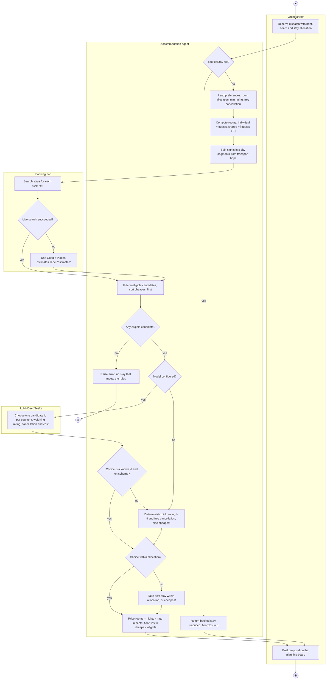
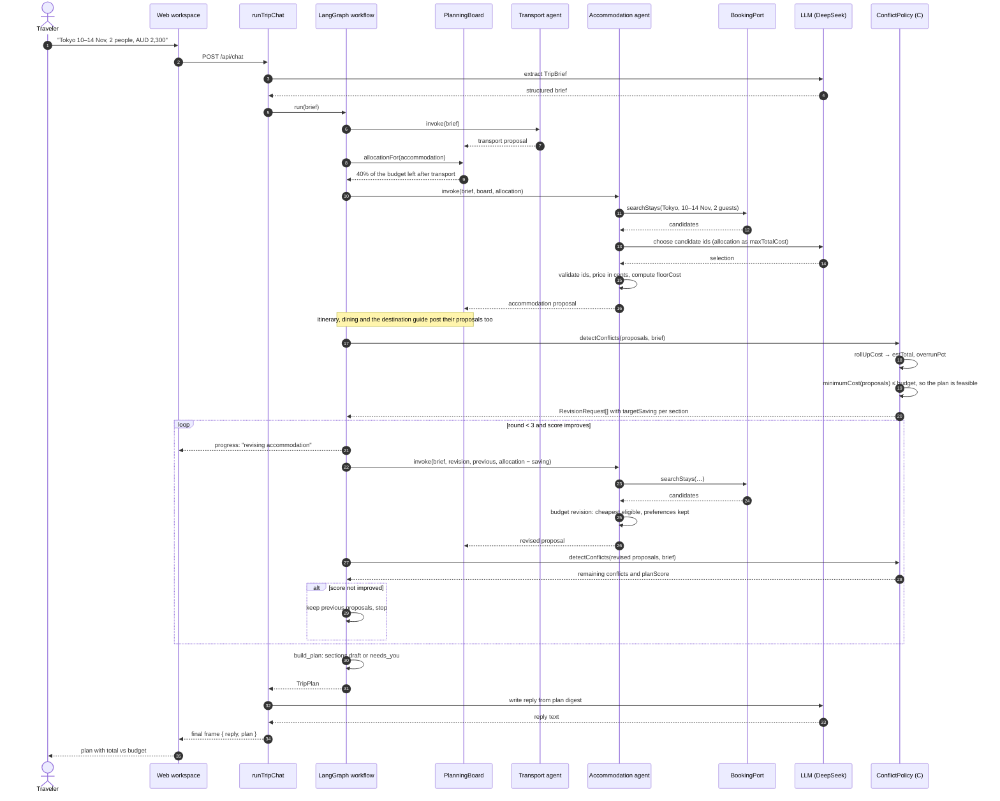
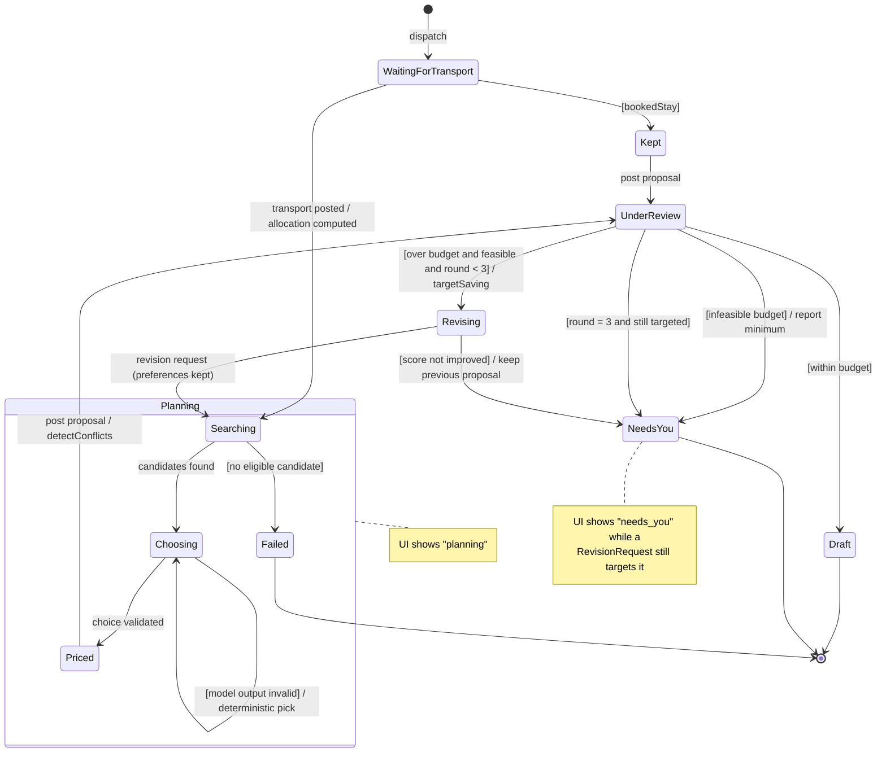

# 4. Behaviour models: member C (`@HeadmasterEggy`, accommodation and budget)

English | [中文](04-member-c-behaviour.zh.md)

All three diagrams come from ad hoc requirement **AH-C1** and the use case specifications **UC-C1
Arrange Accommodation** and **UC-C2 Manage Budget** (`01-requirements.md`, `02-use-cases.md`). Each
focuses on where the LLM sits and what deterministic code guards it, as the brief asks.

## 4.1 Activity diagram: Arrange Accommodation (UC-C1)

Swimlanes are the four participants. The LLM is used once, in *Choose one candidate id per segment*, and
its output is checked before anything is priced.
Rendered: [`../diagrams/c-activity.svg`](../diagrams/c-activity.svg).

## 4.2 Sequence diagram: budget overrun and targeted revision (UC-C2, extension 2a)

One planning turn in which the first round goes over budget and the accommodation agent is asked to
cut its cost. Rendered: [`../diagrams/c-sequence.svg`](../diagrams/c-sequence.svg).

If `minimumCost` is above the budget (extension 2b), `detectConflicts` instead returns one
`infeasible budget` conflict, the loop is skipped, and the reply names the minimum budget needed.

## 4.3 State machine: accommodation section within a planning turn (UC-C1 and UC-C2)

The section's visible status (`planning`, `draft`, `needs_you`) is derived from these internal
states. Rendered: [`../diagrams/c-state.svg`](../diagrams/c-state.svg).

| State | UI status | Entry / exit behaviour |
| --- | --- | --- |
| WaitingForTransport | planning | Waits only if transport was started in the same turn. |
| Searching, Choosing, Priced | planning | The LLM acts only in Choosing; invalid output loops back through the deterministic pick. |
| Kept | planning | Booked stay, no search; floorCost 0 so it is never asked to cut. |
| UnderReview | planning | Member C's `detectConflicts` decides the next state. |
| Revising | planning | Same preferences, new allocation; the round is kept only if `planScore` improves. |
| Draft | draft | No revision request targets the section. |
| NeedsYou | needs_you | The traveller decides: raise the budget, change dates or edit the plan. |
| Failed | — | The run stops and names accommodation as the failing specialist. |
