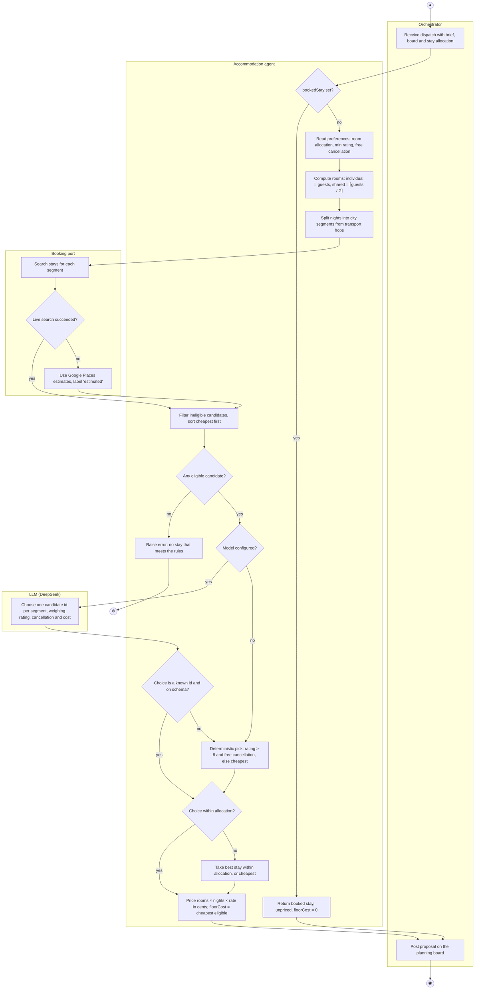
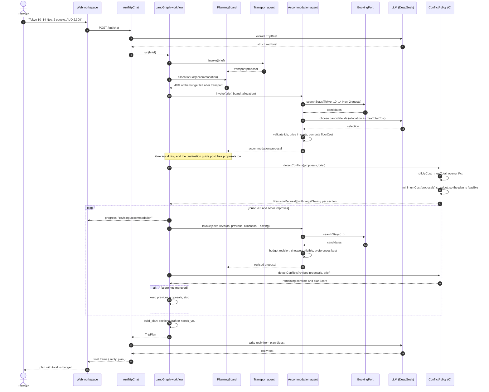
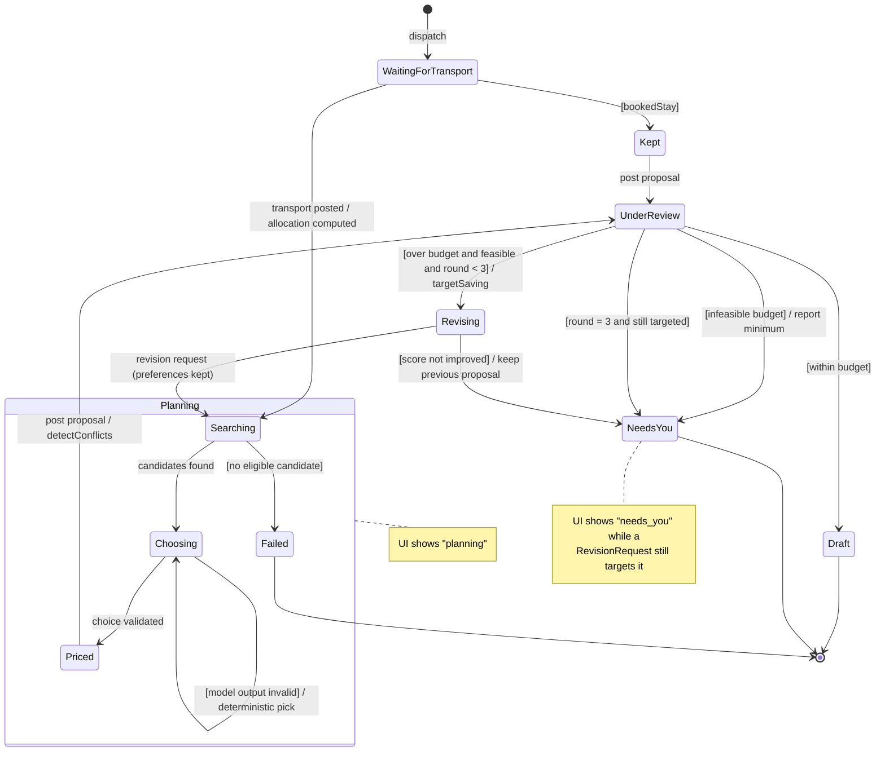

# 4. 行为模型：成员 C（`@HeadmasterEggy`，住宿与预算）

[English](04-member-c-behaviour.md) | 中文

三张图都来自 ad hoc 需求 **AH-C1** 以及用例规格 **UC-C1 Arrange Accommodation** 和 **UC-C2 Manage Budget**（`01-requirements.md`、`02-use-cases.md`）。按项目说明的要求，每张图都突出 LLM 所处的位置，以及由哪些确定性代码对它把关。

## 4.1 活动图：Arrange Accommodation（UC-C1）

四条泳道对应四个参与者。LLM 只在 *Choose one candidate id per segment* 这一步使用一次，它的输出在任何定价之前都会先经过校验。
渲染图：[`c-activity.html`](../../architecture-diagrams/stage1-member-c/rendered/c-activity.html)（Archify，[源文件](../../architecture-diagrams/stage1-member-c/specs/c-activity.workflow.json)、[检查记录](../../architecture-diagrams/stage1-member-c/evidence/c-activity.visual-check.html)）。

## 4.2 时序图：预算超支与定向修订（UC-C2，扩展 2a）

一轮规划：第 1 轮超出预算，住宿 agent 被要求削减费用。渲染图：[`c-sequence.html`](../../architecture-diagrams/stage1-member-c/rendered/c-sequence.html)（Archify，[源文件](../../architecture-diagrams/stage1-member-c/specs/c-sequence.sequence.json)、[检查记录](../../architecture-diagrams/stage1-member-c/evidence/c-sequence.visual-check.html)）。

如果 `minimumCost` 高于预算（扩展 2b），`detectConflicts` 改为返回一个
`infeasible budget` 冲突，跳过修订循环，回复中写明所需的最低预算。

## 4.3 状态机：一轮规划中的住宿区段（UC-C1 和 UC-C2）

区段对外显示的状态（`planning`、`draft`、`needs_you`）由这些内部状态推导得出。渲染图：[`c-state.html`](../../architecture-diagrams/stage1-member-c/rendered/c-state.html)（Archify，[源文件](../../architecture-diagrams/stage1-member-c/specs/c-state.workflow.json)、[检查记录](../../architecture-diagrams/stage1-member-c/evidence/c-state.visual-check.html)）。

| 状态 | 界面状态 | 进入 / 退出行为 |
| --- | --- | --- |
| WaitingForTransport | planning | 只有在同一轮中已经启动了交通时才等待。 |
| Searching, Choosing, Priced | planning | LLM 只在 Choosing 中起作用；无效输出会经由确定性选择回到该状态。 |
| Kept | planning | 已预订住处，不搜索；floorCost 为 0，因此永远不会被要求削减。 |
| UnderReview | planning | 成员 C 的 `detectConflicts` 决定下一个状态。 |
| Revising | planning | 偏好不变，分配额更新；只有 `planScore` 改善时才保留这一轮。 |
| Draft | draft | 没有修订请求指向该区段。 |
| NeedsYou | needs_you | 由旅行者决定：提高预算、更改日期或编辑计划。 |
| Failed | — | 运行停止，并指明失败的是住宿 specialist。 |
