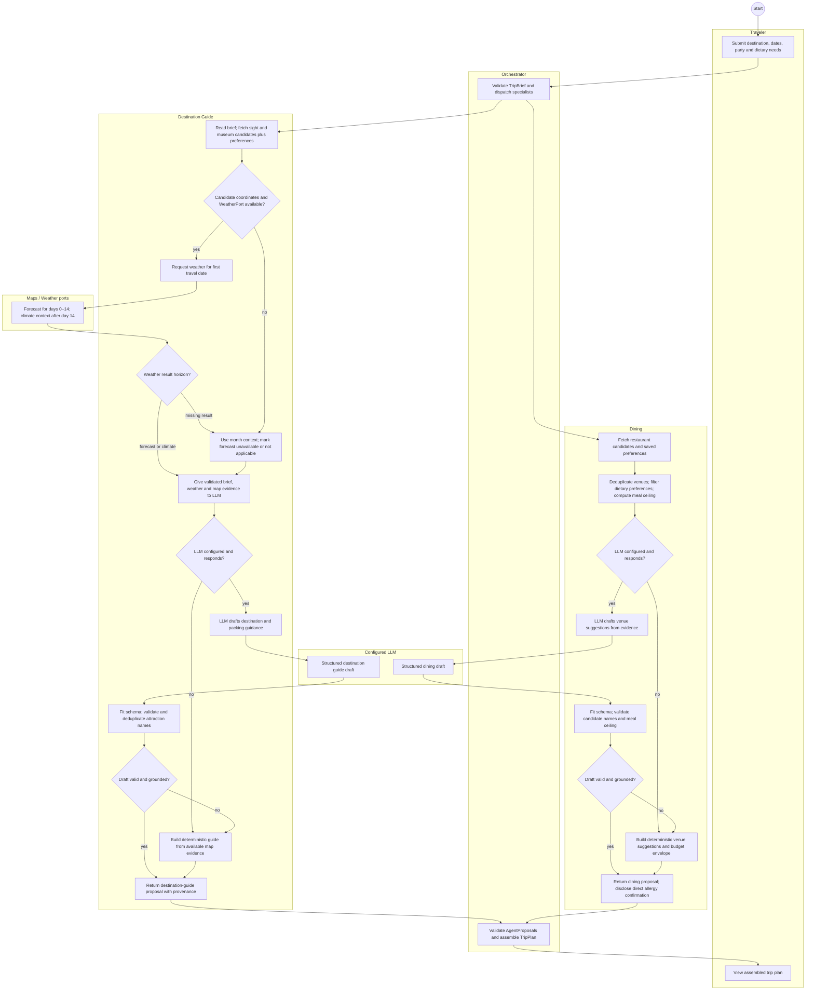
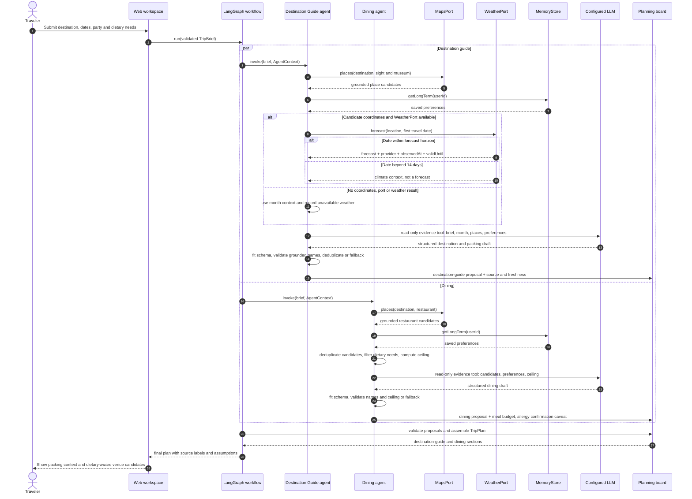
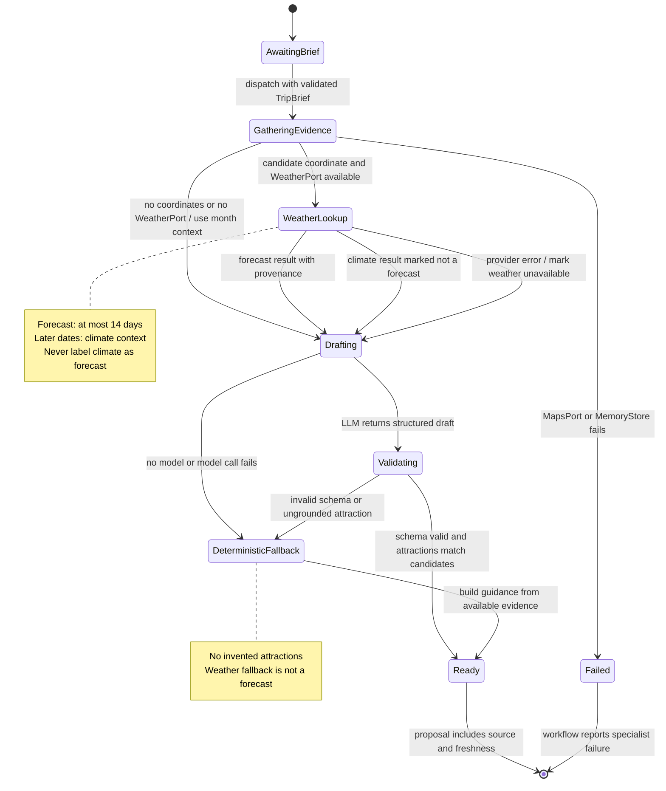

# 4. Behaviour models: member D (`@jbia0391`, destination guide and dining)

English | [中文](04-member-d-behaviour.zh.md)

All three diagrams come from **AH-D1** and **UC-D1 View Weather-based Clothing Recommendation** in
[01-requirements.md](01-requirements.md) and [02-use-cases.md](02-use-cases.md). The use case
dispatches the destination-guide and dining specialists as part of one trip plan. The LLM drafts
language from tool evidence; deterministic code validates schema, names and budget before proposals
reach the plan. Weather provenance distinguishes a forecast from historical climate context.

## 4.1 Activity diagram: weather and dietary guidance (UC-D1)

The two specialist paths run independently. A weather-provider failure degrades only the guide's
weather detail; invalid model output uses deterministic, evidence-bounded guidance.

## 4.2 Sequence diagram: weather-based packing and dietary dining (UC-D1)

The LLM receives validated evidence through read-only tools. Provider calls and the post-model
validation remain deterministic; the diagram shows the guide and dining paths in the same run.

## 4.3 State machine: destination-guide weather and packing section

The state machine follows the destination-guide proposal through evidence collection, model
validation and fallback. Dining produces a separate proposal in parallel, as shown in §4.1–4.2.

| State                 | Proposal behaviour                                                                                                |
| --------------------- | ----------------------------------------------------------------------------------------------------------------- |
| GatheringEvidence     | Reads place candidates and preferences; failure of required maps or memory retrieval fails this specialist.       |
| WeatherLookup         | Runs only when a candidate coordinate and WeatherPort are available; records the returned horizon and provenance. |
| Drafting, Validating  | The LLM drafts the guide; deterministic code fits the output and accepts only grounded attraction names.          |
| DeterministicFallback | Uses local guidance and gathered place evidence; it does not manufacture weather or attractions.                  |
| Ready                 | Returns the guide proposal with source/freshness and forecast-versus-climate wording.                             |
| Failed                | The specialist failure is reported by the workflow; a weather-only failure does not enter this state.             |
