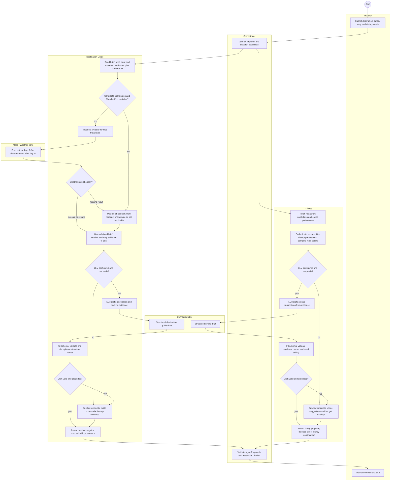
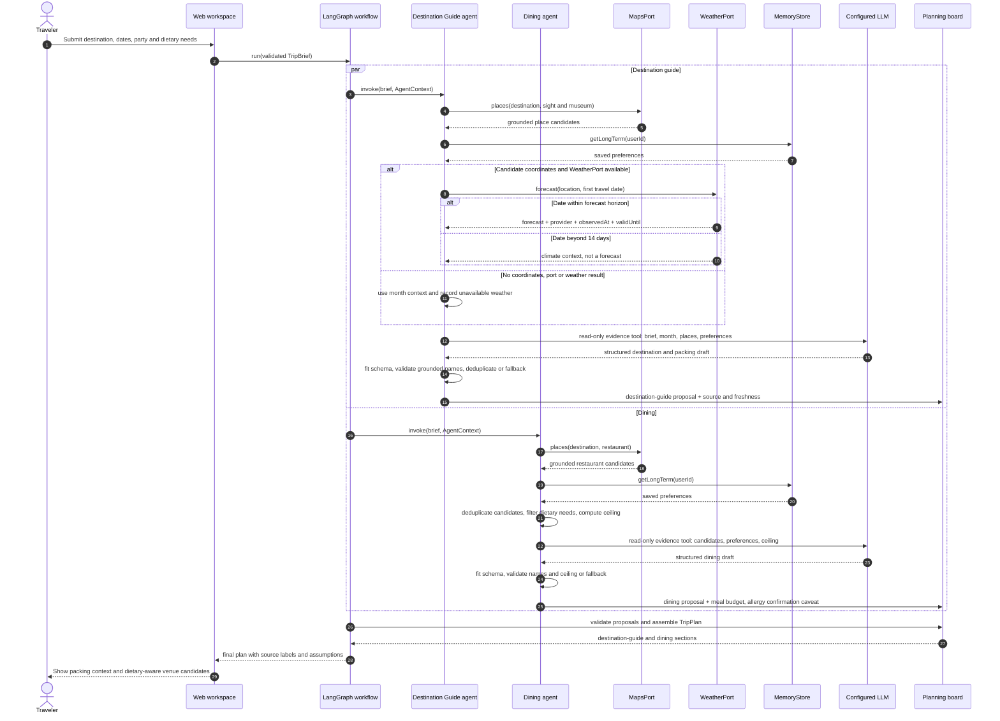
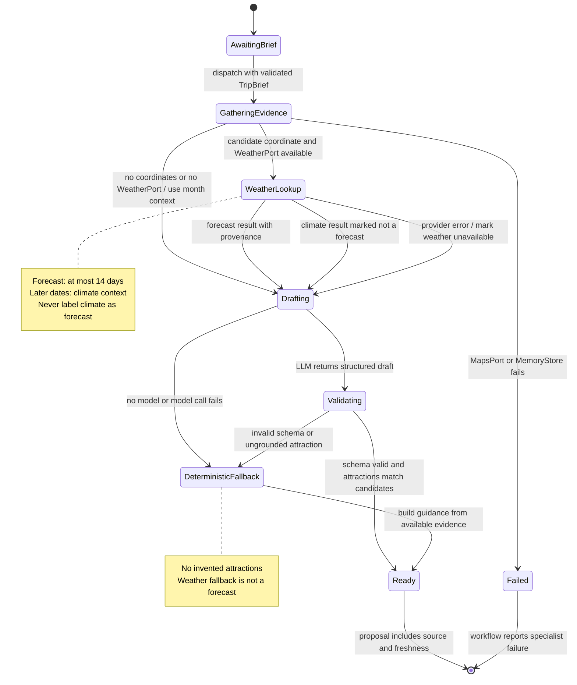

# 4. 行为模型：成员 D（`@jbia0391`，目的地指南与餐饮）

[English](04-member-d-behaviour.md) | 中文

三张图都来自 [01-requirements.zh.md](01-requirements.zh.md) 和 [02-use-cases.zh.md](02-use-cases.zh.md) 中的 **AH-D1** 与 **UC-D1 View Weather-based Clothing Recommendation**。同一次行程计划会分派目的地指南和餐饮两个 specialist。LLM 根据工具证据起草内容；确定性代码在提案进入计划前验证 schema、名称和预算。天气来源信息会区分天气预报与历史气候背景。

## 4.1 活动图：天气与饮食建议（UC-D1）

两个 specialist 的处理路径并行运行。天气提供方失败只会降级目的地指南中的天气内容；无效模型输出会改用有证据边界的确定性建议。

## 4.2 时序图：天气行李建议与饮食建议（UC-D1）

LLM 通过只读工具取得已验证的证据。数据提供方调用和模型调用后的验证仍由确定性代码负责；图中展示同一次运行里的目的地指南和餐饮路径。

## 4.3 狀態機：目的地指南的天氣與行李建議區段

狀態機描述目的地指南提案如何收集證據、驗證模型輸出並在需要時回退。Dining 會並行產生另一份提案，如 §4.1–4.2 所示。

| 状态                  | 提案行为                                                                  |
| --------------------- | ------------------------------------------------------------------------- |
| GatheringEvidence     | 读取地点候选和偏好；必要的地图或记忆读取失败会导致该 specialist 失败。    |
| WeatherLookup         | 仅在存在候选地点坐标和 WeatherPort 时调用；记录返回的时间范围和来源信息。 |
| Drafting, Validating  | LLM 起草指南；确定性代码适配输出，并且只接受有地图依据的景点名称。        |
| DeterministicFallback | 使用本地建议和已收集的地点证据；不会编造天气或景点。                      |
| Ready                 | 返回指南提案及来源、新鲜度信息，并清楚区分预报与气候背景。                |
| Failed                | 工作流报告 specialist 失败；单独的天气失败不会进入此状态。                |
