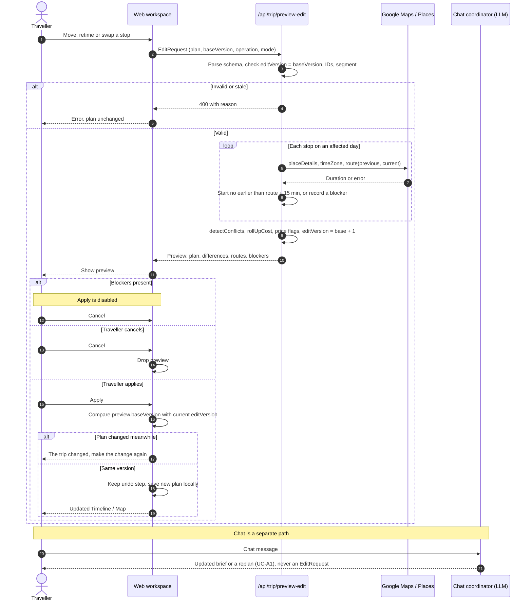
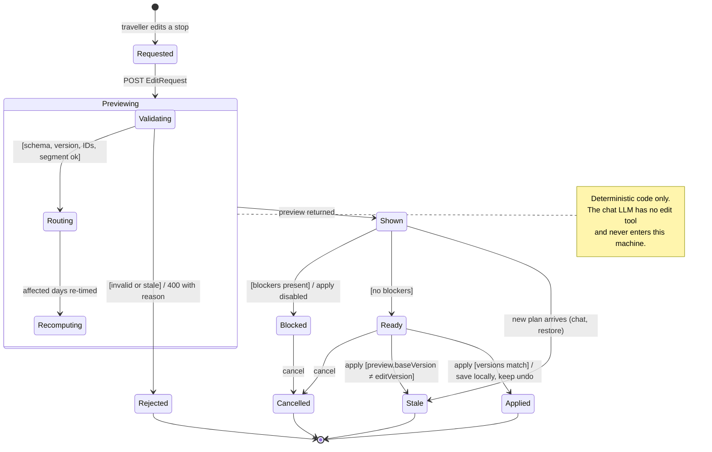

# 4. Behaviour models: member E (`@WhW0591`, chat workspace, timeline and map editing)

English | [中文](04-member-e-behaviour.zh.md)

These models derive from **AH-E1 / R-E1–R-E6** in [Requirements](01-requirements.md#member-e-ah-e1) and
**UC-E1 Edit Itinerary (Timeline / Map)** in [Use cases](02-use-cases.md#uc-e1-edit-itinerary-timeline--map).
The chat coordinator can update the brief or replan, but it has no edit tool; the timeline and map edit
path is deterministic from preview through local application.

## 4.1 Activity diagram: Edit Itinerary (UC-E1)

```mermaid
flowchart TB
  start(( )) --> how{"Edit on Timeline / Map, or ask in chat?"}
  how -- edit --> pick
  how -- chat --> chat

  subgraph T["Traveller"]
    how
    pick["Move, retime or swap a stop on Timeline / Map"]
    choose{"Apply or cancel?"}
    chat["Ask for a change in chat"]
  end

  subgraph W["Web workspace (browser)"]
    send["POST EditRequest: plan, baseVersion, operation"]
    show["Show preview: differences, routes, blockers"]
    blocked{"Any blockers?"}
    fresh{"preview.baseVersion = current editVersion?"}
    apply["Apply previewed plan, keep one undo step, save locally"]
    stale["Drop preview: the trip changed"]
    err["Show error; plan unchanged"]
  end

  subgraph P["Preview route (deterministic)"]
    check{"Schema, version, IDs and segment rules pass?"}
    retime["Re-time affected days: route time + 15 min buffer"]
    recompute["Recompute conflicts, cost roll-up, price flags; editVersion + 1"]
  end

  subgraph G["Google Maps / Places"]
    maps["Place details, time zone, route duration"]
  end

  subgraph C["Chat coordinator (LLM, UC-A1)"]
    replan["Update brief or replan; has no edit tool"]
  end

  pick --> send --> check
  check -- no --> err --> stop(((●)))
  check -- yes --> retime
  retime <--> maps
  retime --> recompute --> show --> blocked
  blocked -- yes --> err
  blocked -- no --> choose
  choose -- cancel --> stop
  choose -- apply --> fresh
  fresh -- no --> stale --> stop
  fresh -- yes --> apply --> stop
  chat --> replan --> stop
  style start fill:#14213D,stroke:#14213D
  style stop fill:#FFFFFF,stroke:#14213D
```

The activity diagram separates the current chat path from the implemented Timeline/Map edit path. The
chat coordinator can update the brief or replan, but it does not produce an `EditRequest`. The edit path
is deterministic from preview through local application.

## 4.2 Sequence diagram: Timeline/Map edit with preview and version check (UC-E1)

The sequence diagram shows the implemented Timeline/Map path and marks chat as a separate coordinator
path. The important control point is the browser-side comparison of `preview.baseVersion` and the
current plan version; persistence is local and there is no server-side atomic commit.

## 4.3 State machine: Timeline/Map edit lifecycle (UC-E1)

The state machine models the implemented Timeline/Map edit lifecycle. It does not include chat
interpretation because the current chat coordinator has no edit tool. A request the preview route
rejects ends in `Rejected`. A preview with blockers can only be cancelled. A preview the traveller
applies ends in `Applied` when its `baseVersion` still matches the plan, and in `Stale` when the plan
changed meanwhile; the applied plan is then saved locally.
