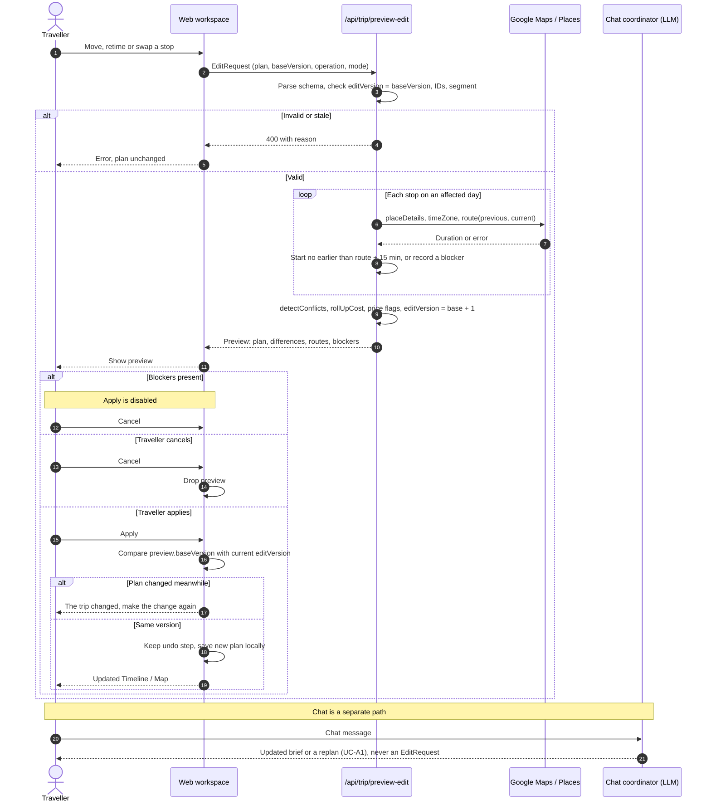
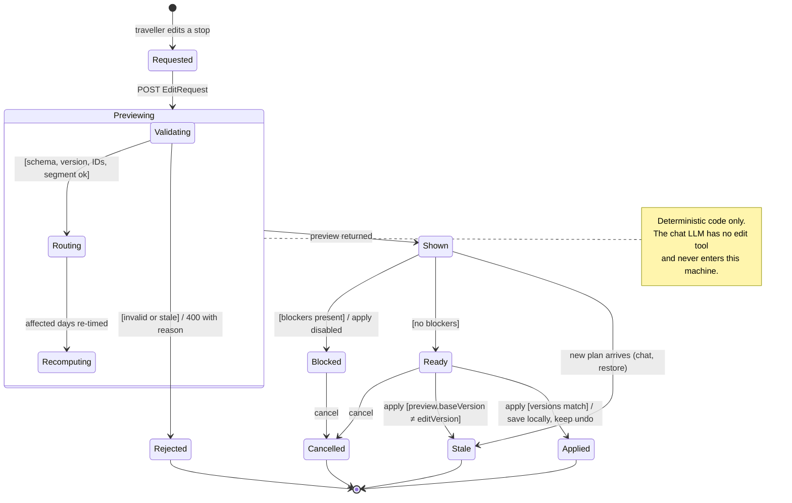

# 4. 行为模型：成员 E（`@WhW0591`，聊天工作区、时间线与地图编辑）

[English](04-member-e-behaviour.md) | 中文

这些模型源自[需求](01-requirements.zh.md#member-e-ah-e1)中的 **AH-E1 / R-E1–R-E6** 和[用例](02-use-cases.zh.md#uc-e1-edit-itinerary-timeline--map)中的
**UC-E1 Edit Itinerary (Timeline / Map)**。聊天协调者可以更新行程简报或重新规划，但没有编辑工具；时间线和地图的编辑路径从预览到本地应用全程是确定性的。

## 4.1 活动图：Edit Itinerary（UC-E1）

```mermaid
flowchart TB
  start(( )) --> how{"Edit on Timeline / Map, or ask in chat?"}
  how -- edit --> pick
  how -- chat --> chat

  subgraph T["Traveller"]
    how
    pick["Move, retime or swap a stop on Timeline / Map"]
    choose{"Apply or cancel?"}
    chat["Ask for a change in chat"]
  end

  subgraph W["Web workspace (browser)"]
    send["POST EditRequest: plan, baseVersion, operation"]
    show["Show preview: differences, routes, blockers"]
    blocked{"Any blockers?"}
    fresh{"preview.baseVersion = current editVersion?"}
    apply["Apply previewed plan, keep one undo step, save locally"]
    stale["Drop preview: the trip changed"]
    err["Show error; plan unchanged"]
  end

  subgraph P["Preview route (deterministic)"]
    check{"Schema, version, IDs and segment rules pass?"}
    retime["Re-time affected days: route time + 15 min buffer"]
    recompute["Recompute conflicts, cost roll-up, price flags; editVersion + 1"]
  end

  subgraph G["Google Maps / Places"]
    maps["Place details, time zone, route duration"]
  end

  subgraph C["Chat coordinator (LLM, UC-A1)"]
    replan["Update brief or replan; has no edit tool"]
  end

  pick --> send --> check
  check -- no --> err --> stop(((●)))
  check -- yes --> retime
  retime <--> maps
  retime --> recompute --> show --> blocked
  blocked -- yes --> err
  blocked -- no --> choose
  choose -- cancel --> stop
  choose -- apply --> fresh
  fresh -- no --> stale --> stop
  fresh -- yes --> apply --> stop
  chat --> replan --> stop
  style start fill:#14213D,stroke:#14213D
  style stop fill:#FFFFFF,stroke:#14213D
```

活动图把当前的聊天路径和已实现的时间线/地图编辑路径分开。聊天协调者可以更新行程简报或重新规划，但不会生成 `EditRequest`。编辑路径从预览到本地应用全程是确定性的。

## 4.2 时序图：带预览和版本检查的时间线/地图编辑（UC-E1）

时序图展示已实现的时间线/地图路径，并把聊天标为另一条协调者路径。关键控制点是浏览器端比较 `preview.baseVersion` 与当前计划版本；保存只在本地进行，没有服务端的原子提交。

## 4.3 状态机：时间线/地图编辑的生命周期（UC-E1）

状态机描述已实现的时间线/地图编辑生命周期。它不包含聊天解析，因为当前聊天协调者没有编辑工具。预览路由拒绝的请求进入 `Rejected`。带阻断项的预览只能取消。旅行者应用预览时，若 `baseVersion` 仍与计划一致则进入 `Applied`，若计划在此期间已变化则进入 `Stale`；应用后的计划随后保存在本地。
