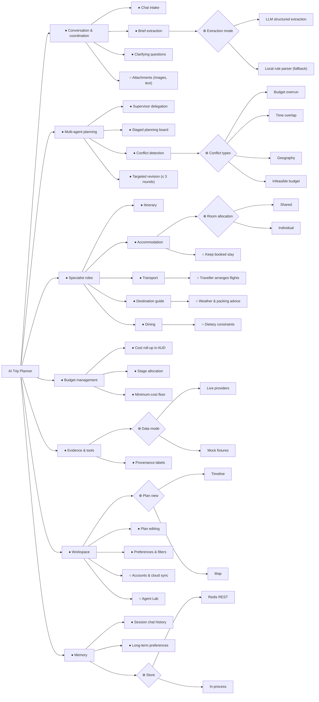

# 3. Feature model

## 3.1 Feature diagram (group)

Notation: ● mandatory, ○ optional, ⊕ alternative (exactly one), ⊗ or (one or more).

## 3.2 Cross-tree constraints

1. *Targeted revision* requires *Conflict detection*.
2. *Budget overrun* requires *Cost roll-up in AUD*; *Infeasible budget* requires *Minimum-cost floor*.
3. *Keep booked stay* excludes searching and pricing in *Accommodation* for that trip.
4. *Traveller arranges flights* excludes fare search in *Transport* and any flight-fare conflict.
5. *Live providers* requires provider keys; without them the system selects *Mock fixtures*.
6. *Accounts & cloud sync* requires *Long-term preferences*.

## 3.3 Non-functional requirements attached to features

| Feature | NFR |
| --- | --- |
| Multi-agent planning | Every proposal is re-validated against the shared Zod schema at each graph boundary. |
| Specialist roles | Each specialist falls back to deterministic output when the model is missing or off-schema, so a request always completes. |
| Budget management | AUD arithmetic in integer cents; overrun percentages are compared unrounded. |
| Evidence & tools | Prices and places come only from tools; every section shows whether its data is live, estimated, mock or fallback. |
| Workspace | Planning progress streams as NDJSON so the traveller sees each stage as it runs. |
| Agent Lab | Fixture runs can never reach a paid model or provider. |
