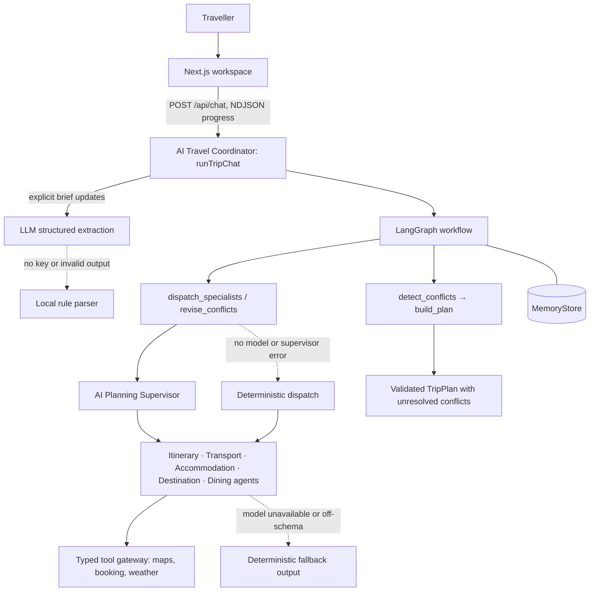
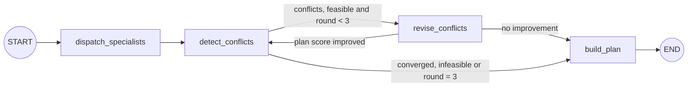
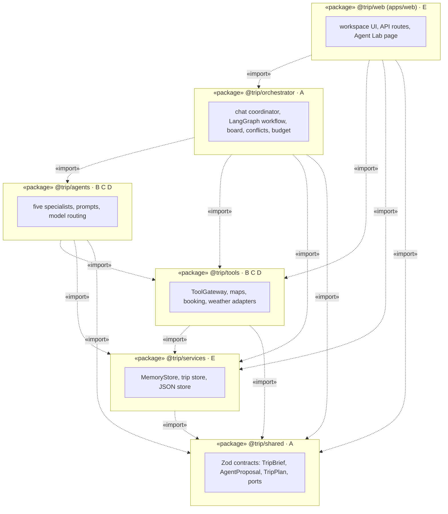
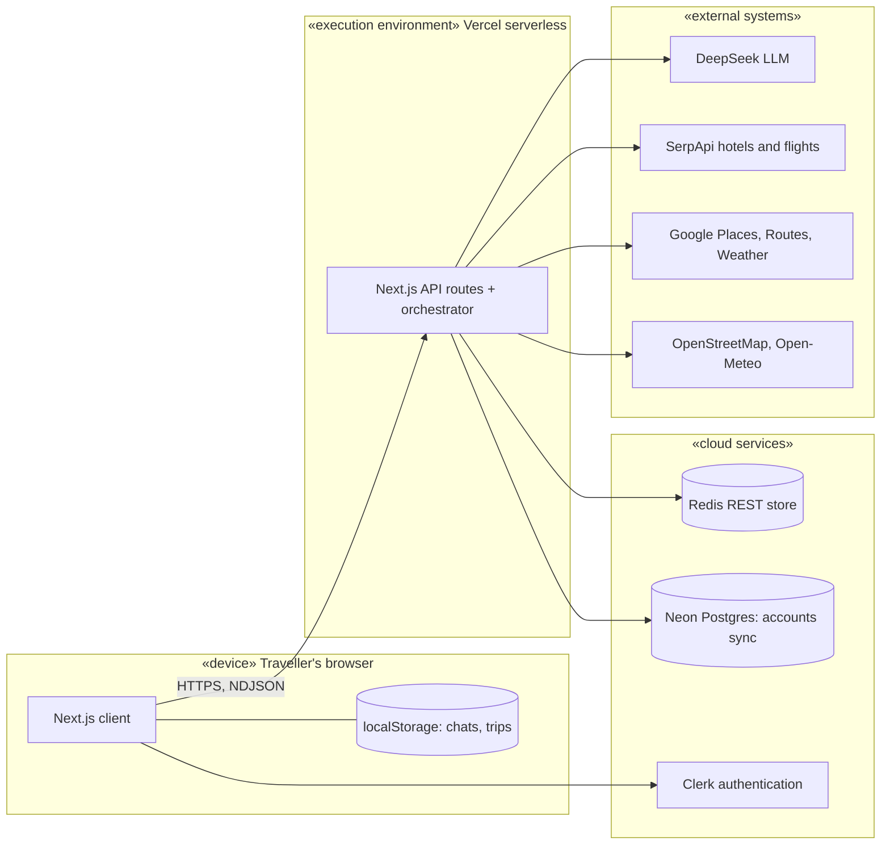

# 5. Architecture analysis and design

## 5.1 Viewpoints

The architecture is described from four viewpoints, chosen for the concerns of each stakeholder.

| Viewpoint | Stakeholder and concern | Where it is modelled |
| --- | --- | --- |
| Logical | Developers: which classes and contracts exist, and how they relate | Class model (§6), feature model (§3) |
| Process | Founder and developers: how agents run, wait for each other, retry and stop | Ad hoc design diagram (§5.2), behaviour models (§8), collaboration (§7.2) |
| Development | The five members: who owns which package, and which dependencies are allowed | Package diagram (§5.3) |
| Physical | Founder: where the system runs and which external services it pays for | Deployment diagram (§5.4) |
| Scenarios | Traveller: what the system does for them | Use cases (§4) |

## 5.2 Ad hoc design diagram: runtime flow

One request from the traveller's message to a validated plan. Solid arrows are the normal path;
dashed arrows are fallbacks when a model or provider is unavailable.

*Figure 5.1. Runtime flow.*

The LangGraph workflow drives the supervisor, not the other way round. The graph decides when to
dispatch, revise and stop; the supervisor only chooses which specialists a step needs. The control
path, budget red lines and stopping condition never depend on a model improvising the next step.

*Figure 5.2. The LangGraph planning loop.*

## 5.3 Package diagram

The repository is a pnpm and Turborepo monorepo. Dependencies point inward to the shared contracts;
`shared` depends on nothing, and no package imports the web app.

*Figure 5.3. Package diagram, with the owning member of each package.*

## 5.4 Deployment diagram

*Figure 5.4. Deployment diagram.*

Without provider keys the same build runs fully offline on mock fixtures and process memory, which is
how the Agent Lab and the tests run.

## 5.5 Life-cycle process

The group follows an iterative, agile process. Work is tracked as GitHub issues with triage labels
and will be mirrored in Jira for Stage 2, as the brief requires. Each change is a short-lived branch merged into `main` through a pull
request after CI (typecheck, lint, tests, build, documentation and protected-file checks). Decisions
with lasting rationale are recorded as Agent Notes in the repository, so the design model and the
code are reviewed in the same pull request.
