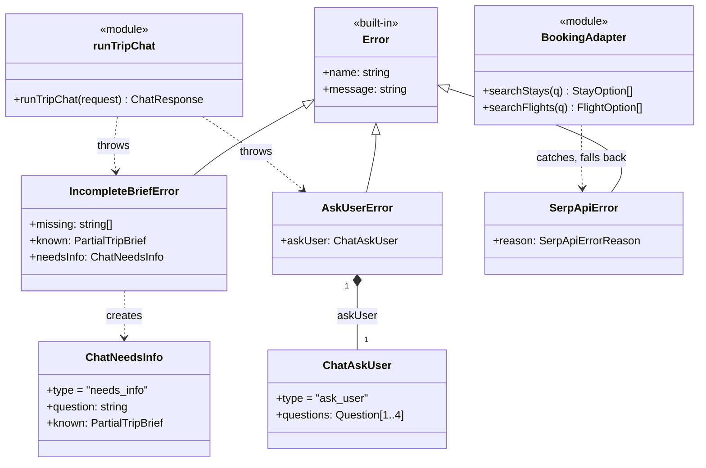

# 6. Elementary structure: class model

The class model has six UML class diagrams that share one namespace, drawn from the code. Modules
that export functions appear as classes with the `«module»` stereotype. Diagrams 1 to 5 show
composition, aggregation, association, dependency, multiplicity, interfaces and realisation;
Diagram 6 adds generalisation.

## 6.1 Notation

| Mark                         | Relationship   | Meaning                                                        |
| ---------------------------- | -------------- | -------------------------------------------------------------- |
| solid line, hollow triangle  | generalisation | subclass → superclass ("is a kind of")                         |
| dashed line, hollow triangle | realisation    | class → interface ("implements")                               |
| solid line, filled diamond   | composition    | whole ◆ part; part cannot outlive the whole                    |
| solid line, hollow diamond   | aggregation    | whole ◇ part, shared; part has an independent lifetime         |
| solid line, open arrow       | association    | source holds a stored reference to the target                  |
| dashed line, open arrow      | dependency     | transient use only (parameter, return, local); no stored field |

## 6.2 Diagram 1: structural spine

The request path from the web workspace through the chat coordinator and LangGraph workflow to the specialists, tools and stores.

*Figure 6.1. Diagram 1: structural spine.*

## 6.3 Diagram 2: domain model

The shared contracts: `TripBrief`, `AgentProposal`, `ProposalItem`, `RevisionRequest`, `TripPlan` and `TripSection`.

*Figure 6.2. Diagram 2: domain model.*

## 6.4 Diagram 3: specialists and orchestration

The `Specialist` interface, its five realisations, the registry and the orchestrator graph.

*Figure 6.3. Diagram 3: specialists and orchestration.*

## 6.5 Diagram 4: ports, adapters and infrastructure

Hexagonal ports in `packages/shared` and the adapters that realise them.

*Figure 6.4. Diagram 4: ports, adapters and infrastructure.*

## 6.6 Diagram 5: use cases traced onto the model

Which classes realise each use case.

*Figure 6.5. Diagram 5: use cases traced onto the model.*

## 6.7 Diagram 6: generalisation

The five class diagrams in above
already show composition, aggregation, multiplicity, interfaces and realisation
(`Specialist <|.. ItineraryAgent`, `MapsPort <|.. MapsAdapter`, …). The criteria also name
**generalisation**, which the existing diagrams do not draw. The code does have real inheritance:
the typed errors that turn a failed or unfinished turn into a specific response frame. This is
**Diagram 6** of the class model.

| Relationship | Kind | Rationale |
| --- | --- | --- |
| `Error <\|-- IncompleteBriefError` | generalisation | "Not enough to plan yet" is a non-plan outcome, not a crash; the API route catches it by type and streams a `needs_info` frame with the fields understood so far. |
| `Error <\|-- AskUserError` | generalisation | A clarifying question with 1–4 concrete choices, streamed as `ask_user`. |
| `Error <\|-- SerpApiError` | generalisation | A provider failure with a typed `reason` (quota, no results, …) so the booking adapter can fall back to Google Places estimates and label the provenance. |

*Design note.* Subclassing `Error` lets `runTripChat` end a turn early from deep inside the
LangGraph or LangChain call stack, and lets the route handler distinguish outcomes with
`instanceof` instead of string matching.

## 6.8 Key associations and multiplicity

Read _source → target_.

| Source                                  | Target                                            | Type        | Mult.          | Meaning                                                                |
| --------------------------------------- | ------------------------------------------------- | ----------- | -------------- | ---------------------------------------------------------------------- |
| `WorkspaceView`                         | panels, editor, map, data-mode toggle             | composition | 1 → 1          | the workspace renders one of each view                                 |
| `WorkspaceController`                   | `TripPlan`                                        | association | 1 → 0..1       | holds the current plan; none before the first plan                     |
| `WorkspaceController`                   | `WorkspaceTransport` / `WorkspaceStorage`         | composition | 1 → 1          | request and `localStorage` hooks used only by this controller          |
| `ChatRoute`                             | `TripChat`, `TripStore`                           | dependency  | —              | handles one request, then saves the resulting plan                     |
| `ChatResponse`                          | `TripPlan`                                        | composition | 1 → 1          | a response carries a full plan                                         |
| `ChatRequest`                           | `TripBrief` / `TripPlan` / `PartialTripBrief`     | composition | 1 → 0..1       | the browser sends its current state with each message                  |
| `OrchestratorGraph`                     | `Supervisor`, `ConflictDetection`, `BudgetPolicy` | dependency  | —              | functions called from graph nodes                                      |
| `SpecialistRegistry`                    | `Specialist`                                      | aggregation | 1 → 5          | references module-level agents; no lifecycle ownership                 |
| `SpecialistRequest`                     | `AgentContext`                                    | composition | 1 → 1          | each call carries its own context                                      |
| `AgentContext`                          | `ToolGateway` / `MemoryStore`                     | association | 1 → 1          | injected — the specialist's only route to tools and memory             |
| `TripPlan`                              | `TripBrief`                                       | composition | 1 → 1          | embeds the brief it answers                                            |
| `TripPlan`                              | `TripSection`                                     | composition | 1 → 0..*       | one section per specialist that returned a proposal                    |
| `TripPlan`                              | `RevisionRequest`                                 | composition | 1 → 0..*       | conflicts still unresolved after the last round                        |
| `TripSection`                           | `AgentProposal`                                   | composition | 1 → 0..1       | the proposal the section was built from, for drill-down                |
| `AgentProposal`                         | `ProposalItem`                                    | composition | 1 → 0..*       | a proposal is its list of line items                                   |
| `AgentProposal`                         | `AgentProposalSource`                             | composition | 1 → 0..1       | where the data came from: live, estimated, mock, fallback, unavailable |
| `StaySelection`                         | `StayCandidate`                                   | composition | 1 → 1..*       | the chosen stay and its alternatives                                   |
| `ToolGateway`                           | `MapsPort` / `BookingPort` / `WeatherPort`        | aggregation | 1 → 1, 1, 0..1 | one port of each kind; weather is optional                             |
| `StayOption` / `FlightOption`           | `ProviderProvenance`                              | composition | 1 → 0..1       | which provider answered and whether it was a fallback                  |
| `PreferenceMemoryService` / `TripStore` | `JsonStore`                                       | dependency  | —              | every read and write goes through the store                            |

## 6.9 Interfaces and realisation

| Interface        | Realised by                                                                                      | Note                                                                      |
| ---------------- | ------------------------------------------------------------------------------------------------ | ------------------------------------------------------------------------- |
| `Specialist`     | `ItineraryAgent`, `TransportAgent`, `AccommodationAgent`, `DestinationGuideAgent`, `DiningAgent` | one `invoke(SpecialistRequest)`; only the destination guide cannot revise |
| `ToolGateway`    | object returned by `createToolGateway()`                                                         | one per planning run                                                      |
| `MapsPort`       | `MapsAdapter` (`maps.ts`)                                                                        | owner B; fixtures, OpenStreetMap or Google                                |
| `BookingPort`    | `BookingAdapter` (`booking.ts`)                                                                  | owner C; SerpApi, then Google Places estimate, or fixtures; no payment    |
| `WeatherPort`    | `WeatherAdapter` (`weather.ts`)                                                                  | owner D; Google Weather, Open-Meteo or climate context                    |
| `MemoryStore`    | `PreferenceMemoryService` (`memory`)                                                             | owner E                                                                   |
| `JsonStore`      | `RedisRestOrLocalStore` (`createJsonStore()`)                                                    | owner E; Redis REST when configured, process memory otherwise             |
| `BriefExtractor` | model extractor in `chat.ts`, or `extractBriefPatchLocally` without a key                        | owner A                                                                   |

`NotificationService` and `AuthService` are stubs: notifications are logged, and every request is the
demo user.

