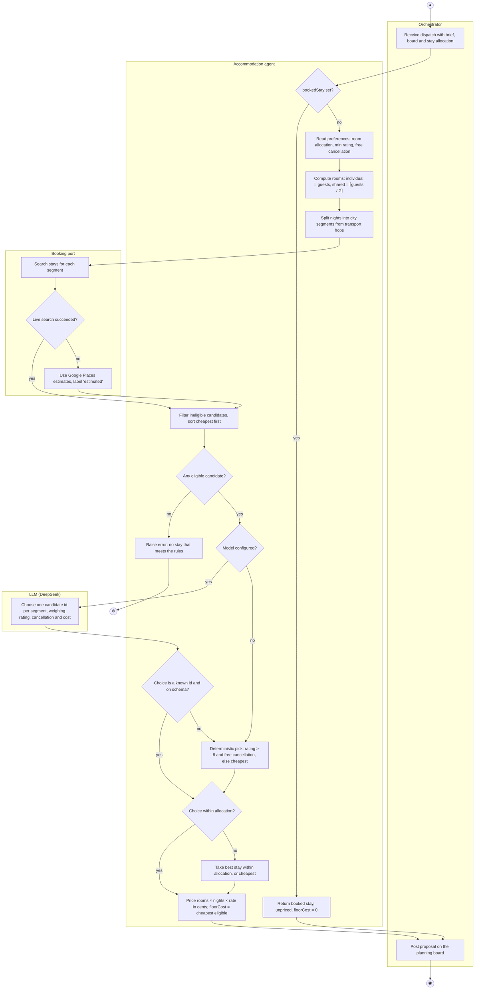
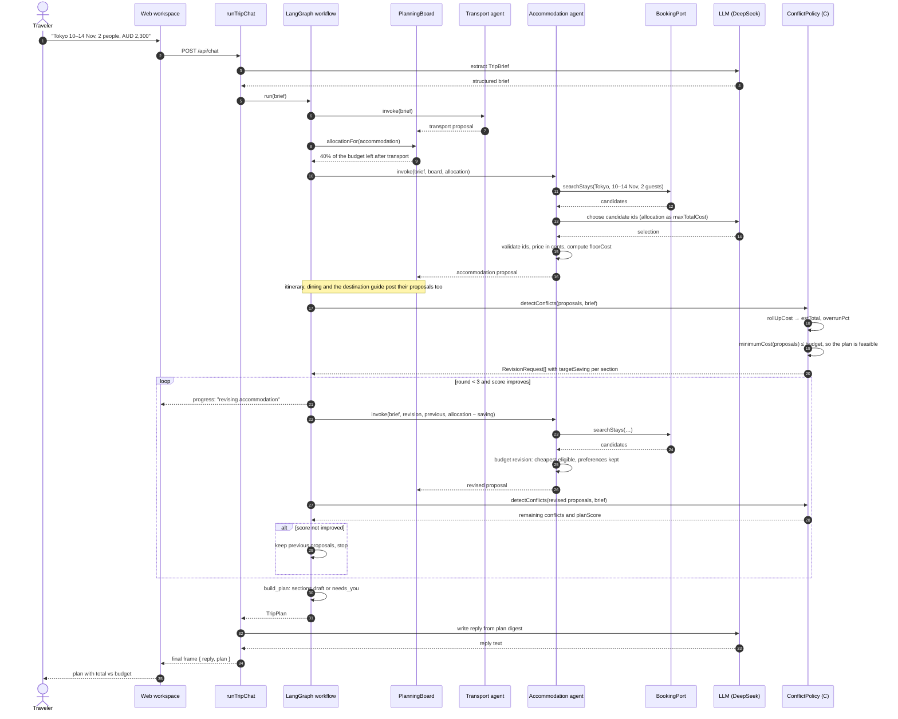
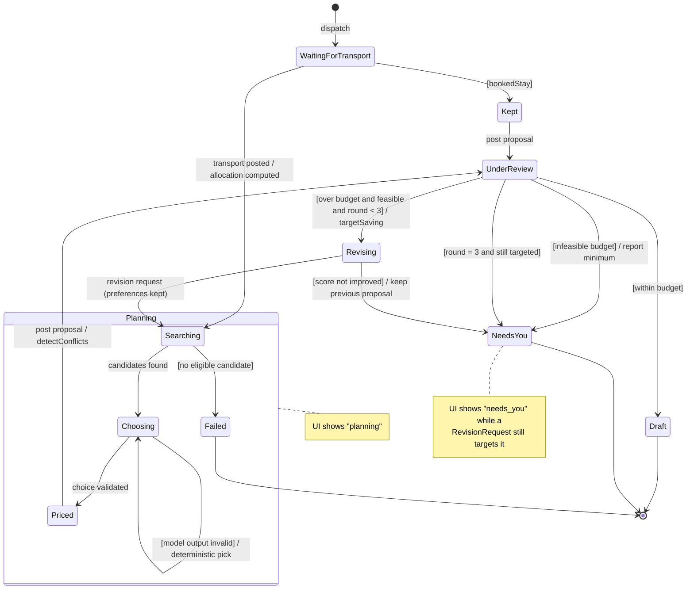
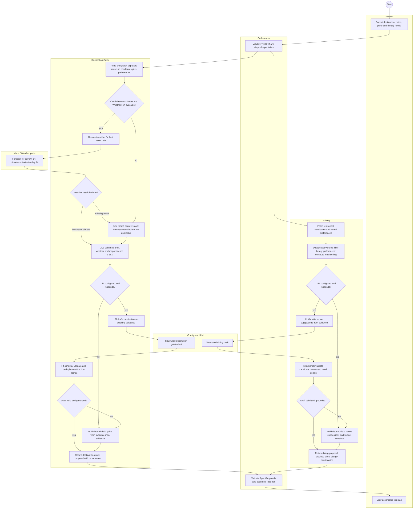
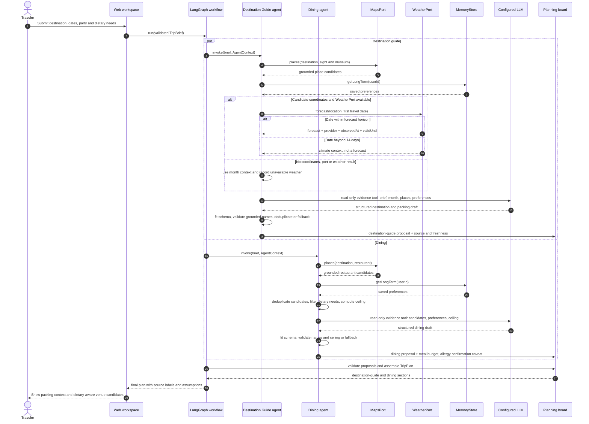
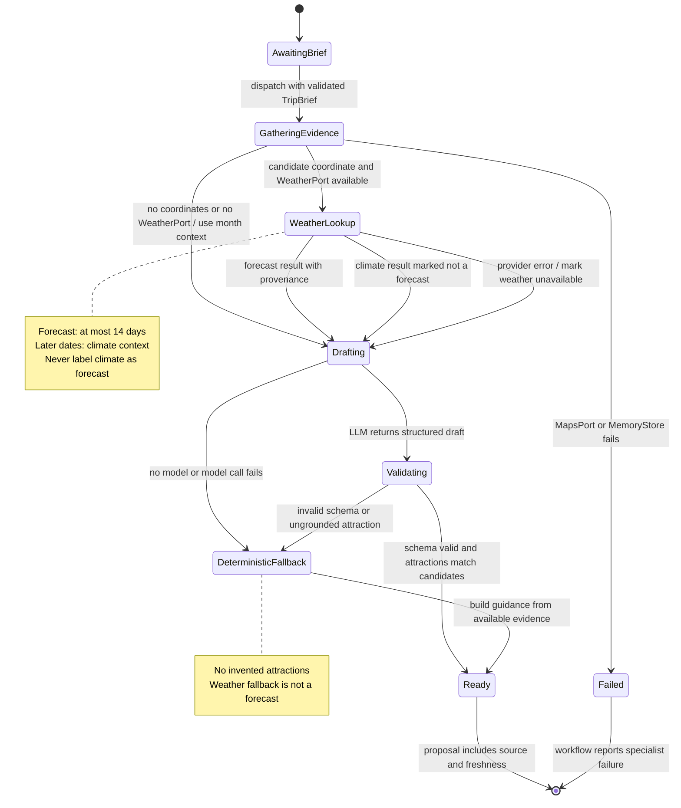

# 8. Behaviour models (individual)

Each member's activity, sequence and state machine diagrams come from their own ad hoc requirement and use case specification, and show where the LLM sits and which deterministic code checks it.

## 8.1 Member C (`@HeadmasterEggy`, accommodation and budget)

All three diagrams come from ad hoc requirement **AH-C1** and the use case specifications **UC-C1
Arrange Accommodation** and **UC-C2 Manage Budget** (`01-requirements.md`, `02-use-cases.md`). Each
focuses on where the LLM sits and what deterministic code guards it, as the brief asks.

### 8.1.1 Activity diagram: Arrange Accommodation (UC-C1)

Swimlanes are the four participants. The LLM is used once, in _Choose one candidate id per segment_, and
its output is checked before anything is priced.

### 8.1.2 Sequence diagram: budget overrun and targeted revision (UC-C2, extension 2a)

One planning turn in which the first round goes over budget and the accommodation agent is asked to
cut its cost.

If `minimumCost` is above the budget (extension 2b), `detectConflicts` instead returns one
`infeasible budget` conflict, the loop is skipped, and the reply names the minimum budget needed.

### 8.1.3 State machine: accommodation section within a planning turn (UC-C1 and UC-C2)

The section's visible status (`planning`, `draft`, `needs_you`) is derived from these internal
states.

| State                       | UI status | Entry / exit behaviour                                                                   |
| --------------------------- | --------- | ---------------------------------------------------------------------------------------- |
| WaitingForTransport         | planning  | Waits only if transport was started in the same turn.                                    |
| Searching, Choosing, Priced | planning  | The LLM acts only in Choosing; invalid output loops back through the deterministic pick. |
| Kept                        | planning  | Booked stay, no search; floorCost 0 so it is never asked to cut.                         |
| UnderReview                 | planning  | Member C's `detectConflicts` decides the next state.                                     |
| Revising                    | planning  | Same preferences, new allocation; the round is kept only if `planScore` improves.        |
| Draft                       | draft     | No revision request targets the section.                                                 |
| NeedsYou                    | needs_you | The traveller decides: raise the budget, change dates or edit the plan.                  |
| Failed                      | —         | The run stops and names accommodation as the failing specialist.                         |

## 8.2 Member A

_Activity, sequence and state machine diagrams from AH-A1 and A's use case specification._

## 8.3 Member B

_Activity, sequence and state machine diagrams from AH-B1 and B's use case specification._

## 8.4 Member D

All three diagrams come from **AH-D1** and **UC-D1 View Weather-based Clothing Recommendation**.
The destination-guide and dining specialists run as part of one trip plan. The LLM drafts from
tool evidence; deterministic code validates schema, candidate names and meal budget before proposals
reach the plan. Weather provenance distinguishes a forecast from historical climate context.

### 8.4.1 Activity diagram: weather and dietary guidance (UC-D1)

The specialist paths run independently. Weather failure degrades only the guide's weather detail;
invalid model output uses deterministic, evidence-bounded guidance.

### 8.4.2 Sequence diagram: weather-based packing and dietary dining (UC-D1)

The LLM receives validated evidence through read-only tools. Provider calls and post-model
validation remain deterministic.

### 8.4.3 State machine: destination-guide weather and packing section

The state machine follows the destination-guide proposal through evidence collection, model
validation and fallback. Dining produces a separate proposal in parallel.

## 8.5 Member E

_Activity, sequence and state machine diagrams from AH-E1 and E's use case specification._
