# 8. Behaviour models (individual)

Each member's activity, sequence and state machine diagrams come from their own ad hoc requirement and use case specification, and show where the LLM sits and which deterministic code checks it.

## 8.1 Member A (`@Lilstanie`, coordination and orchestration)

All three diagrams are built from ad hoc requirement **AH-A1** and use case **UC-A1 Generate
Itinerary** (§2.2, §4.2). Each one marks where the LLM acts and which
code validates what it returns.

One planning turn makes three LLM calls. Each has a deterministic path that takes over when the
model is unavailable or returns invalid output:

| LLM call | What it decides | Deterministic guard |
| --- | --- | --- |
| Brief extraction (`update_trip_brief`) | Which trip facts the message states | `BriefPatchSchema` → `applyBriefPatch` → `TripBrief` Zod parse. Facts the traveller did not state are reported as missing, not inferred |
| Supervisor delegation | Which specialists to call, with what objective | Fixed specialist registry. The itinerary specialist is always delegated, and a failed supervisor falls back to dispatching all five |
| Reply writing | The prose the traveller reads | With no model configured, `fallbackReplyFor(plan)` writes it from the plan |

The plan is not generated by the model. `build_plan` assembles it from the validated proposals.

### 8.1.1 Activity diagram: Generate Itinerary (UC-A1)

The swimlanes are the five participants. Rounds 2 and 3 re-enter *Detect conflicts*.

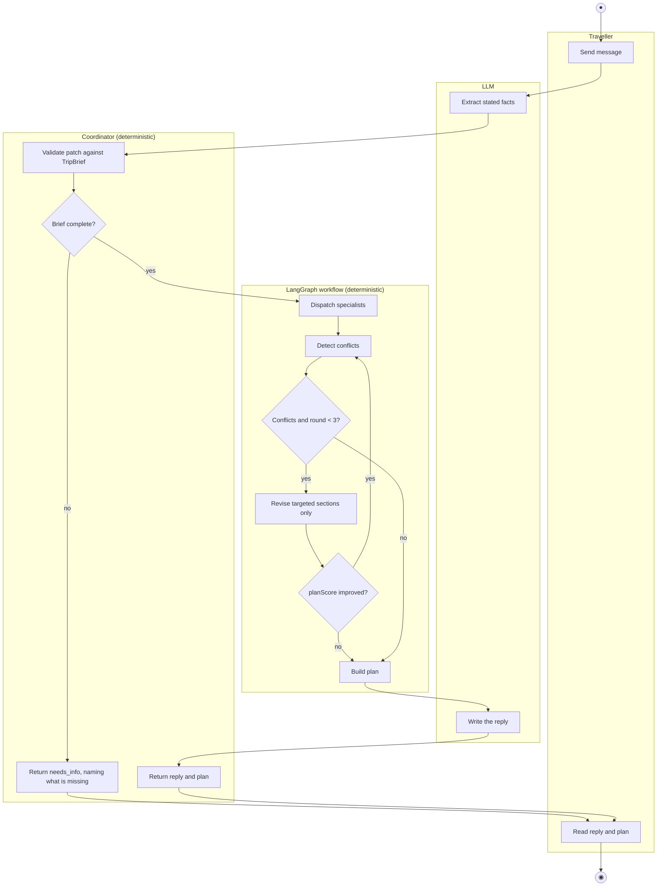

Without a model key, only the three LLM boxes drop out. Extraction uses the facts already stated,
delegation dispatches all five specialists, and `fallbackReplyFor` writes the reply.

### 8.1.2 Sequence diagram: one turn with a clarifying question, then a revised plan (UC-A1, extensions 3a and 7a)

The first message leaves out the budget, so the coordinator asks for it before planning starts. The
first round returns a geography conflict, one targeted revision fixes it, and the plan score improves.

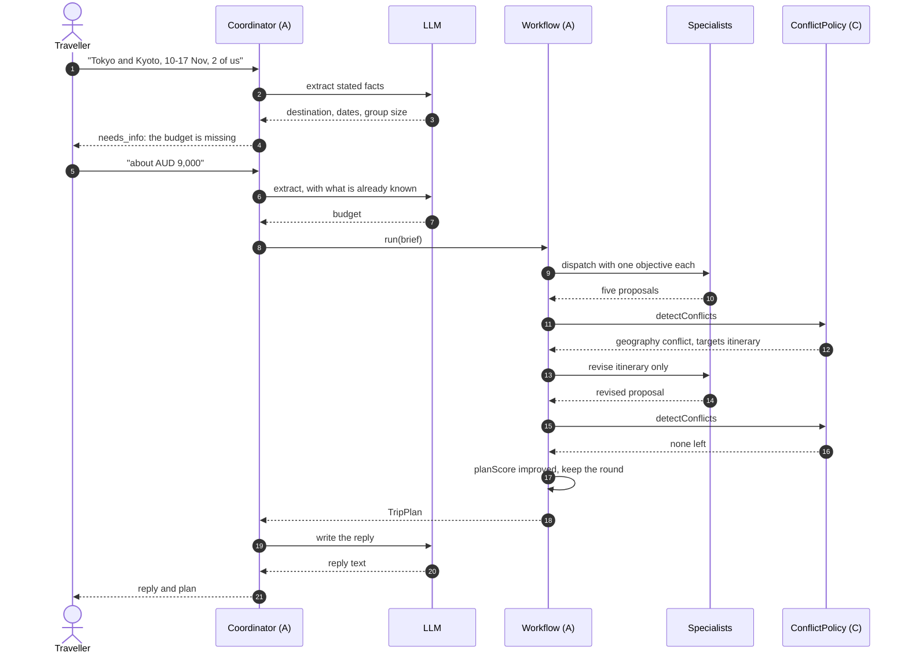

If the score had not improved, `revise_conflicts` sets `stalled` and the previous proposals are
kept. If the conflict had been `infeasible budget`, `routeAfterDetection` skips the loop.

### 8.1.3 State machine: one planning turn (UC-A1)

This is the turn as the orchestrator sees it. Member C's state machine covers a single *section*
inside `Detecting`. This one covers the whole turn.

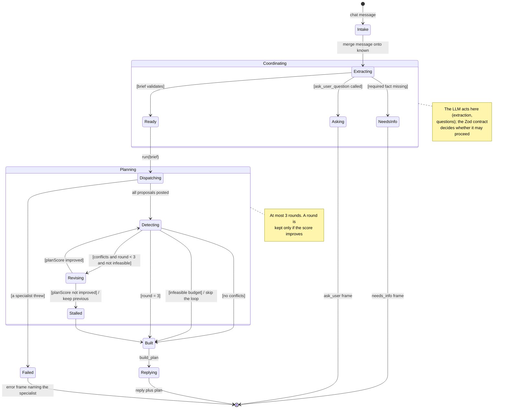

| State | What the traveller sees | Entry / exit behaviour |
| --- | --- | --- |
| Intake, Extracting | "thinking" | The message is merged onto `known`, so a follow-up does not repeat earlier facts. |
| NeedsInfo | The question in chat | No plan exists yet. `IncompleteBriefError` names the missing fields, and required facts are not given default values. |
| Asking | 2–4 clickable options | At most one question per turn, and no other tool runs after it. |
| Dispatching | A progress row per subagent | The supervisor chooses which specialists run. The itinerary specialist always runs. |
| Detecting | "checking budget and schedules" | Member C's `detectConflicts` returns the revision requests. |
| Revising | "revising affected sections" | Only the targeted agents re-run, each given its previous proposal. |
| Stalled | — | The round is discarded and the earlier proposals are kept. |
| Built | Sections `draft` or `needs_you` | The plan is assembled from the validated proposals. |
| Failed | Error naming the specialist | No partial plan is returned. |

### 8.1.4 How this behaviour is measured

`packages/orchestrator/src/agent-lab/` replays fixed scenarios against the orchestrator with
injected faults: a specialist timing out, a provider failing, a model returning output that does not
match the schema. Each run records the number of rounds, the conflicts raised, token usage and an
evaluator score (R-A12). This is how the transitions above are tested under failure conditions.

## 8.2 Member B (`@fonever2`, itinerary and transport)

These models derive from **AH-B1 / R-B1–R-B6** (§2.3.2) and **UC-B1 Arrange Transportation** (§4.2). They describe the current team implementation in B's assigned domain, not exclusive code authorship. The specialist boundary is `Specialist.invoke`.

### 8.2.1 Activity diagram

Rounded actions, guarded decisions, a filled initial node and a double-ring final node express the activity model in Mermaid. Responsibility regions separate the Transport LLM from deterministic code and the workflow. The revision action expands the targeted specialist's planning operation; it does not imply rerunning every agent. Cancellation can terminate any executing action and is omitted for readability.

```mermaid
flowchart TB
  S(( )) --> A("Receive UC-B1 transport dispatch")
  subgraph TR["Transport specialist / deterministic code"]
    A --> M{"Model configured?"}
    G("Gather fares and routes via ToolGateway")
    V{"Selection valid?"}
    F("Use deterministic evidence-based plan")
    P("Validate route and day fit, copy evidence prices, record gaps")
    G0("Gather evidence without a model")
  end
  subgraph LM["Transport LLM"]
    L("Call search_transport_evidence")
    C("Choose offered flight IDs and hop departure slots")
  end
  M -- "[yes]" --> L --> G --> C --> V
  M -- "[no]" --> G0 --> F
  L -- "[model failure]" --> H("Reuse evidence or gather it if absent") --> F
  C -- "[model failure]" --> H
  V -- "[invalid IDs, coverage, day or time]" --> F
  V -- "[valid]" --> P
  F --> P
  subgraph WF["Workflow / planning board / related specialists"]
    B("Validate proposal schema and store on board")
    I("Coordinate itinerary with transport and stays, verify route gaps")
    D("Detect budget, time and geography conflicts")
    R{"Conflicts and feasible budget and round below 3?"}
    T("Increment round, invoke only targeted revisable specialists")
    Q{"Whole-plan score improves?"}
    K("Keep revised proposals")
    O("Restore previous proposals and stop")
    Z("Build draft or needs_you sections, retain pricing warnings")
  end
  P --> B --> I --> D --> R
  R -- "[yes]" --> T --> Q
  Q -- "[yes]" --> K --> D
  Q -- "[no]" --> O --> Z
  R -- "[no]" --> Z --> E(((●)))
  B -- "[schema rejected]" --> X("Report run failure") --> E
  G -- "[unrecoverable error]" --> X
  G0 -- "[unrecoverable error]" --> X
  style S fill:#18334d,stroke:#18334d
  style E fill:#ffffff,stroke:#18334d
```

### 8.2.2 Sequence diagram

The model-call branch shows rejected output falling back after validation. A separate no-model branch gathers evidence directly. The nested optional fragment invokes Transport only when targeted. A non-improving revision restores the previous proposals and exits the revision loop before final assembly; it does not recheck rejected proposals. A model failure before its search tool is called skips that tool exchange and gathers evidence in the fallback. Provider and cancellation errors that end the run are specified in UC-B1 rather than expanded here.

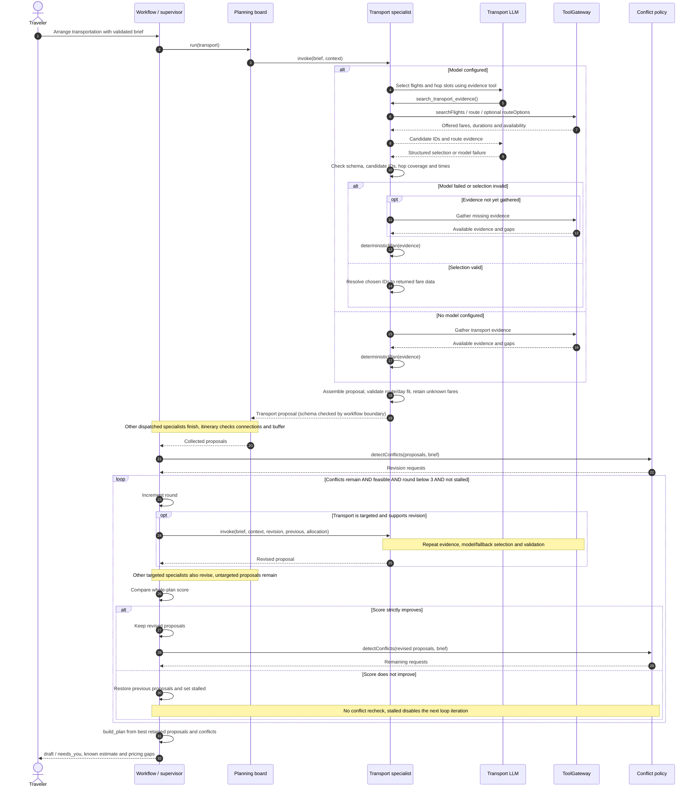

### 8.2.3 State machine

The subject is the transport proposal within one planning run. Transition labels follow event [guard] / action. Internal states are conceptual, not persisted enums; only `draft` and `needs_you` map to final section status. Whole-plan score comparison and round limits belong to the workflow. While other sections revise, an untargeted transport proposal remains under review until the workflow stops. An abort can terminate any non-final state; those repeated transitions are omitted.

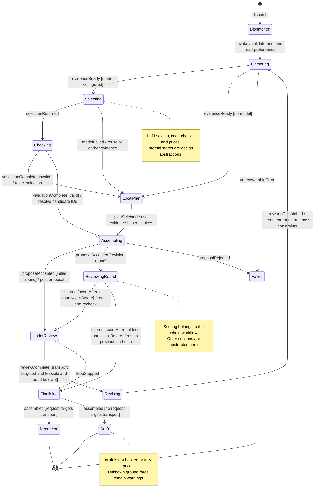

### 8.2.4 Implementation boundaries

- The LLM chooses offered flight IDs and hop departure slots. Deterministic code checks candidate membership, one fare per priced hop, required hop coverage, day bounds, time format and route/day fit before assembling a proposal.
- Unknown ground fares omit `estCost` and remain warnings; a required flight without a valid fare still records a conflict. Traveller-arranged flights are exempt. An unavailable chosen ground mode is explicitly disclosed rather than silently substituted.
- Itinerary planning checks connections against provider durations plus a 15-minute arrival buffer. Transport durations are gathered before model scheduling; a model-changed departure time does not trigger another time-sensitive route search.
- The default limit is three total rounds, including the first. Only targeted revisable specialists rerun. Non-improving rounds are discarded. There is no purchase, booking or approval checkpoint in this use case.
- Generated figures are for full-size report viewing; use the SVGs for zooming. Their detailed labels are not intended to be read as three tiny slide thumbnails.

### 8.2.5 AI acknowledgement

OpenAI Codex assisted with source inspection, the requirement and use-case draft, and diagram preparation. Tingsong Jin must review the individual submission and be able to explain the models. This statement does not assert that all current team code was implemented by B.

## 8.3 Member C (`@HeadmasterEggy`, accommodation and budget)

All three diagrams come from ad hoc requirement **AH-C1** and the use case specifications **UC-C1
Arrange Accommodation** and **UC-C2 Manage Budget** (§2.2, §4.2). Each
focuses on where the LLM sits and what deterministic code guards it, as the brief asks.

### 8.3.1 Activity diagram: Arrange Accommodation (UC-C1)

Swimlanes are the four participants. The LLM is used once, in _Choose one candidate id per segment_, and
its output is checked before anything is priced.

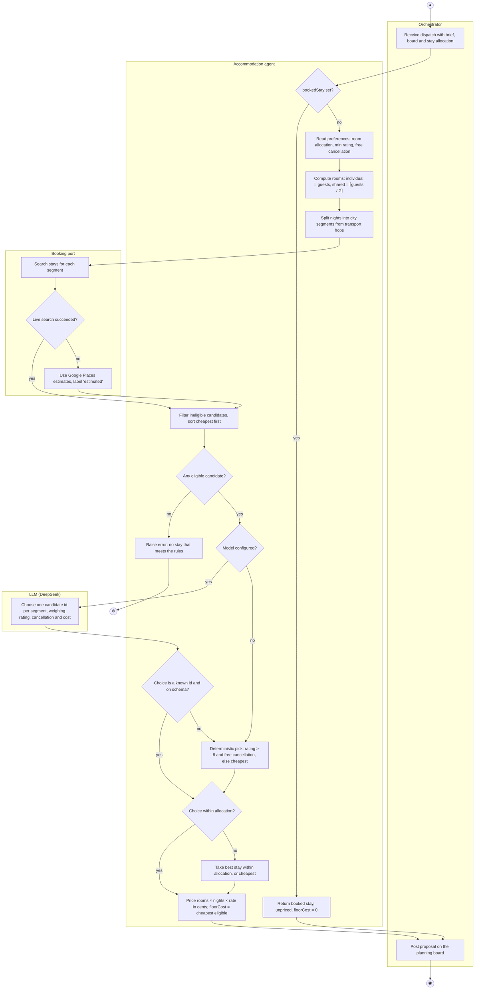

### 8.3.2 Sequence diagram: budget overrun and targeted revision (UC-C2, extension 2a)

One planning turn in which the first round goes over budget and the accommodation agent is asked to
cut its cost.

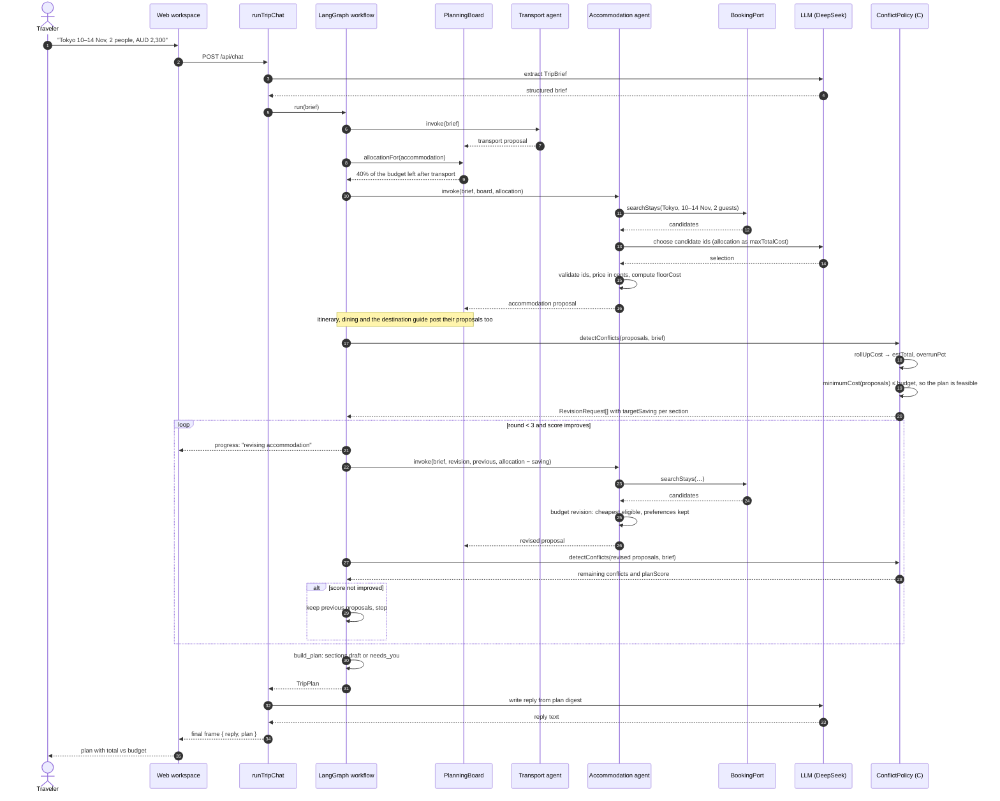

If `minimumCost` is above the budget (extension 2b), `detectConflicts` instead returns one
`infeasible budget` conflict, the loop is skipped, and the reply names the minimum budget needed.

### 8.3.3 State machine: accommodation section within a planning turn (UC-C1 and UC-C2)

The section's visible status (`planning`, `draft`, `needs_you`) is derived from these internal
states.

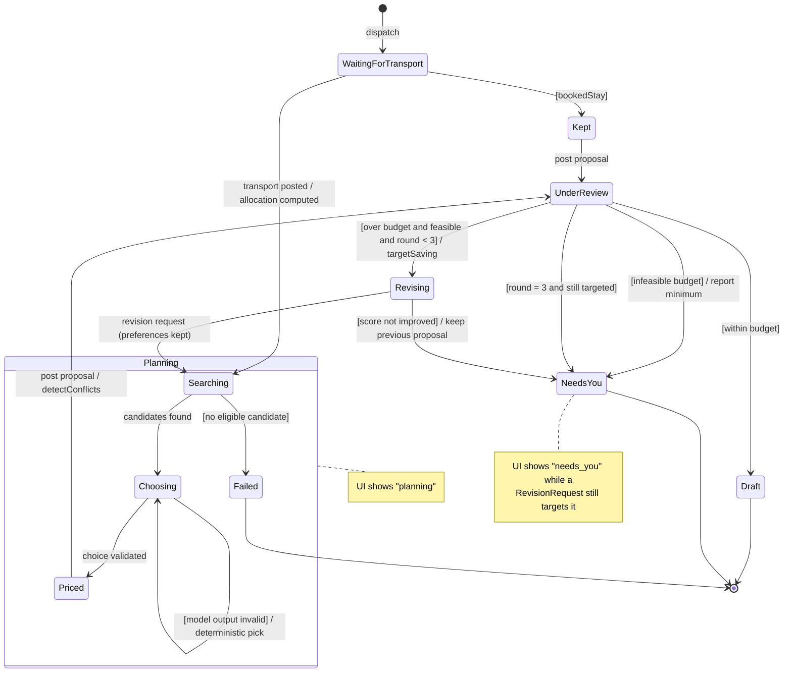

| State                       | UI status | Entry / exit behaviour                                                                   |
| --------------------------- | --------- | ---------------------------------------------------------------------------------------- |
| WaitingForTransport         | planning  | Waits only if transport was started in the same turn.                                    |
| Searching, Choosing, Priced | planning  | The LLM acts only in Choosing; invalid output loops back through the deterministic pick. |
| Kept                        | planning  | Booked stay, no search; floorCost 0 so it is never asked to cut.                         |
| UnderReview                 | planning  | Member C's `detectConflicts` decides the next state.                                     |
| Revising                    | planning  | Same preferences, new allocation; the round is kept only if `planScore` improves.        |
| Draft                       | draft     | No revision request targets the section.                                                 |
| NeedsYou                    | needs_you | The traveller decides: raise the budget, change dates or edit the plan.                  |
| Failed                      | —         | The run stops and names accommodation as the failing specialist.                         |

## 8.4 Member D

All three diagrams come from **AH-D1** and **UC-D1 View Weather-based Clothing Recommendation**.
The destination-guide and dining specialists run as part of one trip plan. The LLM drafts from
tool evidence; deterministic code validates schema, candidate names and meal budget before proposals
reach the plan. Weather provenance distinguishes a forecast from historical climate context.

### 8.4.1 Activity diagram: weather and dietary guidance (UC-D1)

The specialist paths run independently. Weather failure degrades only the guide's weather detail;
invalid model output uses deterministic, evidence-bounded guidance.

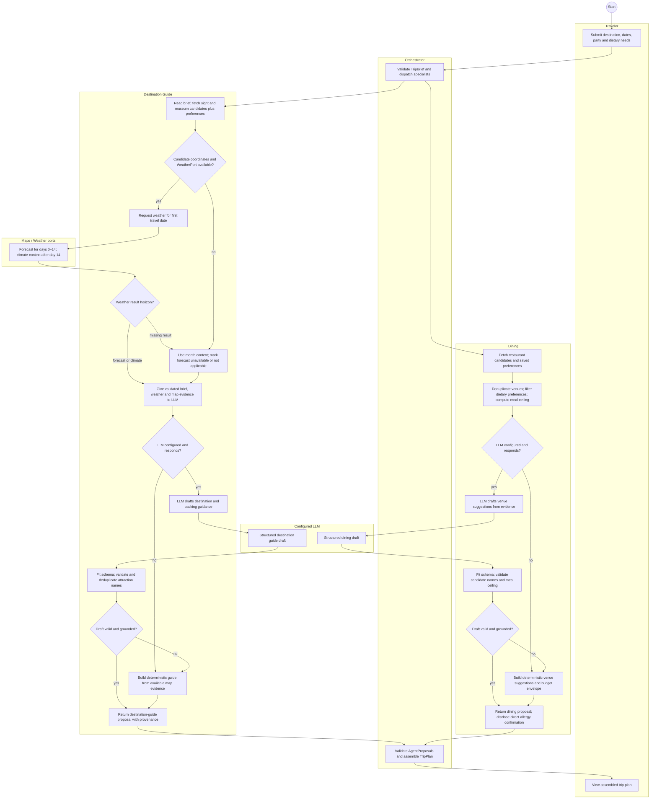

### 8.4.2 Sequence diagram: weather-based packing and dietary dining (UC-D1)

The LLM receives validated evidence through read-only tools. Provider calls and post-model
validation remain deterministic.

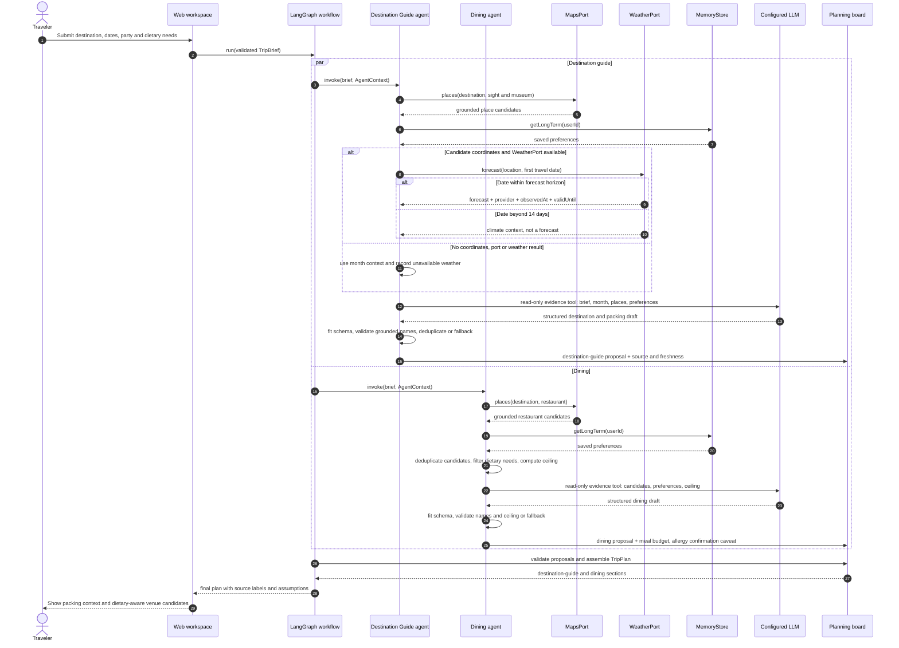

### 8.4.3 State machine: destination-guide weather and packing section

The state machine follows the destination-guide proposal through evidence collection, model
validation and fallback. Dining produces a separate proposal in parallel.

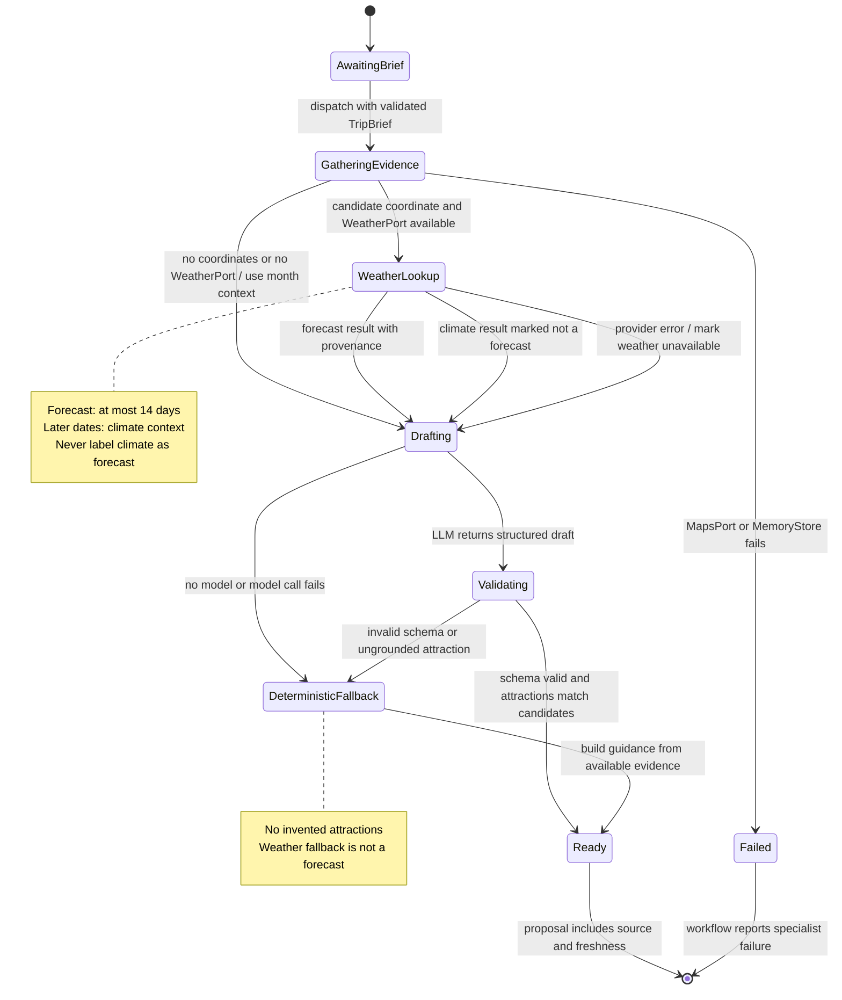

## 8.5 Member E (`@WhW0591`, chat workspace, timeline and map editing)

These models derive from **AH-E1 / R-E1–R-E6** (§2.3.5) and
**UC-E1 Edit Itinerary (Timeline / Map)** (§4.2).
The chat coordinator can update the brief or replan, but it has no edit tool; the timeline and map edit
path is deterministic from preview through local application.

### 8.5.1 Activity diagram: Edit Itinerary (UC-E1)

The activity diagram separates the current chat path from the implemented Timeline/Map edit path. The
chat coordinator can update the brief or replan, but it does not produce an `EditRequest`. The edit path
is deterministic from preview through local application.

### 8.5.2 Sequence diagram: Timeline/Map edit with preview and version check (UC-E1)

The sequence diagram shows the implemented Timeline/Map path and marks chat as a separate coordinator
path. The important control point is the browser-side comparison of `preview.baseVersion` and the
current plan version; persistence is local and there is no server-side atomic commit.

### 8.5.3 State machine: Timeline/Map edit lifecycle (UC-E1)

The state machine models the implemented Timeline/Map edit lifecycle. It does not include chat
interpretation because the current chat coordinator has no edit tool. The preview is either blocked,
cancelled or applied after the client-side version check; the resulting plan is then saved locally.
